# Markdown이란?

* 텍스트 기반의 마크업언어로 2004년 존그루버에 의해 만들어졌으며 쉽게 쓰고 읽을 수 있으며 HTML로 변환이 가능
* 특수기호와 문자를 이용한 **매우 간단한 구조의 문법** 을 사용하여 웹에서도 보다 빠르게 컨텐츠를 작성하고 보다 **직관적으로 인식**
* 깃헙의 저장소Repository에 관한 정보를 기록하는 README.md 파일이 Markdown으로 작성됨
  - 설치방법, 소스코드 설명, 이슈 등을 간단하게 기록하고 가독성을 높일 수 있다는 강점이 부각되면서 널리 사용됨
* HTML : Hyper Text Markup Language  vs Markdown
  - html) `<html><h1>hi</h1></html>`
  - Markdown) `# hi`


::: source
출처: 마크다운 작성법 (ihoneymon) — https://gist.github.com/ihoneymon/652be052a0727ad59601
:::

---

# Markdown의 장-단점

* 장점
  - 1. 간결하다.
  - 2. 별도의 도구없이 작성가능하다.
  - 3. 다양한 형태로 변환이 가능하다.
  - 3. 텍스트(Text)로 저장되기 때문에 용량이 적어 보관이 용이하다.
  - 4. 텍스트파일이기 때문에 버전관리시스템을 이용하여 변경이력을 관리할 수 있다.
  - 5. 지원하는 프로그램과 플랫폼이 다양하다.
* 단점
  - 1. 표준이 없다.
  - 2. 표준이 없기 때문에 도구에 따라서 변환방식이나 생성물이 다르다.
  - 3. 모든 HTML 마크업을 대신하지 못한다.


::: source
출처: 마크다운 작성법 (ihoneymon) — https://gist.github.com/ihoneymon/652be052a0727ad59601
:::

---

# Markdown Example

```markdown
# 개요1
## 개요2
* <http://finfra.com>
* [finfra](https://finfra.com)
* [a relative link](other_file.md)
* 
## 개요2
|id|name |
|--|-----|
|1 |aaa  |
|2 |bbb  |
|3 |cccc |
```

::right::

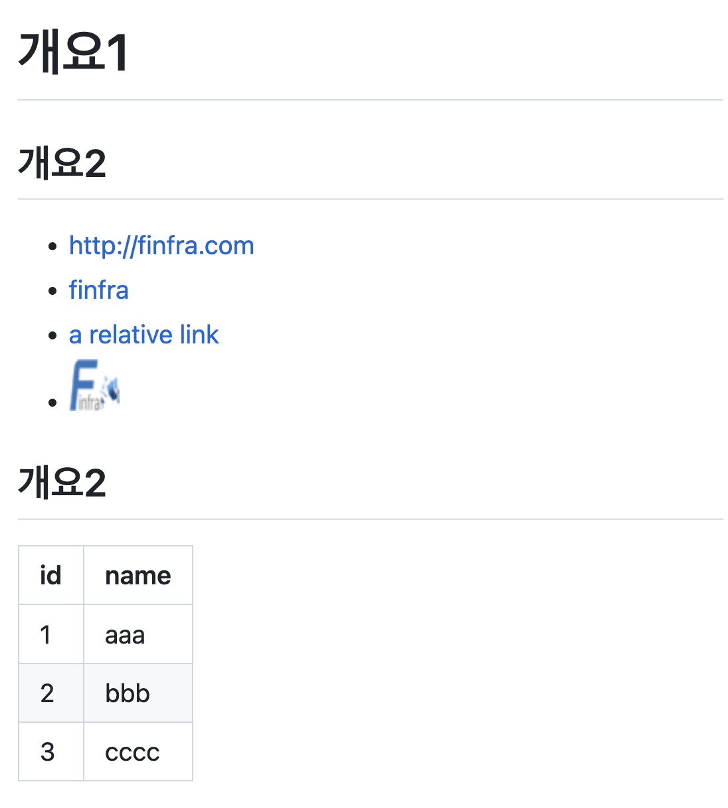

---

# Markdown 문법 - Header

::: columns
::: {.column width="50%"}
* 큰제목: 문서 제목

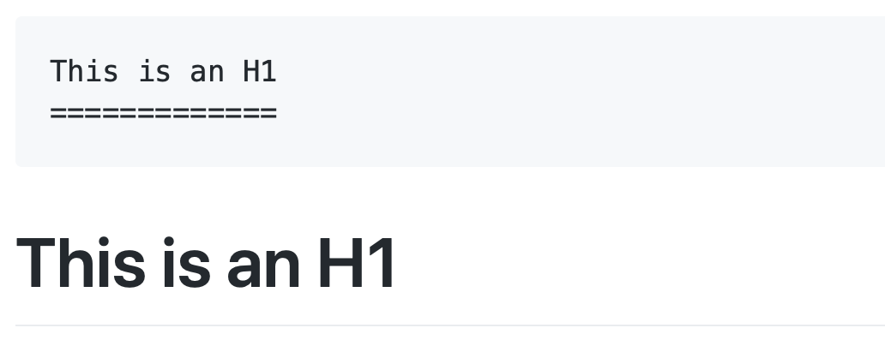

* 큰제목: 문서 제목

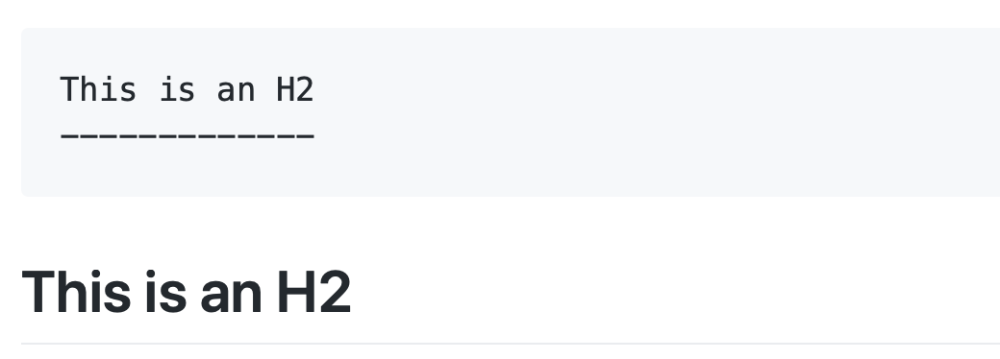
:::
::: {.column width="50%"}
* 글머리: 1~6까지만 지원

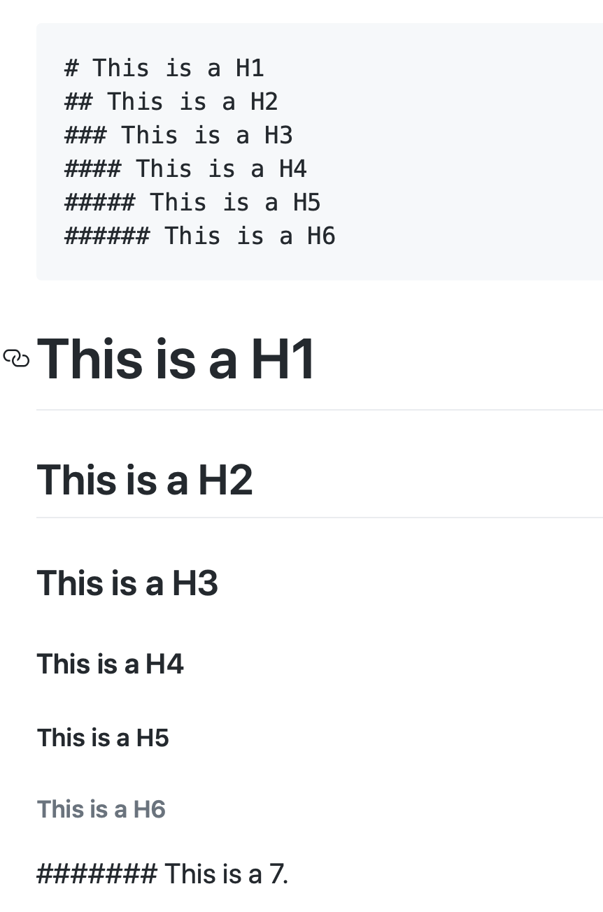
:::
:::

::: source
출처: 마크다운 작성법 (ihoneymon) — https://gist.github.com/ihoneymon/652be052a0727ad59601
:::

---

# Markdown 문법 - BlockQuote

* 이메일에서 사용하는 `>` 블럭인용문자를 이용한다.

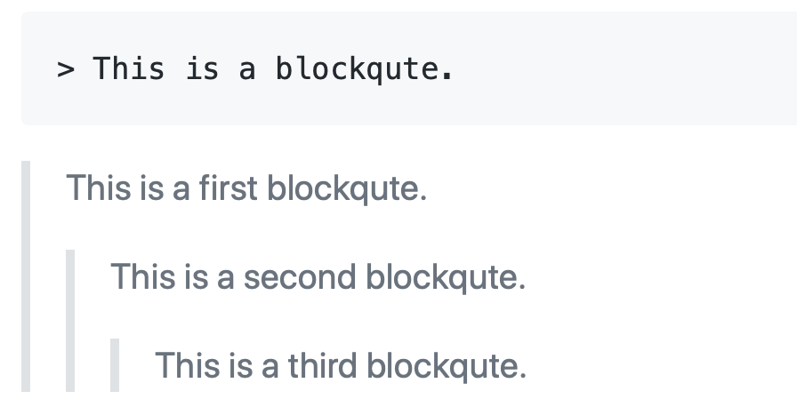

* 이 안에서는 다른 마크다운 요소를 포함할 수 있다.

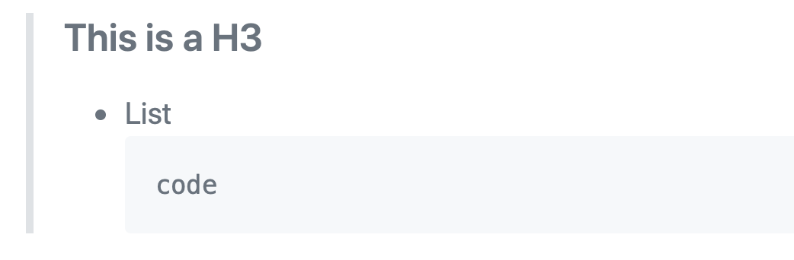

::: source
출처: 마크다운 작성법 (ihoneymon) — https://gist.github.com/ihoneymon/652be052a0727ad59601
:::

---

# Markdown 문법 - 순서있는 목록(번호)

* 순서있는 목록은 <span class="emph-green">숫자와 점(`1.`)</span> 을 사용한다
* 어떤 번호를 입력해도 렌더 시 <span class="emph-green">자동으로 1부터 차례대로</span> 매겨진다

::: columns
::: {.column width="48%" .demo-panel}
<div class="panel-head">소스</div>

```markdown
1. 첫째 항목
1. 둘째 항목
1. 셋째 항목
```
:::
::: {.column width="48%" .demo-panel}
<div class="panel-head">렌더 결과</div>

1. 첫째 항목
2. 둘째 항목
3. 셋째 항목
:::
:::

::: source
출처: 마크다운 작성법 (ihoneymon) — https://gist.github.com/ihoneymon/652be052a0727ad59601
:::

---

# Markdown 문법 - 순서없는 목록(글머리 기호)

* - + 등을 사용

혼합해서 사용하는 것도 가능

::right::

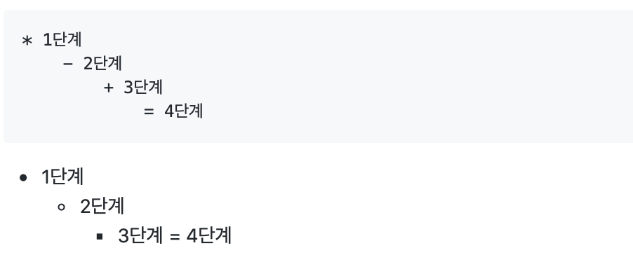

::: source
출처: 마크다운 작성법 (ihoneymon) — https://gist.github.com/ihoneymon/652be052a0727ad59601
:::

---

# Markdown 문법 - 수평선

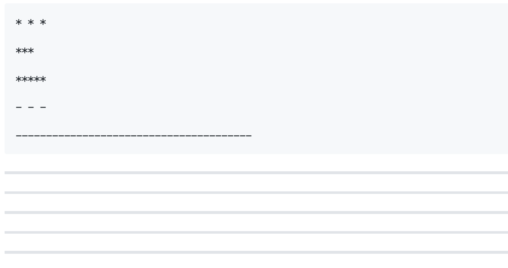

::: source
출처: 마크다운 작성법 (ihoneymon) — https://gist.github.com/ihoneymon/652be052a0727ad59601
:::

---

# Markdown 문법 - 링크

* 인라인 링크
  - [name](URL) : ex) [Google](http://google.com)
* 자동링크
  - `<http://example.com/>`
  - `<address@example.com>`


::: source
출처: 마크다운 작성법 (ihoneymon) — https://gist.github.com/ihoneymon/652be052a0727ad59601
:::

---

# Markdown 문법 - 강조

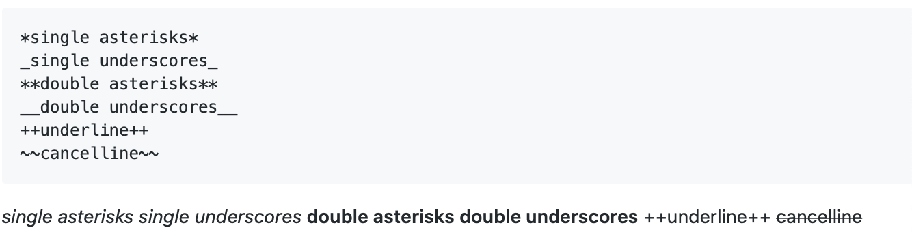

::: source
출처: 마크다운 작성법 (ihoneymon) — https://gist.github.com/ihoneymon/652be052a0727ad59601
:::

---

# Markdown 문법 - 코드,HTML 블록

```python
for i in range(10):
    print(i)
```

* 코드 블록 ( 언어명은 생략 가능)
* HTML 블록
  - Markdown에서 표현 안되는 것 표현할 때 사용

::right::

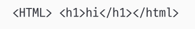

::: source
출처: 마크다운 작성법 (ihoneymon) — https://gist.github.com/ihoneymon/652be052a0727ad59601
:::

---

# Markdown 문법 - html삽입

::: columns
::: {.column width="50%"}
```markdown
|id|name |
|--|-----|
|1 |aaa  |
|2 |bbb  |
|3 |cccc |
```
:::
::: {.column width="50%"}
|id|name |
|--|-----|
|1 |aaa  |
|2 |bbb  |
|3 |cccc |
:::
:::

::: source
출처: 마크다운 작성법 (ihoneymon) — https://gist.github.com/ihoneymon/652be052a0727ad59601
:::

---

# Markdown 문법 - 이미지

* `![이미지명][URL]`

* ex)

    ``


::: source
출처: 마크다운 작성법 (ihoneymon) — https://gist.github.com/ihoneymon/652be052a0727ad59601
:::

---

# Markdown 문법 - 표

간단하게 사용 가능

cf) Atom의 atom-csv-markdown Package사용하면 csv를 간단하게 markdown table로 바꿀 수 있음.

```markdown
|id|name |
|--|-----|
|1 |aaa  |
|2 |bbb  |
|3 |cccc |
```

::right::

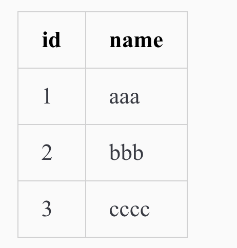

---

# MarkDown Editor

* 기존 고급 Editor의 플러그인 사용
  - Sublime Text, VsCode 등
* Web기반 Editor : https://stackedit.io/
* Markdown 문법을 지원 하는 웹페이지 사용
  - Jupyter Notebook의 Text
  - Github의 .md파일 편집
* 네이티브 앱
  - MacOS : Typora (https://www.typora.io)
  - Windows : Inkdrop (https://inkdrop.app)


::: source
출처: 마크다운 작성법 (ihoneymon) — https://gist.github.com/ihoneymon/652be052a0727ad59601
:::
