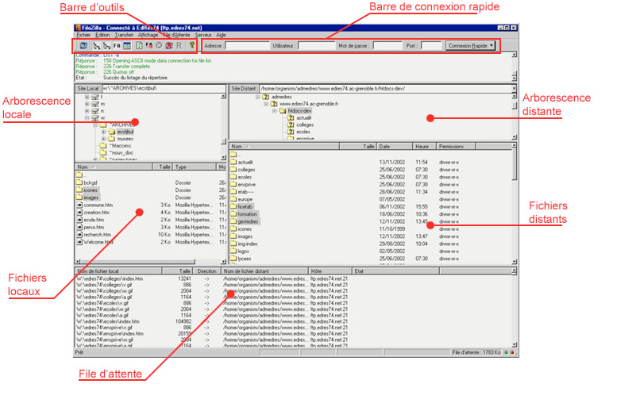
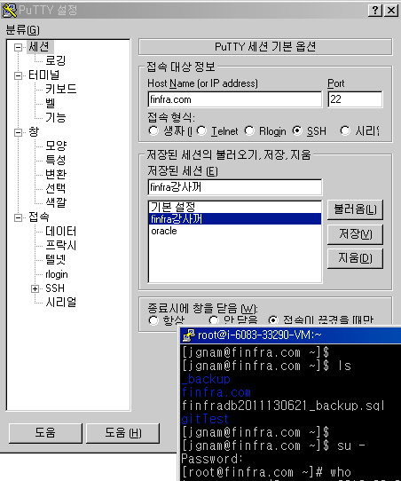

# 리눅스를 알아야 하는 이유

* 사용법이 UNIX와 유사
* 웹서비스 구현시 필요
* HTML5 고급기능 테스트시 필요
* 실전에서의 웹프로그래밍 구현
* 무료

---

# 윈도우에서 접속시

::: columns
::: {.column width="50%"}
* Putty.exe와 같은 ssh지원 어플 사용 접속
* file은 fileZillaftp사용
* upload(일명 sftp)
  - alftp,SublimeText의
  - sftp기능도 사용 가능

:::
::: {.column width="50%"}

:::
:::

---

# 명령어 및 유틸리티 리스트

::: columns
::: {.column width="33%"}
* **alias** — 명령어 별칭 지정
* **cat** — 파일 내용 출력·연결
* **cd** — 디렉토리 이동
* **chgrp** — 파일 그룹 소유자 변경
* **chmod** — 파일 권한 변경
* **chown** — 파일 소유자 변경
* **clear** — 터미널 화면 지우기
* **cp** — 파일·디렉토리 복사
* **date** — 날짜·시간 표시
:::
::: {.column width="33%"}
* **echo** — 문자열·변수 출력
* **head** — 파일 앞부분 출력
* **ls** — 디렉토리 목록 표시
* **man** — 명령어 매뉴얼 보기
* **mkdir** — 디렉토리 생성
* **more** — 파일 페이지 단위로 보기
* **mv** — 파일 이동·이름 변경
* **passwd** — 비밀번호 변경
* **pwd** — 현재 경로 출력
:::
::: {.column width="34%"}
* **rm** — 파일 삭제
* **rmdir** — 빈 디렉토리 삭제
* **ssh** — 원격 서버 접속
* **su** — 사용자 전환(관리자)
* **tail** — 파일 끝부분 출력
* **vi** — 텍스트 편집기
* **wget** — URL 파일 다운로드
* **which** — 명령어 실행 경로 찾기
* **who** — 로그인 사용자 표시
:::
:::

---

# 절대경로 이름과 상대경로 이름

* 절대경로 이름  : /로 시작
  * ex) /home, /etc,
* 상대경로 이름  : 현재 폴더를 기준
  * "." 현재 폴더 의미(생략시 /와 함께)
    * cd ./xx   == cd xx
  * ".." 상위 폴더를 의미
* 관련 명령어
  * cd  : Change Directory
  * pwd  : Parent Working Directory
  * ls  : LiSt
  * mkdir  : MaKe DIRectory
  * cp  : CoPy
  * mv  : MoVe
