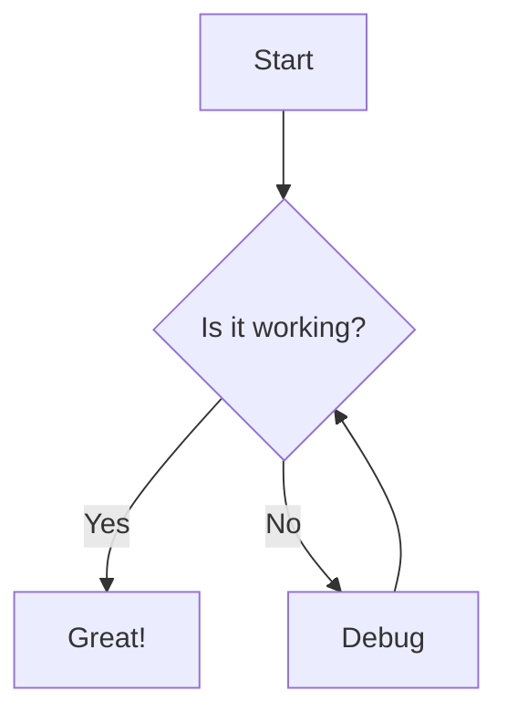

# 구성요소 라이브러리 테스트

이 프로젝트는 m2slide 시각화 라이브러리(수식·차트·아이콘·지도·인포그래픽)의 적용을 슬라이드 단위로 검증한다. Phase별로 슬라이드가 점증된다.

---

## Mermaid 다이어그램 (회귀 기준)

generic fenced 디스패처 신설 후에도 기존 mermaid 경로가 정상 동작하는지 확인하는 회귀 기준 슬라이드.



---

## 수식 (KaTeX)

블록 수식과 인라인 수식을 LaTeX로 작성한다.

$$E = mc^2$$

피타고라스 정리는 인라인으로 \(a^2 + b^2 = c^2\) 처럼 쓴다.

---

## 아이콘 (Font Awesome)

* 시작하기 :fa-rocket:
* 완료 표시 :fa-check-circle:
* 경고 :fa-triangle-exclamation:
* 코드 인라인 안의 `:fa-x:` 는 변환되지 않음

---

## 차트 (chart.js)

```chart
{
  "type": "bar",
  "data": {
    "labels": ["1세대", "2세대", "3세대"],
    "datasets": [{ "label": "도입률(%)", "data": [20, 55, 80] }]
  },
  "options": { "responsive": true }
}
```

---

## 지도 (Leaflet)

```map
{
  "center": [37.5665, 126.9780],
  "zoom": 11,
  "markers": [{ "coords": [37.5665, 126.9780], "popup": "서울" }]
}
```

---

## 인포그래픽 (d3)

데이텀마다 막대 + 값 라벨 + 범주 라벨을 묶어 그린다 — d3 고유의 커스텀 SVG 조립.

```d3
const data = [
  { label: '1세대', value: 20 },
  { label: '2세대', value: 55 },
  { label: '3세대', value: 80 }
];
const svg = d3.select(el).append('svg').attr('width', 480).attr('height', 220);
const g = svg.selectAll('g').data(data).enter().append('g')
  .attr('transform', (d, i) => `translate(${i * 150 + 30}, 0)`);
g.append('rect')
  .attr('y', d => 170 - d.value).attr('width', 110).attr('height', d => d.value)
  .attr('rx', 6).attr('fill', '#4a90d9');
g.append('text')
  .attr('x', 55).attr('y', d => 162 - d.value).attr('text-anchor', 'middle')
  .attr('font-weight', 'bold').text(d => d.value + '%');
g.append('text')
  .attr('x', 55).attr('y', 195).attr('text-anchor', 'middle')
  .attr('fill', '#555').text(d => d.label);
```

---

## Phase 진행 현황

* Phase 0 — 레지스트리 + generic 디스패처 인프라
* Phase 1 — 수식·아이콘·차트 ✅
* Phase 2 — 지도·인포그래픽 (본 슬라이드까지) ✅
