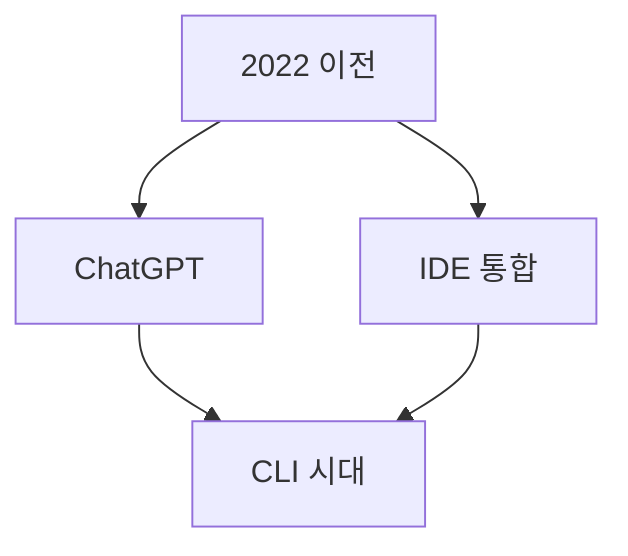
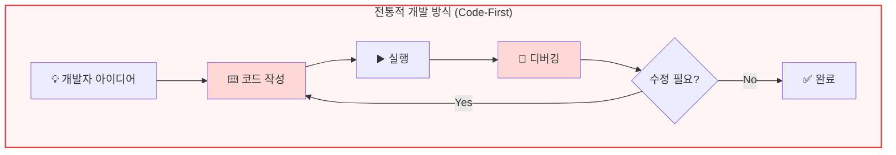
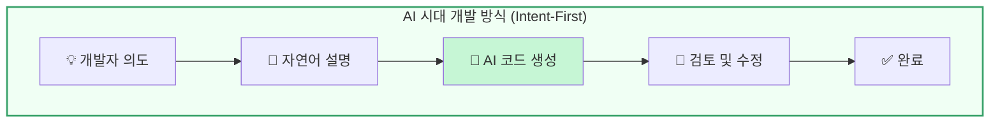

# 1. AI 코딩의 패러다임 전환

---

## 본 자료의 구성
- 작성자 : 남중구 ( [https://finfra.kr/nowage/](https://finfra.kr/nowage/) )
- 본 발표자료의 컨텐츠와 시각화 도구는 100% VibeCoding 도구로 작성되었습니다.
- 발표 자료 : https://finfra.kr/go/vibe2025
- ePub : https://finfra.kr/go/vibe2025e
- Source Code : https://finfra.github.io/m2slide

---

## 개발 방식의 변화

**2022년 이전**
- 개발자가 코드를 한 줄 한 줄 직접 타이핑
- Stack Overflow와 문서 검색에 의존
- 반복적인 코딩 작업에 많은 시간 소요
**2022년 ChatGPT 등장**
- 자연어로 질문하고 코드 조각을 얻는 방식 시작
- 개발 보조 도구로서 LLM 활용 증가

---

## 개발 방식의 변화 (계속)
**2023년 IDE 통합**
- GitHub Copilot, Cursor 등 IDE 내 실시간 코드 제안
- 개발 흐름을 끊지 않는 인라인 자동완성
- 프로젝트 컨텍스트를 일부 이해하기 시작

**2024년부터 CLI 기반 코딩 본격화**
- 터미널에서 실행되는 AI 도구 등장 (2024: Claude Code, 2025: Gemini CLI)
- AI가 전체 프로젝트를 이해하고 파일을 직접 수정
- 에이전트처럼 자율적으로 멀티파일 작업 수행

---

## 변화의 속도

- **ChatGPT**: 출시 후 2개월 만에 1억 사용자 돌파
- **생산성 향상**: GitHub Copilot 도입 기업의 개발자 생산성 55% 증가
- **시장 성장**: AI 코딩 도구 시장, 2024년 기준 연 100% 이상 성장

---

## 기술적 배경

**LLM 성능 향상**
- GPT-4, Claude 3.5 Sonnet 등 강력한 모델 등장
- 코드 이해 및 생성 능력 비약적 발전

**컨텍스트 윈도우 확대**
- 초기 4K 토큰 → 현재 200K 토큰 이상
- 전체 코드베이스를 한 번에 이해 가능

**개발 도구 통합**
- IDE, CLI, 에디터와의 원활한 연동
- 파일 시스템 직접 접근 및 수정 가능

---

## 패러다임 전환: Code-First → Intent-First

**전통적 개발 방식 (Code-First)**

- 모든 코드를 개발자가 직접 작성
- 문법과 API 세부사항 암기 필요
- 반복적인 보일러플레이트 코드 작성
- 디버깅 사이클이 길고 반복적

**AI 시대 개발 방식 (Intent-First)**

- "무엇을" 만들지 설명하면 AI가 "어떻게" 구현
- 고수준 설계와 비즈니스 로직에 집중
- 반복 작업 자동화로 생산성 향상
- 검토와 품질 관리에 집중

---

## 개발자 역할의 변화

| 구분      | 전통적 개발    | AI 시대 개발     |
| --------- | -------------- | ---------------- |
| 주요 역할 | 코드 작성자    | 의도 설계자      |
| 필요 역량 | 문법 전문가    | 아키텍처 설계자  |
| 작업 방식 | 디버깅 중심    | 품질 검토 중심   |
| 시간 배분 | 반복 작업 수행 | 창의적 문제 해결 |

---

## 핵심 인사이트

> 개발자는 더 이상 "코드 타이핑 기계"가 아닌
> **"시스템 설계자이자 품질 관리자"**로 진화하고 있습니다.

- **반복 작업 자동화**: 보일러플레이트, CRUD, 테스트 코드 등
- **창의성 증대**: 비즈니스 로직과 사용자 경험 개선에 집중
- **생산성 향상**: 같은 시간에 더 많은 가치 창출

