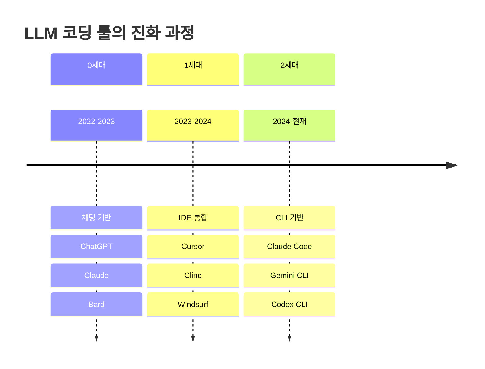

# 2. LLM 코딩 툴의 진화 과정

---

## 진화 타임라인

---

## 진화의 핵심 동인

**기술적 발전**

**LLM 성능 향상**
- GPT-3.5 → GPT-4 → Claude 3.5 Sonnet
- 코드 이해 및 생성 능력 비약적 향상

**컨텍스트 윈도우 확대**
- 초기 (GPT-3.5): 4K 토큰
- 중기 (GPT-4): 32K → 128K 토큰
- 현재 (Claude 3.5): 200K 토큰 이상
- 전체 코드베이스를 한 번에 이해 가능

---

## 진화의 핵심 동인 (계속)

**도구 사용 능력 (Function Calling)**
- AI가 직접 API 호출
- 파일 시스템 조작
- 명령어 실행

**사용자 니즈 변화**
- 더 빠른 개발 속도 요구
- 더 적은 반복 작업 원함
- 더 높은 코드 품질 기대

---
## 세대별 대표 도구

  
  

  
  

**0세대 (채팅 기반)**
**1세대 (IDE 통합)**
**2세대 (CLI 기반)**

---
## 세대별 비교 요약

| 특징          | 0세대 (채팅) | 1세대 (IDE) | 2세대 (CLI) |
| ------------- | ---------------- | --------------- | --------------- |
| **시기**      | 2022-2023        | 2023-2024       | 2024-현재       |
| **환경**      | 웹 브라우저      | IDE 통합        | CLI/서버        |
| **컨텍스트**  | 대화 내용        | 현재 파일       | 프로젝트 전체   |
| **작업 범위** | 코드 조각        | 단일 파일       | 멀티파일        |
| **자동화**    | 없음             | 부분적          | 전면적          |
| **생산성**    | 낮음             | 중간            | 높음            |

---

## 미래 전망

**다음 진화 단계**

- **완전 자율 개발**: 요구사항만으로 전체 애플리케이션 생성
- **팀 협업 에이전트**: 여러 AI 에이전트가 역할 분담하여 협업
- **지속적 학습**: 프로젝트별 코딩 스타일 학습 및 적응
- **실시간 코드 리뷰**: AI가 실시간으로 코드 품질 검증

---

## 개발자 역할의 변화

기술의 진화와 함께 개발자의 역할도 진화:

| 기존        | 새로운 역할    |
| ----------- | -------------- |
| 코드 작성자 | 시스템 설계자  |
| 구현 전문가 | 품질 관리자    |
| 타이핑 중심 | 의도 전달 중심 |
