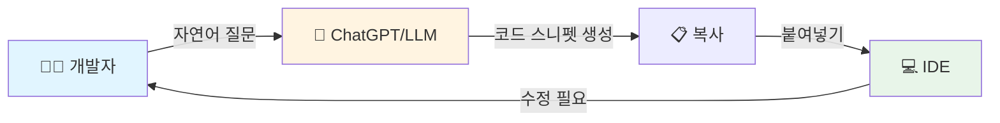

# 2.1 초기: 채팅 기반 시대 (2022-2023)

---

## 0세대: 채팅 기반 시대 (2022-2023)

**2022년 11월 ChatGPT 출시**
* 개발자들이 AI와 상호작용하는 방식의 근본적 변화

**대표 툴**
* ChatGPT (OpenAI)
* Bard (Google)
* Claude (Anthropic)

---

## 0세대: 작동 방식

**워크플로우**

---

## 0세대: 특징

**장점**
* 순수 대화형 인터페이스
* 웹 브라우저 기반으로 접근 용이

**한계**
* 프로젝트 컨텍스트 단절
* 복사-붙여넣기 반복 작업
* 파일 간 의존성 파악 불가
* 멀티파일 작업 불가능

---

## 0세대: 의미

> AI가 코드를 작성할 수 있다는 개념을 대중화시킨
> **혁명적 시작점**

* 코드 조각 중심의 도움
* 학습 도구로서의 가치
* 다음 세대를 위한 토대
