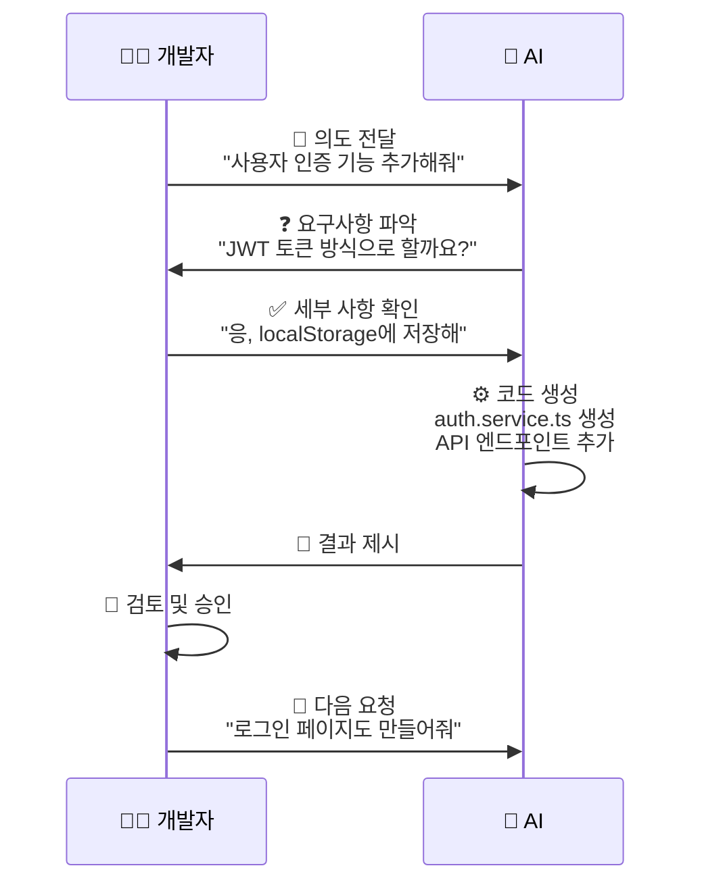

# 3. 바이브 코딩(VibeCoding) 개념과 철학

---

## 바이브 코딩이란?

**자연어로 의도를 전달**하면
AI가 **실제 개발 환경에서 직접 코드를 작성하고 수정**하는
새로운 개발 방식

---

## 핵심 개념

> "느낌(Vibe)만 전달하면 AI가 알아서 코딩한다"

**Vibe**: 개발자의 의도, 느낌, 요구사항
**Coding**: AI가 실제 코드로 구현

단순 코드 생성을 넘어
**개발 환경 전체와 통합**되어
파일을 직접 수정하고, 테스트를 실행하며, 오류를 수정

---

## 바이브 코딩의 핵심 원칙

**Intent-First Programming (의도 우선 프로그래밍)**

```
전통적 개발: "어떻게(How)" 구현할지 고민
바이브 코딩: "무엇을(What)" 만들지만 설명
```

**예시**
```
❌ "useState를 사용해서 counter 변수를 만들고..."
✅ "카운터 기능이 있는 컴포넌트 만들어줘"
```

---

## 바이브 코딩의 핵심 원칙 (계속)

**Human-in-the-Loop Verification (인간 검증 루프)**

```
AI 코드 생성 → 개발자 검토 → 승인/수정 → 다음 단계
```

- AI가 빠르게 구현
- 개발자가 품질 검증
- 안전하고 신뢰할 수 있는 결과

---

## 바이브 코딩의 핵심 원칙 (계속)

**Context-Aware Development (컨텍스트 인식 개발)**

AI가 프로젝트 전체를 이해하고 작업:
- 기존 코드 스타일 학습
- 파일 간 의존성 파악
- 프로젝트 규칙 준수

---

## 철학

**"개발자는 창조자, AI는 실행자"**

**개발자의 역할**
- 문제 정의
- 요구사항 명세
- 아키텍처 설계
- 품질 검증

**AI의 역할**
- 반복 작업 자동화
- 보일러플레이트 코드 생성
- 테스트 코드 작성
- 문서화

---

## 바이브 코딩 워크플로우


---

## 왜 "바이브"인가?

**직관성**
- 정확한 문법이 아닌 **느낌**만 전달
- "이런 느낌으로 만들어줘" 같은 추상적 요청도 가능

**자연스러움**
- 마치 동료와 대화하듯 편안하게 요청
- 딱딱한 명령어가 아닌 자연어 사용

**유연성**
- 완벽한 명세가 아니어도 작동
- AI가 불명확한 부분은 질문하며 보완

---

## 바이브 코딩의 핵심 가치

**생산성 향상**
- 반복 작업 제거
- 빠른 프로토타이핑
- 신속한 이터레이션

**창의성 증대**
- 구현 세부사항에서 해방
- 비즈니스 로직에 집중
- 더 많은 실험 가능

---

## 바이브 코딩의 핵심 가치 (계속)

**진입 장벽 낮춤**
- 초보 개발자도 복잡한 기능 구현 가능
- 새로운 기술 스택 빠르게 학습
- 모범 사례 자동 적용

**품질 향상**
- 일관된 코드 스타일
- 자동 테스트 생성
- 보안 모범 사례 적용

---

## 바이브 코딩 vs 전통 코딩

**개발 프로세스 비교**

**전통 코딩**
```
요구사항 분석 (1시간)
기술 스택 조사 (2시간)
아키텍처 설계 (3시간)
코드 작성 (10시간)
테스트 작성 (4시간)
디버깅 (5시간)
문서화 (2시간)
───────────────
총 27시간
```

---

## 바이브 코딩 vs 전통 코딩 (계속)

**바이브 코딩**
```
요구사항 분석 (1시간)
AI와 대화하며 구현 (3시간)
코드 검토 및 수정 (2시간)
테스트 검토 (1시간)
문서 검토 (30분)
───────────────
총 7.5시간
```

**시간 절감**: 약 **70%**

---

## 주의사항

**AI가 못하는 것**
- 비즈니스 요구사항 파악
- 최적의 아키텍처 선택
- 보안 취약점 완벽한 식별
- 복잡한 알고리즘 최적화

**개발자가 해야 할 것**
- 요구사항 명확히 정의
- AI 생성 코드 검토
- 아키텍처 의사결정
- 최종 품질 책임

---

## 바이브 코딩의 성공 조건

**명확한 의도 전달**

❌ 나쁜 예: "뭔가 좋은 거 만들어줘"

✅ 좋은 예:
```
"사용자가 상품을 장바구니에 담고,
결제할 수 있는 기능을 만들어줘.
결제는 토스페이먼츠 API를 사용하고,
주문 내역은 데이터베이스에 저장해줘."
```

---

## 바이브 코딩의 성공 조건 (계속)

**적절한 검증**
- 생성된 코드를 **반드시 읽고 이해**
- 테스트 실행으로 **동작 확인**
- 보안 취약점 **수동 검토**

**점진적 개발**
```
큰 기능을 한 번에 요청 (X)
작은 단위로 나누어 요청 (O)
각 단계마다 검증
다음 단계 진행
```

---

## 바이브 코딩의 성공 조건 (계속)

**Git 활용**

```bash
# 자주 커밋하여 롤백 가능성 확보
git add .
git commit -m "AI: 사용자 인증 기능 추가"
```

---

## 바이브 코딩이 가져온 변화

**개발 문화의 변화**

**Before**
- 코드 라인 수가 생산성 지표
- 타이핑 속도가 중요
- "어떻게" 구현할지 고민

**After**
- 구현한 기능이 생산성 지표
- 문제 정의 능력이 중요
- "무엇을" 만들지 고민

---

## 바이브 코딩이 가져온 변화 (계속)

**학습 방식의 변화**

**Before**
- 문서 읽기 → 예제 따라하기 → 숙달
- 수개월의 학습 곡선

**After**
- AI에게 질문 → 즉시 구현 → 코드 이해
- 수일의 학습 곡선

---

## 바이브 코딩이 가져온 변화 (계속)

**팀 협업의 변화**

**Before**
- 시니어 개발자의 코드 리뷰 대기
- 구현 방법에 대한 긴 논의

**After**
- AI가 1차 구현 → 시니어가 설계 검토
- 비즈니스 로직에 집중한 논의
