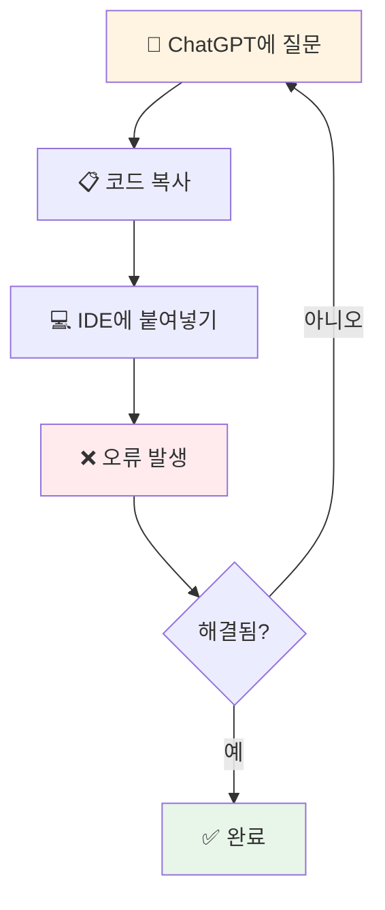
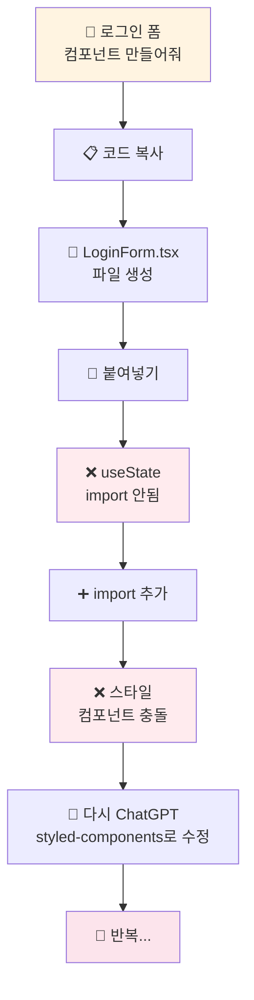

# 3.1 채팅 기반의 한계

---

## 채팅 기반의 한계

**전통적인 ChatGPT 방식의 워크플로우**

---

## 채팅 기반의 주요 한계

**컨텍스트 단절**
* 프로젝트 구조를 AI가 모름
* 파일 간 의존성 무시
* 기존 코드 스타일 불일치

**복사-붙여넣기 지옥**
* 코드 복사 → IDE 전환 → 붙여넣기 → 들여쓰기 수정
* import 문 추가 → 오류 확인 → 다시 ChatGPT로...

---

## 구체적 사례: React 컴포넌트

**ChatGPT 방식**

**소요 시간**: 약 15-20분

---

## 생산성 차이

| 작업 | ChatGPT | 바이브 코딩 | 차이 |
|------|---------|-----------|------|
| 컴포넌트 생성 | 15분 | 3분 | **5배** |
| 버그 수정 | 20분 | 5분 | **4배** |
| 리팩토링 | 30분 | 8분 | **3.7배** |
| 테스트 작성 | 25분 | 7분 | **3.5배** |
