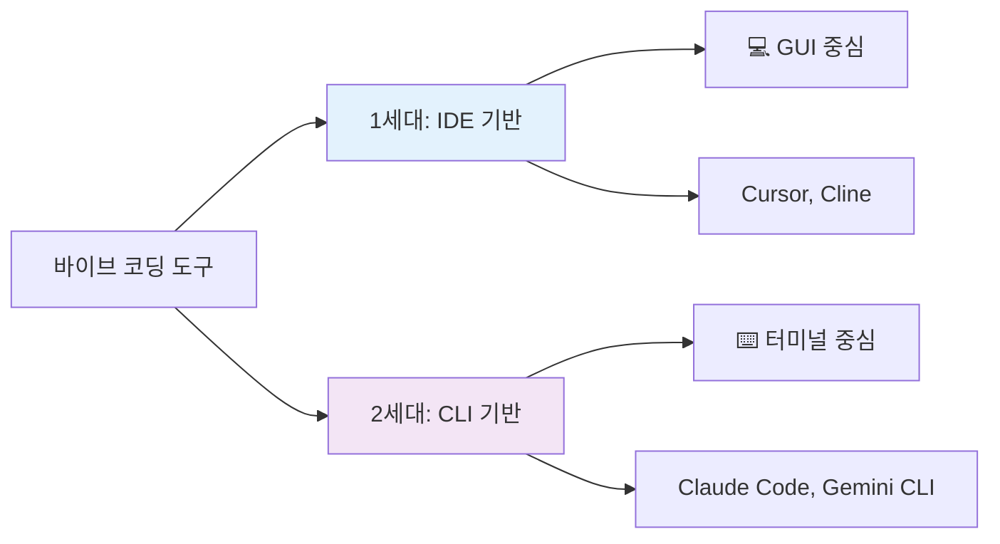

# 4. 바이브 코딩 세대 구분

---

## 세대 구분의 기준

바이브 코딩 도구는 **실행 환경**과 **작업 방식**에 따라
크게 두 세대로 구분

---

## 세대별 핵심 차이

| 구분 | 1세대 (IDE) | 2세대 (CLI) |
|------|------------|------------|
| **실행 환경** | IDE 내부 | 터미널 |
| **인터페이스** | GUI | CLI |
| **메모리 사용** | 높음 (8GB+) | 낮음 (<1GB) |
| **병렬 작업** | 제한적 | 무제한 |
| **실행 위치** | 로컬 | 서버/클라우드 |
| **자동화** | 제한적 | 완전 자동화 |

---

## 세대별 핵심 차이 (계속)

| 구분 | 1세대 (IDE) | 2세대 (CLI) |
|------|------------|------------|
| **DevOps** | 부분 지원 | 완전 지원 |
| **학습 난이도** | 쉬움 | 중간 |
| **진입 장벽** | 낮음 | 중간 |

---

## 하이브리드 활용

**프론트엔드 개발**
* 1세대 (Cursor): UI 컴포넌트 작성 및 스타일링
* 2세대 (Claude Code): 빌드 설정 및 배포 자동화

**풀스택 개발**
* 1세대 (Cline): 프론트엔드와 API 개발
* 2세대 (Gemini CLI): 인프라 구성 및 CI/CD

---

## 하이브리드 활용 (계속)

**DevOps/인프라**
* 2세대 주력: Terraform, Ansible 코드 생성
* 1세대 보조: 스크립트 디버깅 시 시각적 확인

---

## 팀 협업

**주니어 개발자**
* 1세대로 시작하여 기본 익히기
* 점진적으로 2세대 도입

**시니어 개발자**
* 2세대로 생산성 극대화
* 주니어 지도 시 1세대 활용

---

## 선택 가이드

**1세대를 선택해야 할 때**
* 처음 바이브 코딩 시작하는 경우
* GUI 환경이 익숙한 경우
* 프론트엔드 개발 중심
* 시각적 피드백이 중요한 작업
* 로컬 환경에서만 작업

---

## 선택 가이드 (계속)

**2세대를 선택해야 할 때**
* 터미널 작업이 익숙한 경우
* 여러 프로젝트 동시 관리
* DevOps/인프라 자동화
* 원격 서버 작업
* 스크립트 자동화 필요
* 로컬 리소스 절약 필요

---

## 선택 가이드 (계속)

**두 가지 모두 사용**
* 풀스택 개발자
* 대규모 프로젝트
* 팀 협업 환경
* 다양한 워크플로우
