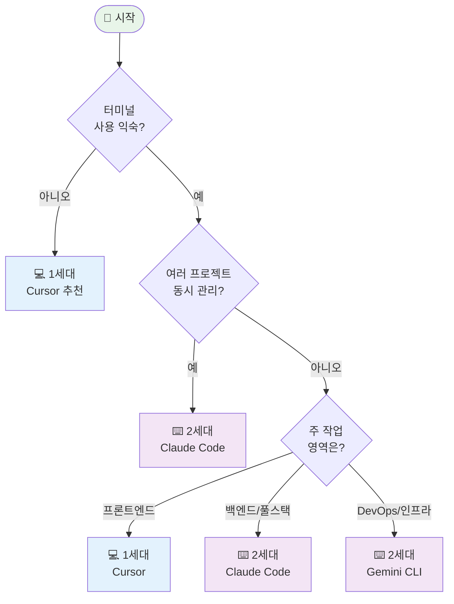

# 5. 세대별 비교 및 선택 가이드

---

## 종합 비교 테이블

| 기능 | ChatGPT<br/>(0세대) | Copilot<br/>(0.5세대) | Cursor/Cline<br/>(1세대) | Claude Code/CLI<br/>(2세대) |
|------|----|----|----|----|
| **인터페이스** | 웹 | IDE 인라인 | IDE 통합 | CLI 터미널 |
| **코드 제안** | 복사-붙여넣기 | 실시간 자동완성 | 멀티라인 | 멀티파일 |
| **파일 편집** | 불가 | 단일 파일 | 멀티파일 (제한적) | 멀티파일 (완전) |
| **프로젝트 이해** | 없음 | 현재 파일만 | 프로젝트 전체 | 프로젝트 + 히스토리 |
| **명령 실행** | 불가 | 불가 | 제한적 | 완전 가능 |
| **자동화** | 없음 | 코드 제안만 | 제한적 | 완전 자동화 |
| **Git 통합** | 없음 | 기본 | IDE 통합 | 완전 통합 |
| **비용** | 무료/유료 | $10/월 | $20/월 | $20/월 |
| **학습 곡선** | 낮음 | 낮음 | 중간 | 중간-높음 |

---

## 사용 시나리오별 비교: 웹 개발

| 시나리오 | 1세대 추천 | 2세대 추천 | 이유 |
|---------|----------|----------|------|
| React 컴포넌트 작성 | ✅ Cursor | - | 시각적 프리뷰 필요 |
| API 엔드포인트 개발 | - | ✅ Claude Code | 멀티파일 + 테스트 |
| 전체 페이지 구현 | ✅ Cursor | - | UI 피드백 중요 |
| 백엔드 로직 | △ | ✅ Claude Code | 복잡한 비즈니스 로직 |
| DB 마이그레이션 | - | ✅ Gemini CLI | 스크립트 자동화 |

---

## 사용 시나리오별 비교: DevOps/인프라

| 시나리오 | 1세대 추천 | 2세대 추천 | 이유 |
|---------|----------|----------|------|
| Dockerfile 작성 | △ | ✅ Claude Code | 빌드 + 테스트 |
| Kubernetes 설정 | - | ✅ Gemini CLI | YAML 다중 파일 |
| CI/CD 파이프라인 | - | ✅ Claude Code | 스크립트 자동화 |
| 인프라 모니터링 | - | ✅ Gemini CLI | 서버 작업 |
| Terraform 코드 | △ | ✅ Claude Code | 멀티파일 관리 |

---

## 프로필별 추천

**초보 개발자 (경력 < 1년)**
```
추천: 1세대 (Cursor)

이유:
- GUI 환경이 직관적
- 시각적 피드백으로 학습 효과
- 코드 변경사항 쉽게 확인
```

---

## 프로필별 추천 (계속)

**주니어 개발자 (경력 1-3년)**
```
추천: 1세대 → 1+2세대 병행

경로:
1. Cursor로 시작
2. 터미널 익숙해지면 Claude Code 추가
3. 프론트는 Cursor, 백엔드는 Claude Code
```

---

## 프로필별 추천 (계속)

**중급 개발자 (경력 3-5년)**
```
추천: 2세대 (Claude Code) 주력

이유:
- 생산성 극대화
- 멀티 프로젝트 관리
- 자동화 워크플로우 구축
```

---

## 프로필별 추천 (계속)

**시니어 개발자 (경력 5년+)**
```
추천: 2세대 + 1세대 보조

전략:
- Claude Code로 대부분 작업
- 복잡한 UI는 Cursor로 시각 확인
- 팀 전체의 워크플로우 최적화
```

---

## 프로필별 추천 (계속)

**DevOps 엔지니어**
```
추천: 2세대 (Gemini CLI/Claude Code)

이유:
- 인프라 자동화 필수
- 서버 환경 작업
- 스크립트 기반 작업
```

**프론트엔드 전문가**
```
추천: 1세대 (Cursor) 주력

이유:
- UI 프리뷰 필수
- 디자인 시스템 작업
- 브라우저 DevTools 활용
```

---

## 의사결정 트리



---

## 비용 vs 효과 분석

**월간 비용 (2024년 기준)**

| 도구 | 비용 | 특징 |
|------|------|------|
| ChatGPT Plus | $20 | 기본 채팅 |
| GitHub Copilot | $10 | 코드 자동완성 |
| Cursor Pro | $20 | IDE 통합 |
| Claude Code | $20 | CLI 기반 |
| Gemini Advanced | $20 | CLI + 다른 서비스 |

---

## ROI 분석

**예시: 중급 개발자 (월 기준)**

```
기존 작업 시간: 160시간/월
바이브 코딩 도입 후: 100시간/월 (37% 절감)
절감 시간: 60시간/월

개발자 시급 (평균): $50
절감 비용: 60시간 × $50 = $3,000/월
도구 비용: $20/월

ROI: ($3,000 - $20) / $20 × 100 = 14,900%
```

---

## 전환 비용

**1세대 → 2세대 전환**
- 학습 시간: 약 1주일
- 생산성 회복: 2-3주
- 총 전환 비용: 약 20-30시간

**예상 회수 기간**: 첫 달 내 회수 가능

---

## 팀 도입 전략

**상세 팀 규모별 도입 전략은 7장 참조**

**빠른 가이드**:
- 소규모 (1-5명): 개인 선택 존중, 경험 공유
- 중형 (6-20명): 역할별 표준화
- 대형 (20명+): 공식 도구 선정, 전담 교육

---

## 시작 가이드

**상세 학습 로드맵은 7장 참조**

**Week 1-2**: Cursor로 시작
**Month 1**: 실전 프로젝트 적용
**Month 2+**: 고급 기능 및 2세대 도구 시도

---

## 생산성 극대화 팁

**상세 실전 팁은 6장 참조**

**1세대**: 단축키, Composer 모드, diff 확인
**2세대**: 명확한 요구사항, 작은 단위 분할, Git 커밋

---

## 마이그레이션 가이드

**ChatGPT → Cursor**
- 준비: VSCode 경험, Git 기초
- 적응 기간: 1-2일

**Cursor → Claude Code**
- 준비: 터미널 명령어, Git 중급, API 키
- 적응 기간: 1주일

**상세 도입 가이드는 7장 참조**

---

## 자주 묻는 질문

**상세 Q&A는 8장 참조**

**핵심 질문**:
- 두 도구 동시 사용 가능? → 권장
- 무료 대안? → ChatGPT, Cline
- 회사 도입? → 파일럿 프로젝트부터
- 보안? → 민감 정보 공유 금지, 기업용 라이선스 고려
