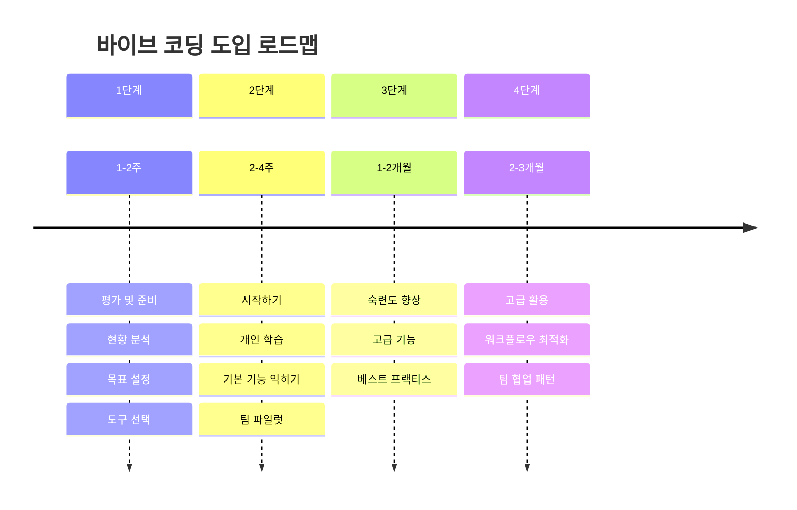
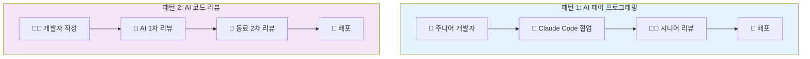
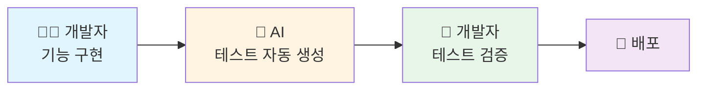
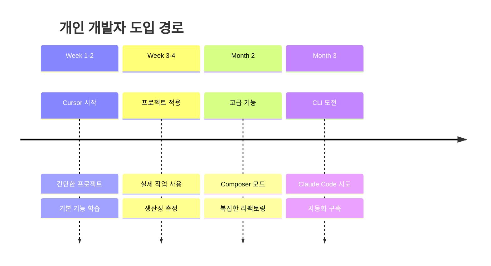

# 7. (참고) 바이브 코딩 도입 로드맵

---

## 도입 단계별 가이드



---

## 1단계: 평가 및 준비 (1-2주)

**현황 분석 체크리스트**
```
□ 현재 개발 프로세스 파악
□ 팀원 기술 스택 확인
□ 예산 및 리소스 검토
□ 보안 정책 확인
□ 법적 검토 (필요시)
```

---

## 1단계: 목표 설정

**단기 목표 (1-3개월)**
* 개인 생산성 향상

**중기 목표 (3-6개월)**
* 팀 전체 적용

**장기 목표 (6-12개월)**
* 워크플로우 최적화

---

## 1단계: 도구 선택

| 선택 기준 | 1세대 추천 | 2세대 추천 |
|----------|----------|----------|
| 팀 대부분이 초보자 | Cursor | - |
| CLI 사용 익숙 | - | Claude Code |
| 프론트엔드 중심 | Cursor | - |
| DevOps/백엔드 중심 | - | Claude Code |
| 제한된 예산 | Cline (무료) | - |

---

## 2단계: 시작하기 (2-4주)

**개인 학습 (Week 1-2)**

**Day 1-3: 기본 설정**
```
□ 도구 설치 및 설정
□ API 키 발급
□ 첫 번째 프롬프트 실행
□ 간단한 Hello World 생성
```

---

## 2단계: 기본 기능 익히기

**Day 4-7: 기본 기능**
```
□ 코드 생성 요청 연습
□ 파일 수정 요청
□ 오류 수정 요청
□ Git 통합 사용
```

**Day 8-14: 실전 적용**
```
□ 사이드 프로젝트에 적용
□ 작은 기능 구현
□ 코드 리뷰 습관 형성
□ 베스트 프랙티스 학습
```

---

## 2단계: 팀 파일럿 (Week 3-4)

**파일럿 프로그램**
```
1. 파일럿 그룹 선정 (2-3명)
2. 작은 프로젝트/기능 선택
3. 1주일 집중 사용
4. 결과 측정 및 공유
```

**측정 지표**
* 개발 시간 변화
* 코드 품질 변화
* 버그 발생률
* 팀원 만족도

---

## 3단계: 숙련도 향상 (1-2개월)

**1세대 (IDE) 고급 기법**
```
□ Composer 모드 마스터
□ @mentions 활용
□ 멀티파일 리팩토링
□ 커스텀 프롬프트 템플릿
□ IDE 단축키 최적화
```

---

## 3단계: 고급 기능 (계속)

**2세대 (CLI) 고급 기법**
```
□ 복잡한 프롬프트 작성
□ 쉘 스크립트 통합
□ CI/CD 파이프라인 연동
□ 자동화 워크플로우 구축
□ 멀티 프로젝트 관리
```

---

## 3단계: 팀 베스트 프랙티스

**가이드라인 수립**

**프롬프트 작성 규칙**
* 명확하고 구체적으로
* 기술 스택 명시
* 예상 결과 설명

**코드 리뷰 프로세스**
* AI 생성 코드는 반드시 리뷰
* 보안 체크리스트 적용
* 테스트 코드 필수

---

## 3단계: Git 커밋 규칙

```bash
# AI 작업 후 즉시 커밋
git add .
git commit -m "AI: 사용자 인증 기능 추가"

# 커밋 메시지에 "AI:" 접두사
# 정기적인 푸시
```

---

## 4단계: 고급 활용 (2-3개월)

**워크플로우 최적화**

**자동화 파이프라인**
```yaml
name: AI-Powered CI

on: [push]

jobs:
  ai-review:
    runs-on: ubuntu-latest
    steps:
      - uses: actions/checkout@v2
      - name: AI Code Review
        run: |
          claude << EOF
          코드 품질 분석해줘
          보안 취약점 찾아줘
          테스트 커버리지 확인해줘
          EOF
```

---

## 4단계: 팀 협업 패턴



---

## 4단계: 협업 패턴 (계속)

**패턴 3: AI 테스트 생성**



---

## 개인 개발자 도입 전략



**예산**: $20/월 | **예상 ROI**: 첫 달부터 시간 절약

---

## 소규모 팀 (2-5명) 도입

**Phase 1: 파일럿 (2주)**
```
* 1-2명 선발
* Cursor로 시작
* 작은 기능 구현
* 성과 측정
```

**Phase 2: 확대 (4주)**
```
* 전체 팀 적용
* 내부 가이드 작성
* 주간 공유 세션
* 문제 해결 협력
```

---

## 소규모 팀 (계속)

**Phase 3: 최적화 (2개월)**
```
* 팀 워크플로우 정립
* 베스트 프랙티스 문서화
* CLI 도구 도입 검토
* 자동화 구축
```

**예산**: $20/월 × 5명 = $100/월
**예상 ROI**: 2-3개월 내 회수

---

## 중형 팀 (6-20명) 도입

**Q1: 파일럿 프로그램**
```
* 부서별 1-2명 선발 (총 3-5명)
* 2개월 집중 사용
* 상세 데이터 수집
* 성과 발표
```

**Q2: 부서별 확대**
```
* 각 부서 50% 도입
* 부서별 챔피언 지정
* 내부 교육 프로그램
* Slack 채널 운영
```

---

## 중형 팀 (계속)

**Q3: 전사 확대**
```
* 전체 개발팀 적용
* 공식 가이드라인 수립
* 라이선스 협상
* KPI 모니터링
```

**Q4: 고도화**
```
* CI/CD 통합
* 자동화 파이프라인
* 커스텀 워크플로우
* 지속적 개선
```

**예산**: $20/월 × 20명 = $400/월
**협상 팁**: 10명 이상은 단체 할인 문의

---

## 대규모 조직 (20명+) 도입

**준비 단계 (1-2개월)**
```
□ 경영진 승인
□ 법무/보안 검토
□ 예산 확보
□ 전담 TF 구성
□ 벤더 협상
```

**파일럿 (3개월)**
```
□ 3개 팀 선정
□ 각 팀 다른 도구 테스트
□ 상세 데이터 수집
□ ROI 분석
□ 보안 감사
```

---

## 대규모 조직 (계속)

**확대 (6개월)**
```
□ 우선순위 부서부터
□ 단계적 롤아웃
□ 전담 교육팀 운영
□ 내부 지원 체계
□ 정기 피드백
```

**안정화 (6-12개월)**
```
□ 전사 표준화
□ 자동화 고도화
□ 성과 측정 체계
□ 지속적 개선
```

---

## 주의사항

**피해야 할 것**

❌ **맹신하지 않기**
* AI 코드를 무조건 신뢰하지 말 것
* 항상 코드 리뷰 필수
* 보안 취약점 수동 검증

❌ **과도한 의존**
* 기본 코딩 스킬 유지
* 알고리즘 이해도 중요
* 문제 해결 능력 계속 연마

---

## 주의사항 (계속)

❌ **민감 정보 공유**
* API 키, 비밀번호 절대 입력 금지
* 고객 데이터 공유 금지
* 회사 내부 정보 주의

❌ **한 번에 너무 많이**
* 점진적 도입이 핵심
* 작은 성공부터 쌓기
* 팀원 속도 맞추기

---

## 권장사항

✅ **코드 리뷰 문화**
* 모든 AI 생성 코드 리뷰
* 페어 프로그래밍 활용
* 정기적인 품질 검토

✅ **지속적 학습**
* 최신 도구 동향 파악
* 새로운 기법 실험
* 팀 내 지식 공유

---

## 권장사항 (계속)

✅ **데이터 기반 의사결정**
* 생산성 지표 측정
* 정기적인 회고
* 개선 사항 문서화

✅ **보안 우선**
* 정기 보안 감사
* 민감 정보 보호 규칙
* 접근 권한 관리

---

## 성공 체크리스트

**1개월 후**
* [ ] 기본 기능 숙달
* [ ] 실제 프로젝트 적용
* [ ] 생산성 20% 향상
* [ ] 팀원 1명 이상 동참

**3개월 후**
* [ ] 고급 기능 활용
* [ ] 생산성 40% 향상
* [ ] 팀 워크플로우 정립
* [ ] 베스트 프랙티스 문서화

---

## 성공 체크리스트 (계속)

**6개월 후**
* [ ] 전체 팀 적용
* [ ] 자동화 파이프라인 구축
* [ ] 생산성 50%+ 향상
* [ ] ROI 명확히 입증

---

## 다음 단계

**지금 바로 시작**
1. 오늘부터 작은 프로젝트에 적용
2. 팀과 공유: 성공 경험 공유하여 동기 부여
3. 지속적 개선: 계속해서 새로운 방법 탐색
4. 커뮤니티 참여: 다른 개발자들과 경험 교류
