# Text Samples
---
## 짧은글 ABC abc
* hi
* hello
  - hi
---
## 긴글
* hihihihihihihihihihihihihihihi hihihihihihihihihihihihihihihi hihihihihihihihihihihihihihihi hihihihihihihihihihihihihihihi hihihihihihihihihihihihihihihi hihihihihihihihihihihihihihihi hihihihihihihihihihihihihihihi hihihihihihihihihihihihihihihi hihihihihihihihihihihihihihihi hihihihihihihihihihihihihihihi 
* hello
- hihihihihihihihihihihihihihihihi hihihihihihihihihihihihihihihi hihihihihihihihihihihihihihihi hihihihihihihihihihihihihihihi hihihihihihihihihihihihihihihi hihihihihihihihihihihihihihihi hihihihihihihihihihihihihihihi hihihihihihihihihihihihihihihi  hihi hihihih ihihihihihi hihihi hello
- hihihihihihihihihihihihihihihihi hihihihihihihihihihihihihihihi hihihihihihihihihihihihihihihi hihihihihihihihihihihihihihihi hihihihihihihihihihihihihihihi hihihihihihihihihihihihihihihi hihihihihihihihihihihihihihihi hihihihihihihihihihihihihihihi  hihi hihihih ihihihihihi hihihi hello

---

# Mermaid Samples
---
## Paragraph and Diagram
Lorem ipsum dolor sit amet, consectetur adipiscing elit. Sed do eiusmod tempor incididunt ut labore et dolore magna aliqua. Ut enim ad minim veniam, quis nostrud exercitation ullamco laboris nisi ut aliquip ex ea commodo consequat. Duis aute irure dolor in reprehenderit in voluptate velit esse cillum dolore eu fugiat nulla pariatur. Excepteur sint occaecat cupidatat non proident, sunt in culpa qui officia deserunt mollit anim id est laborum.

Lorem ipsum dolor sit amet, consectetur adipiscing elit. Sed do eiusmod tempor incididunt ut labore et dolore magna aliqua. Ut enim ad minim veniam, quis nostrud exercitation ullamco laboris nisi ut aliquip ex ea commodo consequat. Duis aute irure dolor in reprehenderit in voluptate velit esse cillum dolore eu fugiat nulla pariatur. Excepteur sint occaecat cupidatat non proident, sunt in culpa qui officia deserunt mollit anim id est laborum.

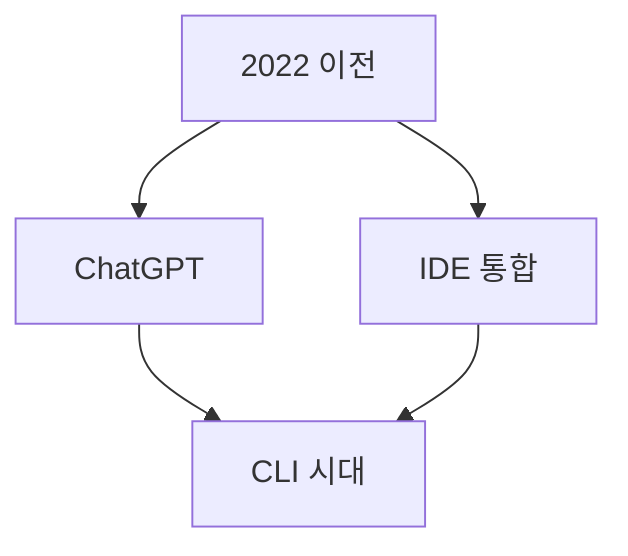
```mermaid
graph TD;
    A[2022 이전] --> B[ChatGPT];
    A --> C[IDE 통합];
    B --> D[CLI 시대];
    C --> D;
```

---
## Flowchart
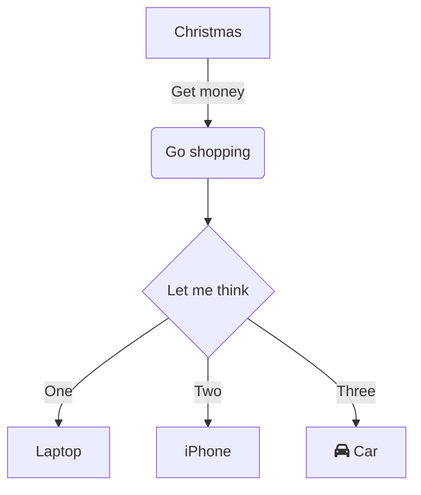
```mermaid
flowchart TD
    A[Christmas] -->|Get money| B(Go shopping)
    B --> C{Let me think}
    C -->|One| D[Laptop]
    C -->|Two| E[iPhone]
    C -->|Three| F[fa:fa-car Car]
  
```

---
## Class

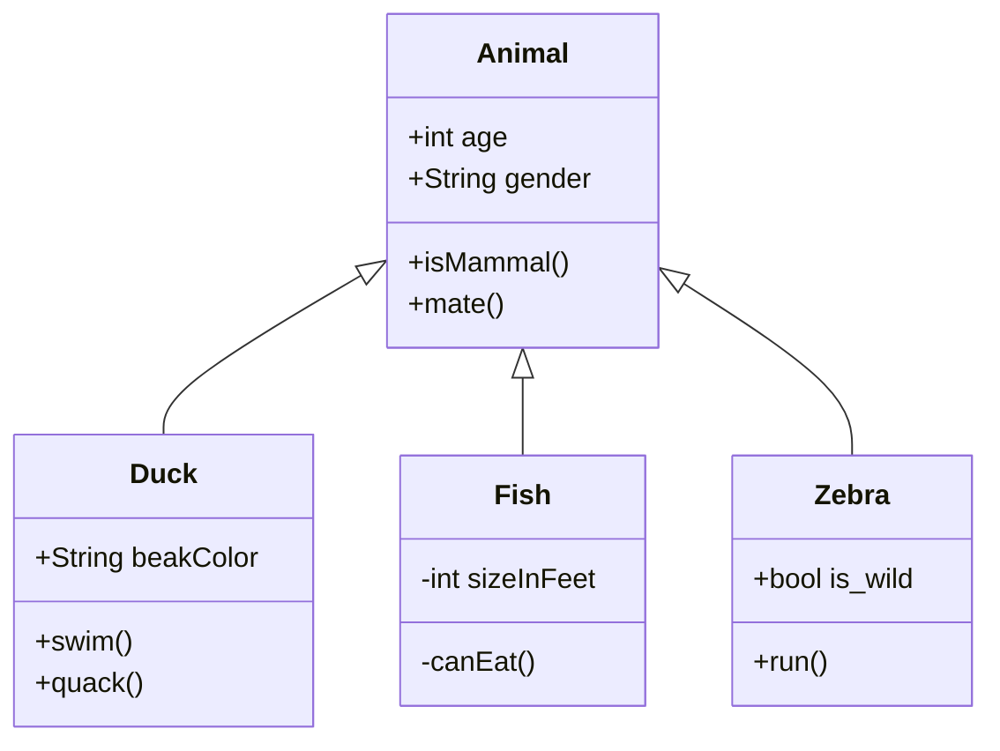
```mermaid
classDiagram
    Animal <|-- Duck
    Animal <|-- Fish
    Animal <|-- Zebra
    Animal : +int age
    Animal : +String gender
    Animal: +isMammal()
    Animal: +mate()
    class Duck{
      +String beakColor
      +swim()
      +quack()
    }
    class Fish{
      -int sizeInFeet
      -canEat()
    }
    class Zebra{
      +bool is_wild
      +run()
    }
```

---
## Sequence

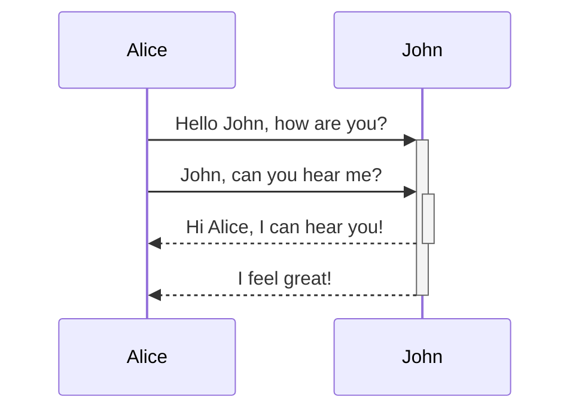
```mermaid
sequenceDiagram
    Alice->>+John: Hello John, how are you?
    Alice->>+John: John, can you hear me?
    John-->>-Alice: Hi Alice, I can hear you!
    John-->>-Alice: I feel great!
```

---
## Entity Relationship

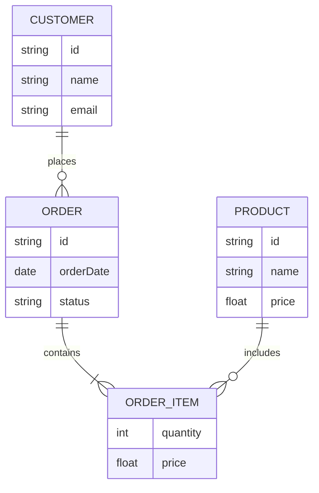
```mermaid
erDiagram
    CUSTOMER ||--o{ ORDER : places
    ORDER ||--|{ ORDER_ITEM : contains
    PRODUCT ||--o{ ORDER_ITEM : includes
    CUSTOMER {
        string id
        string name
        string email
    }
    ORDER {
        string id
        date orderDate
        string status
    }
    PRODUCT {
        string id
        string name
        float price
    }
    ORDER_ITEM {
        int quantity
        float price
    }
```

---
## State

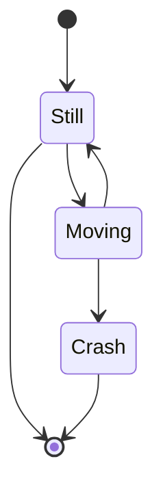
```mermaid
stateDiagram-v2
    [*] --> Still
    Still --> [*]
    Still --> Moving
    Moving --> Still
    Moving --> Crash
    Crash --> [*]
```

---
## Mindmap

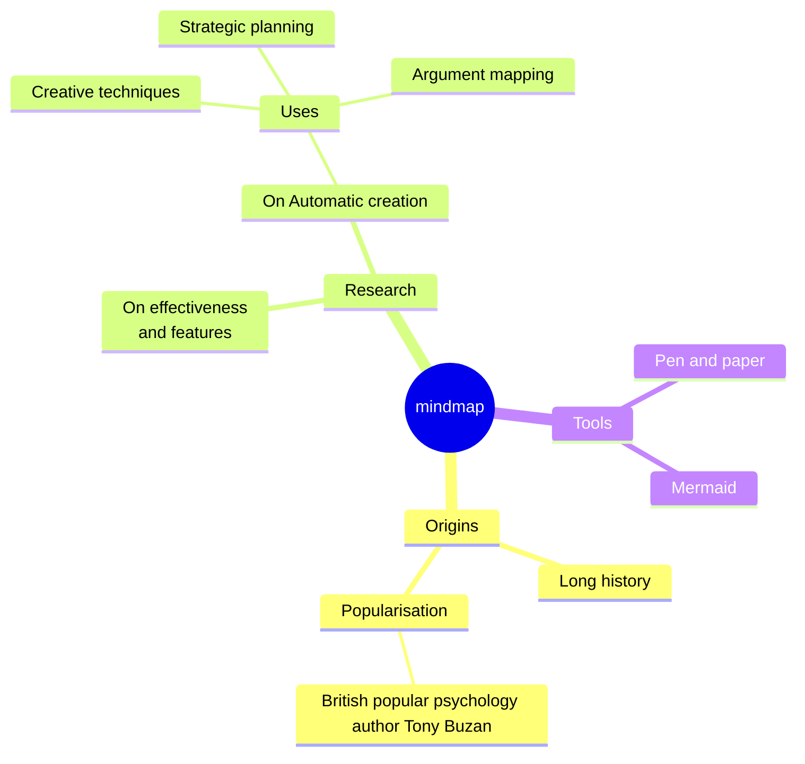
```mermaid
mindmap
  root((mindmap))
    Origins
      Long history
      ::icon(fa fa-book)
      Popularisation
        British popular psychology author Tony Buzan
    Research
      On effectiveness<br/>and features
      On Automatic creation
        Uses
            Creative techniques
            Strategic planning
            Argument mapping
    Tools
      Pen and paper
      Mermaid
```

---
## Architecture
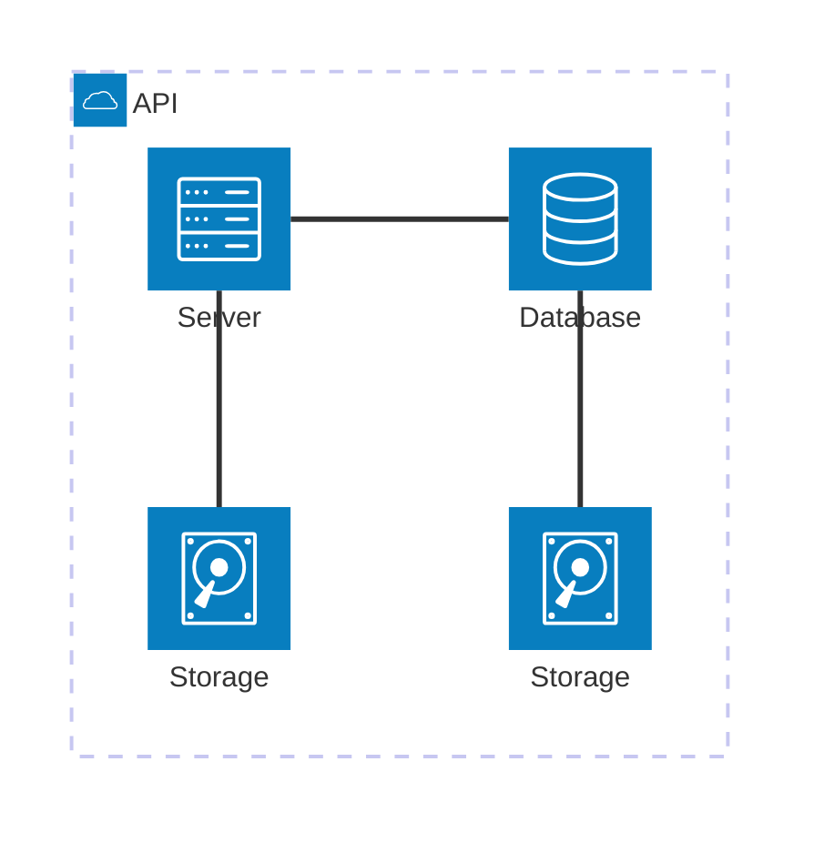
```mermaid
architecture-beta
    group api(cloud)[API]

    service db(database)[Database] in api
    service disk1(disk)[Storage] in api
    service disk2(disk)[Storage] in api
    service server(server)[Server] in api

    db:L -- R:server
    disk1:T -- B:server
    disk2:T -- B:db
```

---
## Block

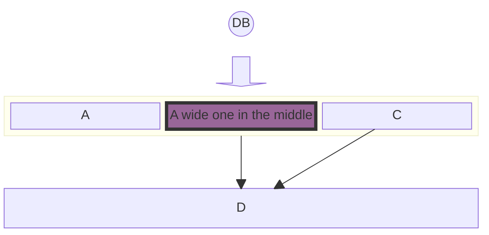
```mermaid
block-beta
columns 1
  db(("DB"))
  blockArrowId6<["&nbsp;&nbsp;&nbsp;"]>(down)
  block:ID
    A
    B["A wide one in the middle"]
    C
  end
  space
  D
  ID --> D
  C --> D
  style B fill:#969,stroke:#333,stroke-width:4px
```

---
## C4

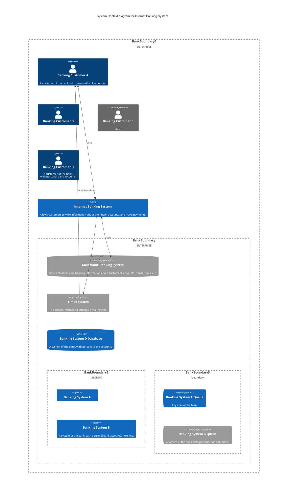
```mermaid
C4Context
    title System Context diagram for Internet Banking System
    Enterprise_Boundary(b0, "BankBoundary0") {
        Person(customerA, "Banking Customer A", "A customer of the bank, with personal bank accounts.")
        Person(customerB, "Banking Customer B")
        Person_Ext(customerC, "Banking Customer C", "desc")

        Person(customerD, "Banking Customer D", "A customer of the bank, <br/> with personal bank accounts.")

        System(SystemAA, "Internet Banking System", "Allows customers to view information about their bank accounts, and make payments.")

        Enterprise_Boundary(b1, "BankBoundary") {
            SystemDb_Ext(SystemE, "Mainframe Banking System", "Stores all of the core banking information about customers, accounts, transactions, etc.")

            System_Boundary(b2, "BankBoundary2") {
                System(SystemA, "Banking System A")
                System(SystemB, "Banking System B", "A system of the bank, with personal bank accounts. next line.")
            }

            System_Ext(SystemC, "E-mail system", "The internal Microsoft Exchange e-mail system.")
            SystemDb(SystemD, "Banking System D Database", "A system of the bank, with personal bank accounts.")

            Boundary(b3, "BankBoundary3", "boundary") {
                SystemQueue(SystemF, "Banking System F Queue", "A system of the bank.")
                SystemQueue_Ext(SystemG, "Banking System G Queue", "A system of the bank, with personal bank accounts.")
            }
        }
    }

    BiRel(customerA, SystemAA, "Uses")
    BiRel(SystemAA, SystemE, "Uses")
    Rel(SystemAA, SystemC, "Sends e-mails", "SMTP")
    Rel(SystemC, customerA, "Sends e-mails to")
```

---
## Gantt

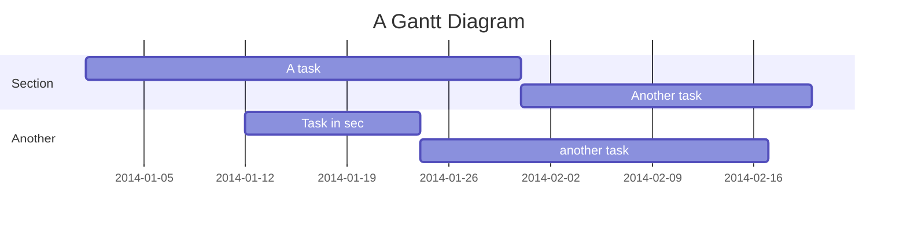
```mermaid
gantt
    title A Gantt Diagram
    dateFormat  YYYY-MM-DD
    section Section
    A task           :a1, 2014-01-01, 30d
    Another task     :after a1  , 20d
    section Another
    Task in sec      :2014-01-12  , 12d
    another task      : 24d
```

---
## Git

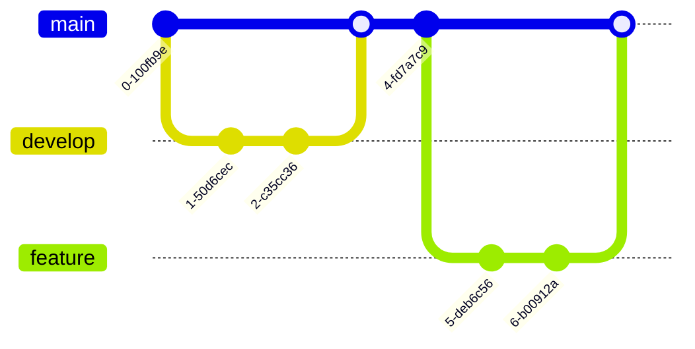
```mermaid
gitGraph
    commit
    branch develop
    checkout develop
    commit
    commit
    checkout main
    merge develop
    commit
    branch feature
    checkout feature
    commit
    commit
    checkout main
    merge feature
```
---

## Kanban

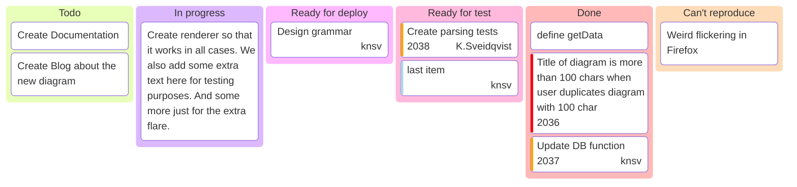
```mermaid
%% Mermaid config removed for slide compatibility
kanban
  Todo
    [Create Documentation]
    docs[Create Blog about the new diagram]
  [In progress]
    id6[Create renderer so that it works in all cases. We also add some extra text here for testing purposes. And some more just for the extra flare.]
  id9[Ready for deploy]
    id8[Design grammar]@{ assigned: 'knsv' }
  id10[Ready for test]
    id4[Create parsing tests]@{ ticket: 2038, assigned: 'K.Sveidqvist', priority: 'High' }
    id66[last item]@{ priority: 'Very Low', assigned: 'knsv' }
  id11[Done]
    id5[define getData]
    id2[Title of diagram is more than 100 chars when user duplicates diagram with 100 char]@{ ticket: 2036, priority: 'Very High'}
    id3[Update DB function]@{ ticket: 2037, assigned: knsv, priority: 'High' }

  id12[Can't reproduce]
    id3[Weird flickering in Firefox]

```
---

## Packet

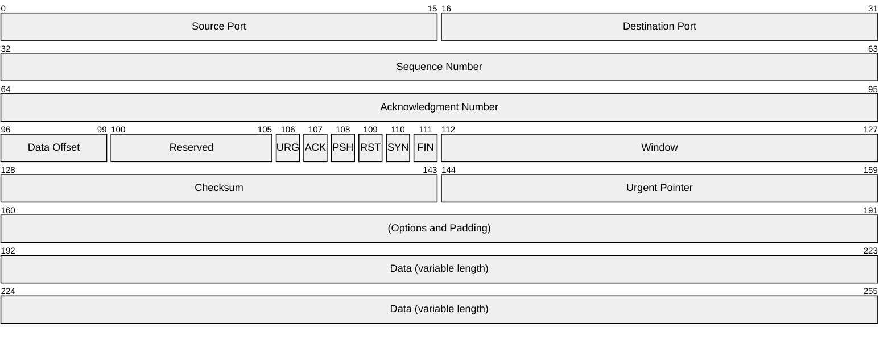
```mermaid
%% title: "TCP Packet"
packet
0-15: "Source Port"
16-31: "Destination Port"
32-63: "Sequence Number"
64-95: "Acknowledgment Number"
96-99: "Data Offset"
100-105: "Reserved"
106: "URG"
107: "ACK"
108: "PSH"
109: "RST"
110: "SYN"
111: "FIN"
112-127: "Window"
128-143: "Checksum"
144-159: "Urgent Pointer"
160-191: "(Options and Padding)"
192-255: "Data (variable length)"
```

---
## Pie

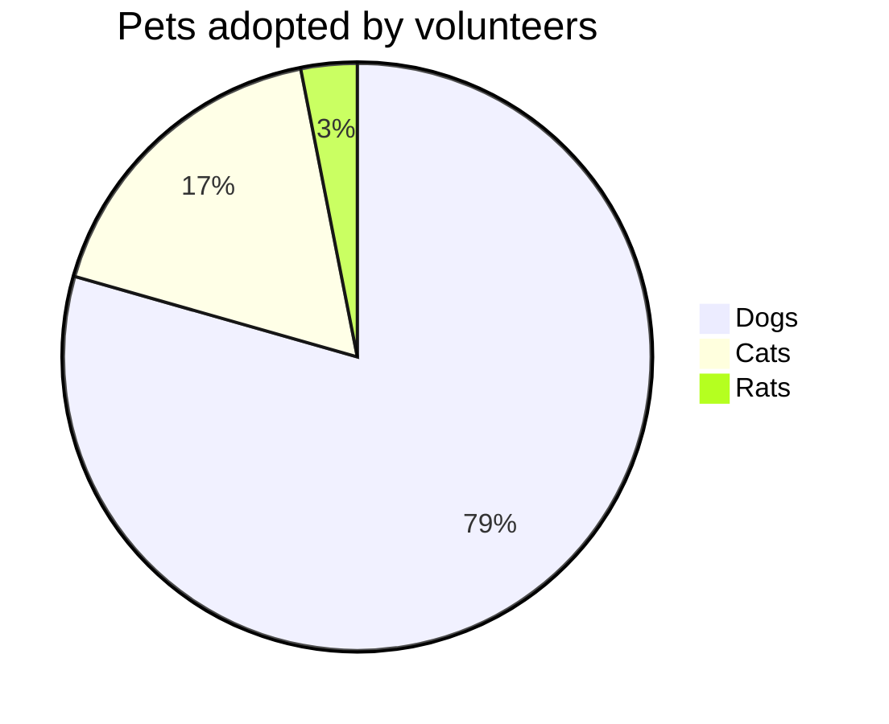
```mermaid
pie title Pets adopted by volunteers
    "Dogs" : 386
    "Cats" : 85
    "Rats" : 15
```

---
## Quadrant

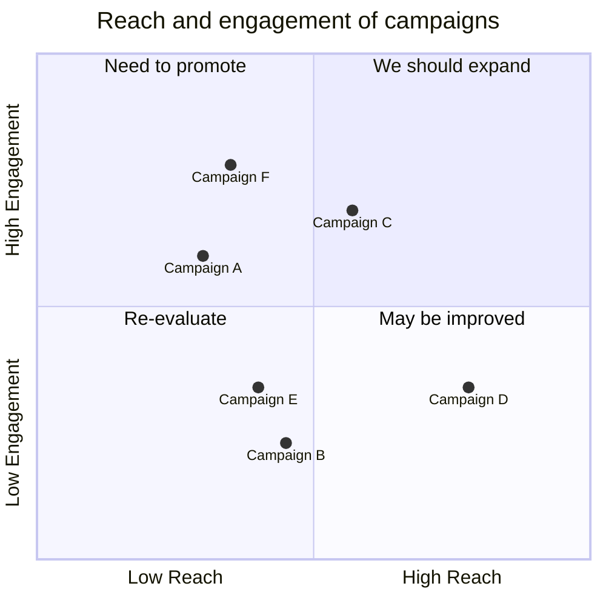
```mermaid
quadrantChart
    title Reach and engagement of campaigns
    x-axis Low Reach --> High Reach
    y-axis Low Engagement --> High Engagement
    quadrant-1 We should expand
    quadrant-2 Need to promote
    quadrant-3 Re-evaluate
    quadrant-4 May be improved
    Campaign A: [0.3, 0.6]
    Campaign B: [0.45, 0.23]
    Campaign C: [0.57, 0.69]
    Campaign D: [0.78, 0.34]
    Campaign E: [0.40, 0.34]
    Campaign F: [0.35, 0.78]
```
---

## Radar

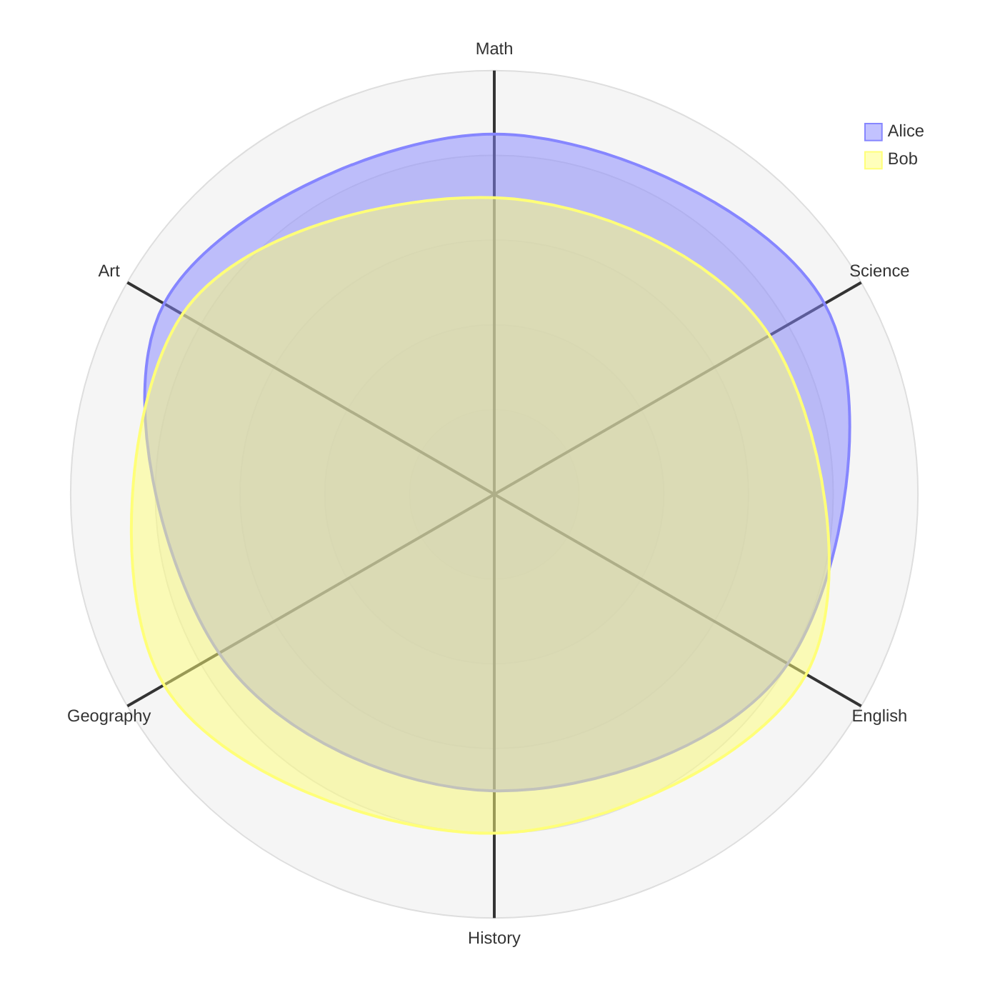
```mermaid
%% title: "Grades"
radar-beta
  axis m["Math"], s["Science"], e["English"]
  axis h["History"], g["Geography"], a["Art"]
  curve a["Alice"]{85, 90, 80, 70, 75, 90}
  curve b["Bob"]{70, 75, 85, 80, 90, 85}

  max 100
  min 0

```

---
## Requirement

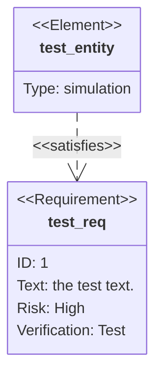
```mermaid
requirementDiagram

    requirement test_req {
    id: 1
    text: the test text.
    risk: high
    verifymethod: test
    }

    element test_entity {
    type: simulation
    }

    test_entity - satisfies -> test_req
```
---
## Sankey

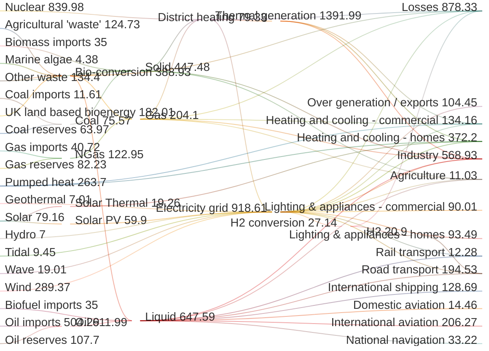
```mermaid
%% sankey config removed for slide compatibility
sankey-beta

Agricultural 'waste',Bio-conversion,124.729
Bio-conversion,Liquid,0.597
Bio-conversion,Losses,26.862
Bio-conversion,Solid,280.322
Bio-conversion,Gas,81.144
Biofuel imports,Liquid,35
Biomass imports,Solid,35
Coal imports,Coal,11.606
Coal reserves,Coal,63.965
Coal,Solid,75.571
District heating,Industry,10.639
District heating,Heating and cooling - commercial,22.505
District heating,Heating and cooling - homes,46.184
Electricity grid,Over generation / exports,104.453
Electricity grid,Heating and cooling - homes,113.726
Electricity grid,H2 conversion,27.14
Electricity grid,Industry,342.165
Electricity grid,Road transport,37.797
Electricity grid,Agriculture,4.412
Electricity grid,Heating and cooling - commercial,40.858
Electricity grid,Losses,56.691
Electricity grid,Rail transport,7.863
Electricity grid,Lighting & appliances - commercial,90.008
Electricity grid,Lighting & appliances - homes,93.494
Gas imports,NGas,40.719
Gas reserves,NGas,82.233
Gas,Heating and cooling - commercial,0.129
Gas,Losses,1.401
Gas,Thermal generation,151.891
Gas,Agriculture,2.096
Gas,Industry,48.58
Geothermal,Electricity grid,7.013
H2 conversion,H2,20.897
H2 conversion,Losses,6.242
H2,Road transport,20.897
Hydro,Electricity grid,6.995
Liquid,Industry,121.066
Liquid,International shipping,128.69
Liquid,Road transport,135.835
Liquid,Domestic aviation,14.458
Liquid,International aviation,206.267
Liquid,Agriculture,3.64
Liquid,National navigation,33.218
Liquid,Rail transport,4.413
Marine algae,Bio-conversion,4.375
NGas,Gas,122.952
Nuclear,Thermal generation,839.978
Oil imports,Oil,504.287
Oil reserves,Oil,107.703
Oil,Liquid,611.99
Other waste,Solid,56.587
Other waste,Bio-conversion,77.81
Pumped heat,Heating and cooling - homes,193.026
Pumped heat,Heating and cooling - commercial,70.672
Solar PV,Electricity grid,59.901
Solar Thermal,Heating and cooling - homes,19.263
Solar,Solar Thermal,19.263
Solar,Solar PV,59.901
Solid,Agriculture,0.882
Solid,Thermal generation,400.12
Solid,Industry,46.477
Thermal generation,Electricity grid,525.531
Thermal generation,Losses,787.129
Thermal generation,District heating,79.329
Tidal,Electricity grid,9.452
UK land based bioenergy,Bio-conversion,182.01
Wave,Electricity grid,19.013
Wind,Electricity grid,289.366
```
---
## StateDiagram 
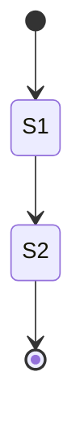
```mermaid
stateDiagram
    [*] --> S1
    S1 --> S2
    S2 --> [*]

```
---
## Timeline
* base
```mermaid
timeline
    title History of Social Media Platform
    2002 : LinkedIn
    2004 : Facebook
         : Google
    2005 : YouTube
    2006 : Twitter
```
---
## Timeline (계속)
* beta
```mermaid
timeline-beta
    section Projects
      2023 : Start
      2024 : Release
```
---

## Treemap
```mermaid
treemap-beta
"Section 1"
    "Leaf 1.1": 12
    "Section 1.2"
      "Leaf 1.2.1": 12
"Section 2"
    "Leaf 2.1": 20
    "Leaf 2.2": 25
```

---
## User Journey

```mermaid
journey
    title My working day
    section Go to work
      Make tea: 5: Me
      Go upstairs: 3: Me
      Do work: 1: Me, Cat
    section Go home
      Go downstairs: 5: Me
      Sit down: 5: Me
```

---
## XY

```mermaid
xychart-beta
    title "Sales Revenue"
    x-axis [jan, feb, mar, apr, may, jun, jul, aug, sep, oct, nov, dec]
    y-axis "Revenue (in $)" 4000 --> 11000
    bar [5000, 6000, 7500, 8200, 9500, 10500, 11000, 10200, 9200, 8500, 7000, 6000]
    line [5000, 6000, 7500, 8200, 9500, 10500, 11000, 10200, 9200, 8500, 7000, 6000]
```

---

## blockdiag

```blockdiag
blockdiag {
  blockdiag -> generates -> "block-diagrams";
  blockdiag -> is -> "very easy!";

  blockdiag [color = "greenyellow"];
  "block-diagrams" [color = "pink"];
  "very easy!" [color = "orange"];
}
```

---
## seqdiag

```seqdiag
seqdiag {
  browser  -> webserver [label = "GET /index.html"];
  browser <-- webserver;

  browser  -> webserver [label = "POST /blog/comment"];
  webserver -> database [label = "INSERT comment"];
  webserver <-- database;
  browser  <-- webserver;
}
```

---
## actdiag

```actdiag
actdiag {
  write -> convert -> image;

  lane user {
    label = "User";
    write  [label = "Writing reST"];
    image  [label = "Get diagram IMAGE!"];
  }

  lane actdiag {
    convert [label = "Convert reST to Image"];
  }
}
```

---
## nwdiag

```nwdiag
nwdiag {
  network dmz {
    address = "210.x.x.x/24";

    web01 [address = "210.x.x.1"];
    web02 [address = "210.x.x.2"];
  }

  network internal {
    address = "192.168.0.0/24";

    web01 [address = "192.168.0.1"];
    web02 [address = "192.168.0.2"];
    db01  [address = "192.168.0.10"];
  }
}
```
---


## `ditaa` (ASCII → 그림 변환)

```ditaa
+--------+    +-------+
|  CPU   | -> | RAM   |
+--------+    +-------+
```


---
# Graphviz (DOT)

```dot
digraph G {
    rankdir=TB;

    A [label="2022 이전"];
    B [label="ChatGPT"];
    C [label="IDE 통합"];
    D [label="CLI 시대"];

    A -> B;
    A -> C;
    B -> D;
    C -> D;
}

```

---
# Vega
---

## Vega-lite
```vegalite
{
    "$schema": "https://vega.github.io/schema/vega/v5.json",
  "width": 300,
  "height": 200,
  "padding": 5,
  "data": {
    "values": [
      {"a": "A", "b": 28},
      {"a": "B", "b": 55},
      {"a": "C", "b": 43},
      {"a": "D", "b": 91},
      {"a": "E", "b": 81},
      {"a": "F", "b": 53}
    ]
  },
  "mark": "bar",
  "encoding": {
    "x": {"field": "a", "type": "ordinal"},
    "y": {"field": "b", "type": "quantitative"}
  }
}
```
---
## Vega
```vega
{
  "$schema": "https://vega.github.io/schema/vega/v5.json",
  "width": 300,
  "height": 200,
  "padding": 5,

  "data": [
    {
      "name": "table",
      "values": [
        {"category": "A", "amount": 28},
        {"category": "B", "amount": 55},
        {"category": "C", "amount": 43},
        {"category": "D", "amount": 91},
        {"category": "E", "amount": 81},
        {"category": "F", "amount": 53}
      ]
    }
  ],

  "scales": [
    {
      "name": "xscale",
      "type": "band",
      "domain": {"data": "table", "field": "category"},
      "range": "width",
      "padding": 0.05
    },
    {
      "name": "yscale",
      "type": "linear",
      "domain": {"data": "table", "field": "amount"},
      "range": "height"
    }
  ],

  "axes": [
    {"orient": "bottom", "scale": "xscale"},
    {"orient": "left", "scale": "yscale"}
  ],

  "marks": [
    {
      "type": "rect",
      "from": {"data": "table"},
      "encode": {
        "enter": {
          "x": {"scale": "xscale", "field": "category"},
          "width": {"scale": "xscale", "band": 1},
          "y": {"scale": "yscale", "field": "amount"},
          "y2": {"scale": "yscale", "value": 0}
        },
        "update": {"fill": {"value": "steelblue"}},
        "hover": {"fill": {"value": "red"}}
      }
    }
  ]
}

```

---
# PlantUML
---

## Class Diagram
```plantuml
@startuml
A : 2022 이전;
B : ChatGPT;
C : IDE 통합;
D : CLI 시대;

A --> B
A --> C
B --> D
C --> D
@enduml
```
---
## Component Diagram

```plantuml
@startuml
component API
component DB
API --> DB
@enduml
```

---
## Activity Diagram
<div style="display:flex; gap:20px;">
  <div style="flex:1;">
```plantuml
@startuml
start
:Login;
if (valid?) then (yes)
  :Show Dashboard;
else (no)
  :Retry;
endif
stop
@enduml
```
  </div>
  <div style="flex:1;">
* 항목 1
* 항목 2

  </div>
</div>


---
## Use Case Diagram

```plantuml
@startuml
actor User
User --> (Login)
User --> (Purchase)
@enduml
```


---
# try 
---
## ZenUML
* 요거는 Python. 
```python
for i in range(10):
  print(i)
```
* 요거는 java
```java
for (int i = 0; i < 10; i++) {
  System.out.println(i);
}
```