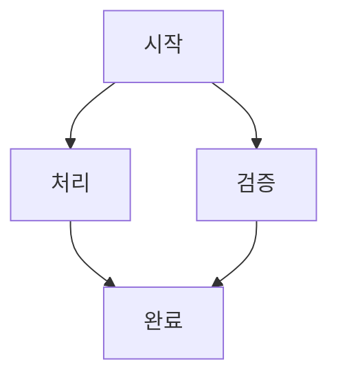
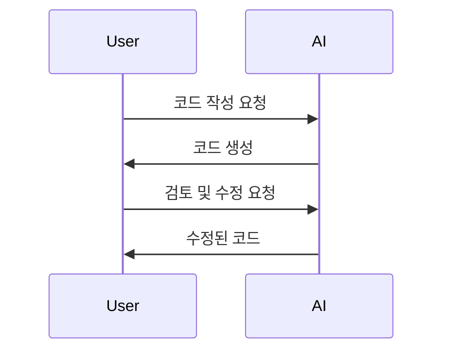
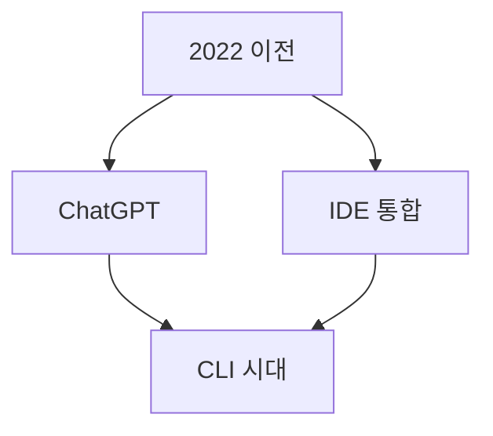
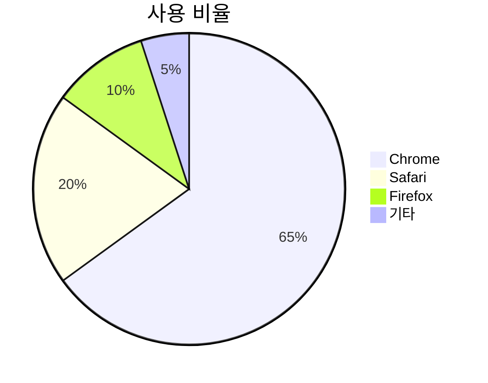

# 기본 구조
## 슬라이드 구분
`---`로 슬라이드를 구분합니다:

```markdown
# 제목 슬라이드
첫 번째 슬라이드 내용

---

# 두 번째 슬라이드
두 번째 슬라이드 내용

---

# 세 번째 슬라이드

세 번째 슬라이드 내용
```

## 파일명 규칙
- **메인 섹션**: `XX-title.md` (예: `01-opening.md`, `02-main-topic.md`)
- **하위 섹션**: `XX.Y-title.md` (예: `02.1-subtopic.md`, `03.2-details.md`)


## Mermaid 다이어그램

Mermaid를 사용하여 다이어그램을 그릴 수 있습니다:

````markdown

````

**지원되는 다이어그램 타입**:
- `graph` / `flowchart`: 플로우차트
- `sequenceDiagram`: 시퀀스 다이어그램
- `classDiagram`: 클래스 다이어그램
- `stateDiagram`: 상태 다이어그램
- `gantt`: 간트 차트
- `pie`: 파이 차트

**예시: 시퀀스 다이어그램**
````markdown

````

**오른쪽에 Mermaid 다이어그램 배치**:

Mermaid 다이어그램을 오른쪽에 배치하려면 HTML div로 감싸서 float 스타일을 적용합니다:

````markdown
<div style="margin-left:15px; max-width:100%;">



</div>


# 개발 방식의 변화

Mermaid 다이어그램이 오른쪽에 표시되고, 텍스트는 왼쪽에 배치됩니다.

**2022년 이전**:
- 개발자가 코드를 한 줄 한 줄 직접 타이핑
- Stack Overflow와 문서 검색에 의존
- 반복적인 코딩 작업에 많은 시간 소요

**2022년 ChatGPT 등장**:
- 자연어로 질문하고 코드 조각을 얻는 방식 시작
- 개발 보조 도구로서 LLM 활용 증가
````

**중앙 정렬 Mermaid**:
````markdown
<div style="text-align:center;">



</div>
````

## 인용구

```markdown
> 인용문은 이렇게 작성합니다.
> 여러 줄에 걸쳐서 작성할 수 있습니다.
```

# 이미지 활용

## 기본 이미지

```markdown

```

이미지 파일은 `markdown/img/` 폴더에 저장하면 자동으로 `slide/img/`로 복사됩니다.

## 오른쪽에 이미지 1장 추가

텍스트와 함께 이미지를 오른쪽에 배치:

```markdown


# 제목

이미지가 오른쪽에 표시되고, 텍스트는 왼쪽에 배치됩니다.

- 리스트 항목 1
- 리스트 항목 2
- 리스트 항목 3
```

## 오른쪽에 이미지 2장 추가 (세로 배치)

여러 이미지를 오른쪽에 세로로 배치:

```markdown
<div style="float:right; margin-left:15px; text-align:right;">
  
  <br>
  
</div>

# 제목

두 개의 이미지가 오른쪽에 세로로 표시됩니다.

**주요 내용**:
- 포인트 1
- 포인트 2
- 포인트 3
```

## 중앙 정렬 이미지

```markdown
<div style="text-align:center;">
  
</div>
```

## 이미지 크기 조절

```markdown
<!-- 너비 지정 -->


<!-- 너비와 높이 모두 지정 -->


<!-- 비율로 지정 -->

```

## 이미지 한개 (안정적 렌더링 버전)

### Flex 기반(추천)

```html
<div style="display:flex; justify-content:center; margin:20px 0;">
  
</div>
```

## 이미지 두개(좌우 정렬)

```html
<div style="display:flex; justify-content:space-between; gap:20px; margin:20px 0;">
  
  
</div>
```

## 이미지 여러개(정중앙)

```html
<div style="text-align:center; margin:20px 0;">
  
</div>
```


## 양쪽 이미지 배치
### 이미너비 살리기
```markdown
---
<div style="float:left; width:35%;">
  
  
</div>

<div style="float:right; width:35%;">
  
  
</div>
**0세대 (채팅 기반)**
**1세대 (IDE 통합)**
**2세대 (CLI 기반)**

```


### 너비우선
```markdown
---
# 세대별 대표 도구2
<div style="display:flex; justify-content:space-between; align-items:center;">
  <div style="width:150px;">
    
    
  </div>
  <div>
    **0세대 (채팅 기반)**  
    **1세대 (IDE 통합)**  
    **2세대 (CLI 기반)**
  </div>
  <div style="width:150px; text-align:right;">
    
    
  </div>
</div>
```


# 레이아웃 팁
## 2단 레이아웃
```markdown
<div style="display:flex; gap:20px;">
  <div style="flex:1;">

## 왼쪽 내용
- 항목 1
- 항목 2

  </div>
  <div style="flex:1;">

## 오른쪽 내용
- 항목 A
- 항목 B

  </div>
</div>
```

## 텍스트와 이미지 나란히
```markdown
<div style="display:flex; align-items:center; gap:20px;">
  <div style="flex:1;">

**설명 텍스트**:
- 핵심 포인트 1
- 핵심 포인트 2

  </div>
  <div>
    
  </div>
</div>
```

# 작성 원칙
## 청중 배포용 문서
md 파일은 **청중 배포용 참고 자료**이므로:

❌ **사용하지 말 것**:
- "여러분", "오늘", "함께" 등 구어체 표현
- "Let's dive in!", "Now, let's see..." 등 강연 멘트
- "학습 목표", "기대 효과" 등 강사용 메모

✅ **권장 사항**:
- 객관적이고 중립적인 서술
- 완결된 정보 제공 (독립적으로 읽을 수 있도록)
- 명확하고 구조화된 내용

## 예시

**❌ 잘못된 예**:
```markdown
# 여러분과 함께 알아볼 내용

오늘은 AI 코딩에 대해 알아보겠습니다.
Let's dive in!
```

**✅ 올바른 예**:
```markdown
# AI 코딩 도구의 발전

AI 코딩 도구는 2022년부터 급격히 발전했습니다.
```

# AGENDA.md 작성

목차 파일은 인라인 링크 형식을 사용합니다:

```markdown
# 프레젠테이션 제목

# [1. 오프닝](./01-opening.md)

# [2. 주요 내용](./02-main-topic.md)
## [2.1 세부 항목](./02.1-subtopic.md)
## [2.2 추가 항목](./02.2-details.md)

# [3. 마무리](./03-closing.md)
```

**규칙**:
 메인 섹션: `## [제목](./파일명.md)`
 하위 섹션: `### [제목](./파일명.md)` (메인 섹션 바로 아래)
- 상대 경로는 `./` 사용

# 스타일 가이드
## 폰트 크기 조정

```markdown
<div style="font-size:0.8em;">
작은 텍스트입니다.
</div>

<div style="font-size:1.2em;">
큰 텍스트입니다.
</div>
```

## 색상 강조

```markdown
<span style="color:#e74c3c;">중요한 내용</span>
<span style="color:#3498db;">참고 사항</span>
<span style="color:#2ecc71;">성공 메시지</span>
```

## 박스 스타일

```markdown
<div style="border:2px solid #3498db; padding:15px; border-radius:5px; background:#f0f8ff;">

**핵심 요약**:
- 주요 포인트 1
- 주요 포인트 2

</div>
```

# 체크리스트

파일 작성 전:
- [ ] 파일명이 규칙에 맞는지 확인 (`XX-title.md` 또는 `XX.Y-title.md`)
- [ ] AGENDA.md에 링크 추가했는지 확인
- [ ] 슬라이드 구분자(`---`) 적절히 사용했는지 확인
- [ ] 이미지 파일이 `markdown/img/` 폴더에 있는지 확인
- [ ] 강연 멘트가 아닌 객관적 서술인지 확인

파일 작성 후:
- [ ] `./convert.sh` 실행하여 HTML 생성
- [ ] 브라우저에서 슬라이드 확인
- [ ] 이미지가 정상 표시되는지 확인
- [ ] 네비게이션(화살표 키)이 정상 작동하는지 확인

# 참고 자료

- [Reveal.js 공식 문서](https://revealjs.com/)
- [Markdown 기본 문법](https://www.markdownguide.org/basic-syntax/)
- [HTML 인라인 스타일](https://www.w3schools.com/html/html_styles.asp)
- [Mermaid 공식 문서](https://mermaid.js.org/)
