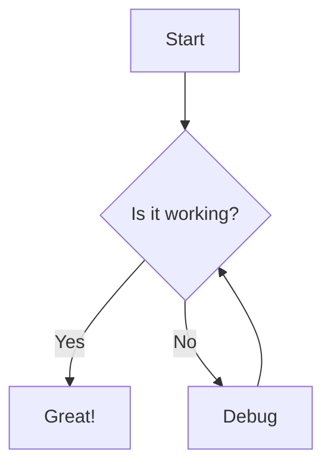
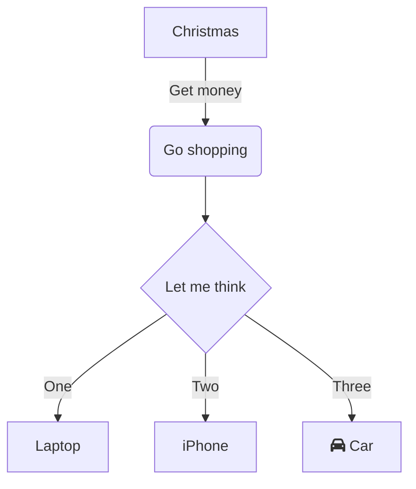
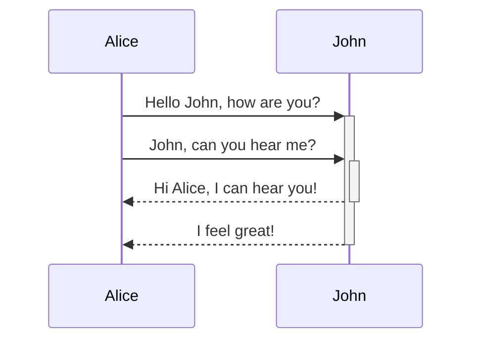
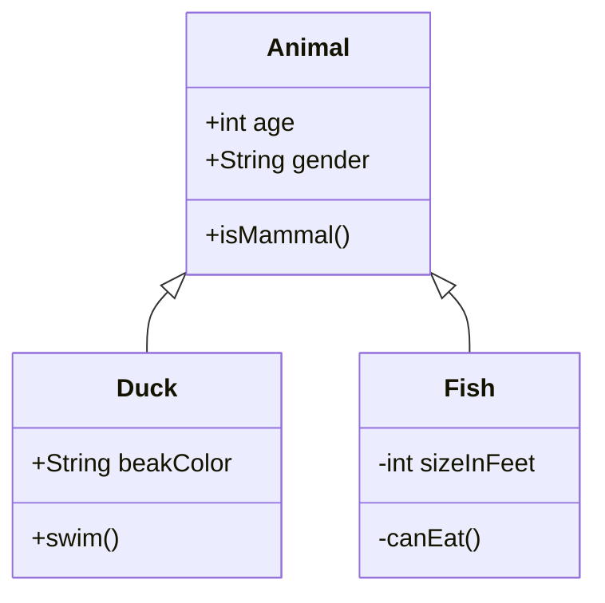
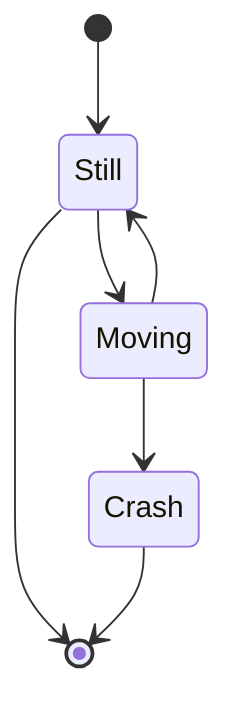
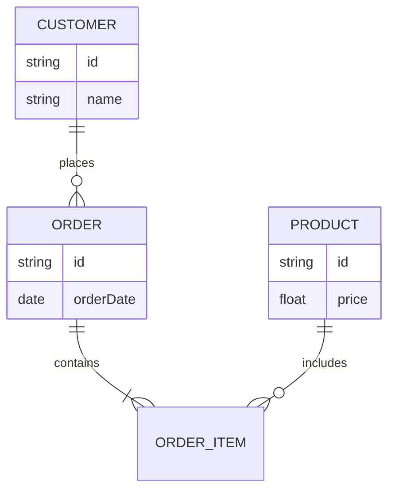
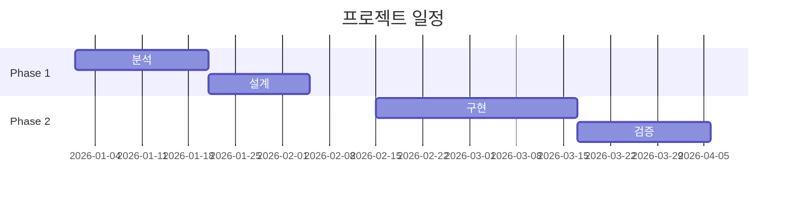
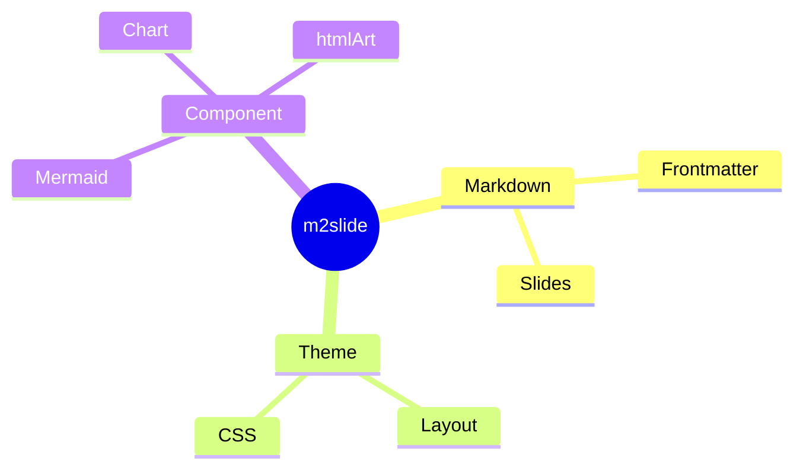
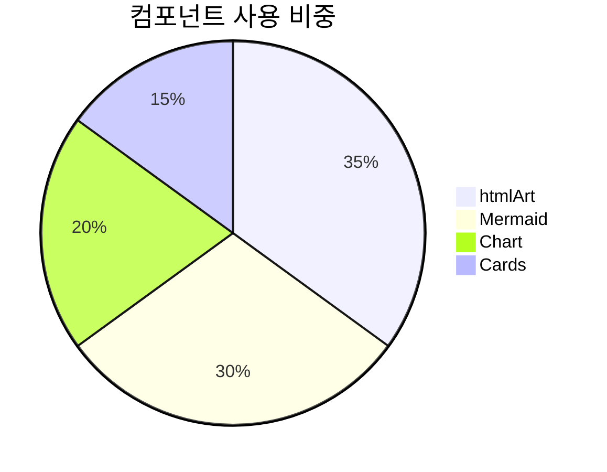
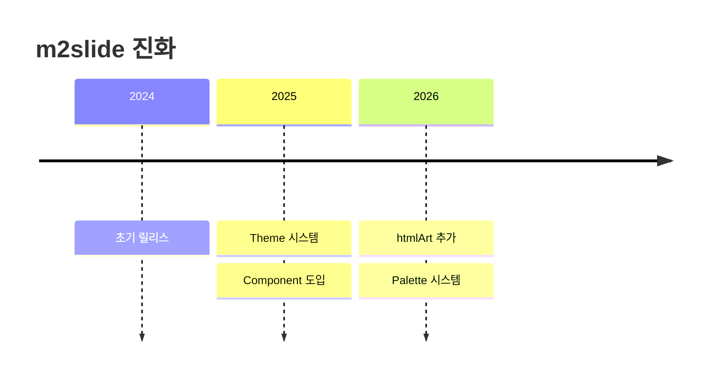

# 2. 구성요소 라이브러리 테스트

m2slide 시각화 라이브러리(수식·차트·심벌·지도·인포그래픽)의 적용을 슬라이드 단위로 검증한다. (구 ComponentTest)

---

## Mermaid 다이어그램 (회귀 기준)

generic fenced 디스패처 신설 후에도 기존 mermaid 경로가 정상 동작하는지 확인하는 회귀 기준 슬라이드.



---

## 수식 (KaTeX)

블록 수식과 인라인 수식을 LaTeX로 작성한다.

$$E = mc^2$$

피타고라스 정리는 인라인으로 \(a^2 + b^2 = c^2\) 처럼 쓴다.

---

## 심벌 (Font Awesome)

* 시작하기 :fa-rocket:
* 완료 표시 :fa-check-circle:
* 경고 :fa-triangle-exclamation:
* 코드 인라인 안의 `:fa-x:` 는 변환되지 않음

---

## 이모지 (Emoji)

별도 라이브러리 없이 Unicode 문자로 직접 렌더된다.

* 상태 표시 — 성공 ✅ / 경고 ⚠️ / 실패 ❌
* 강조·분위기 — 🚀 🎯 💡 🔥
* 목록 마커 보조 — 📁 📊 🗂 📌
* 심벌(Font Awesome)과 달리 변환 단계 없이 그대로 표시

---

## 차트 (chart.js)

```chart
{
  "type": "bar",
  "data": {
    "labels": ["1세대", "2세대", "3세대"],
    "datasets": [{ "label": "도입률(%)", "data": [20, 55, 80] }]
  },
  "options": { "responsive": true }
}
```

---

## 지도 (Leaflet)

```map
{
  "center": [37.5665, 126.9780],
  "zoom": 11,
  "markers": [{ "coords": [37.5665, 126.9780], "popup": "서울" }]
}
```

---

## 인포그래픽 (d3)

데이텀마다 막대 + 값 라벨 + 범주 라벨을 묶어 그린다 — d3 고유의 커스텀 SVG 조립.

```d3
const data = [
  { label: '1세대', value: 20 },
  { label: '2세대', value: 55 },
  { label: '3세대', value: 80 }
];
const svg = d3.select(el).append('svg').attr('width', 480).attr('height', 220);
const g = svg.selectAll('g').data(data).enter().append('g')
  .attr('transform', (d, i) => `translate(${i * 150 + 30}, 0)`);
g.append('rect')
  .attr('y', d => 170 - d.value).attr('width', 110).attr('height', d => d.value)
  .attr('rx', 6).attr('fill', '#4a90d9');
g.append('text')
  .attr('x', 55).attr('y', d => 162 - d.value).attr('text-anchor', 'middle')
  .attr('font-weight', 'bold').text(d => d.value + '%');
g.append('text')
  .attr('x', 55).attr('y', 195).attr('text-anchor', 'middle')
  .attr('fill', '#555').text(d => d.label);
```

---

## 카드 (Cards)

리스트를 카드 그리드로 배치한다. 인포그래픽과 달리 균질한 항목을 단순 병렬 제시할 때 쓴다.

::: cards
* **수식**
  - KaTeX 블록·인라인 LaTeX 렌더
* **심벌**
  - Font Awesome `:fa-name:` 인라인
* **차트**
  - chart.js 캔버스 그래프
  - 막대·선·원형 차트 지원
  - 실시간 데이터 갱신
* **지도**
  - Leaflet OpenStreetMap 타일
* **인포그래픽**
  - d3 커스텀 SVG 조립
* **이모지**
  - Unicode 네이티브 문자
:::

---

## React artifact

JSX로 작성하는 인터랙티브 컴포넌트. Babel-standalone가 브라우저에서 변환한다.

```react
function Counter() {
  const [n, setN] = React.useState(0);
  return (
    <div style={{ textAlign: 'center', fontSize: '1.4rem' }}>
      <p>클릭 횟수: <strong>{n}</strong></p>
      <button onClick={() => setN(n + 1)}>+1</button>
      <button onClick={() => setN(0)}>리셋</button>
    </div>
  );
}
render(<Counter />);
```

---

## HTML artifact (WordArt)

Cards로 표현하기 복잡한 장식 텍스트. 순수 CSS WordArt 효과.

```wordart
<h2 class="wordart-gradient">그라데이션</h2>
<h2 class="wordart-outline">외곽선</h2>
<h2 class="wordart-shadow">그림자</h2>
<h2 class="wordart-3d">입체 3D</h2>
<h2 class="wordart-glow">네온 발광</h2>
```

---

## React artifact — Hooks·리스트

`useEffect` 타이머와 배열 `map` 렌더링 검증.

```react
function Clock() {
  const [t, setT] = React.useState(new Date().toLocaleTimeString());
  React.useEffect(() => {
    const id = setInterval(() => setT(new Date().toLocaleTimeString()), 1000);
    return () => clearInterval(id);
  }, []);
  const hooks = ['useState', 'useEffect', 'cleanup'];
  return (
    <div style={{ textAlign: 'center' }}>
      <p style={{ fontSize: '2rem', fontWeight: 'bold', color: '#2b8fb3' }}>{t}</p>
      <ul style={{ display: 'inline-block', textAlign: 'left' }}>
        {hooks.map((h, i) => <li key={i}>{h}</li>)}
      </ul>
    </div>
  );
}
render(<Clock />);
```

---

## HTML artifact — SVG 곡선 텍스트

WordArt 클래스로 표현 불가한 곡선 텍스트는 본문에 inline SVG `textPath`로 작성.

```wordart
<svg viewBox="0 0 420 170" width="460">
  <defs>
    <linearGradient id="wa-grad" x1="0" y1="0" x2="1" y2="0">
      <stop offset="0%" stop-color="#2b8fb3"/>
      <stop offset="55%" stop-color="#6a3fb5"/>
      <stop offset="100%" stop-color="#c0392b"/>
    </linearGradient>
    <path id="wa-curve" d="M30,140 Q210,10 390,140" fill="none"/>
  </defs>
  <text font-size="40" font-weight="800" fill="url(#wa-grad)">
    <textPath href="#wa-curve" startOffset="50%" text-anchor="middle">곡선 WordArt</textPath>
  </text>
</svg>
```

---

## Mermaid — Flowchart 분기



---

## Mermaid — Sequence



---

## Mermaid — Class



---

## Mermaid — State



---

## Mermaid — Entity Relationship



---

## Mermaid — Gantt



---

## Mermaid — Mindmap



---

## Mermaid — Pie



---

## Mermaid — Timeline



---

## model3d — GLB 자동 회전 (Issue206)

```model3d
{
  "src": "./img/test-cube.glb",
  "alt": "파란 큐브 — model-viewer 검증",
  "autoRotate": true,
  "rotationPerSecond": "30deg",
  "backgroundColor": "#1a1a2e"
}
```

---

## model3d — 카메라 고정 (정면 뷰)

```model3d
{
  "src": "./img/test-cube.glb",
  "alt": "정면 카메라 + 자동회전 없음",
  "fieldOfView": "45deg",
  "minCameraOrbit": "0deg 75deg 4m",
  "maxCameraOrbit": "0deg 75deg 4m",
  "backgroundColor": "#222831"
}
```

* `minCameraOrbit == maxCameraOrbit` → 카메라 위치 완전 고정 (드래그 회전 차단)
* 정적 정면 뷰 — 단일 각도 강조 시 유용

---

## Phase 진행 현황

* Phase 0 — 레지스트리 + generic 디스패처 인프라
* Phase 1 — 수식·심벌·차트 ✅
* Phase 2 — 지도·인포그래픽 ✅
* Phase 3 — React artifact·HTML artifact(WordArt) ✅
* Phase 4 — model3d(Issue206) ✅
* Mermaid 카테고리 — flowchart·sequence·class·state·er·gantt·mindmap·pie·timeline ✅
* emoji — Unicode 네이티브, 라이브러리 무관 ✅
* 카드 — `::: cards` 리스트→카드 그리드, m2slide 자체 구현 ✅
