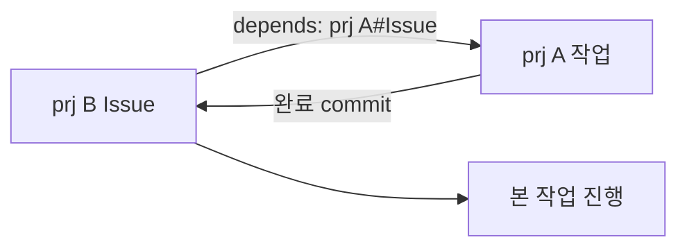

# pm-do — 크로스 프로젝트 위임 & depends

::: columns
:::: {.column width="48%"}
* **이게 없으면 겪는 불편**: A 프로젝트를 끝내야 B를 시작하는 흐름을 매번 손으로 챙김
* `pm-do`는 한 프로젝트에서 다른 프로젝트로 작업을 **위임**하고, 완료까지 기다렸다가 결과(commit hash)를 회수함
* 이슈의 `* depends:` 메타로 **선행 프로젝트 작업을 자동 처리** 후 본 작업을 진행함
::::
:::: {.column width="52%"}
```bash
# prj16 에서 prj7 로 작업 위임
/fpm-pm-do 7 "Issue42 처리해줘"
```
::::
:::

---

# depends 의존성 체인



* `pm-do --auto-deps`가 `depends` 필드를 파싱해 선행 prj를 먼저 위임·대기함
* 같은 prj 선행은 접두 없이(`Issue3`), 다른 prj 선행은 접두로(`prj7#Issue42`) 구분함
* 선행이 끝나야 본 작업이 시작되므로 **순서를 사람이 챙길 필요가 없음**

---

# 순차 vs 병렬 — depends가 결정

::: htmlart compare
* **순차 (depends)** / A→B 선후 관계
  - 선행 완료 후 본 작업
  - 순서를 선언 한 줄로 자동화
* **병렬 (fan-out)** / 서로 독립
  - 여러 프로젝트에 동시 위임
  - 완료·commit hash 일괄 회수
:::

* 의존 관계가 있으면 순차, 없으면 병렬 — `depends` 선언이 실행 순서를 자동 결정함

> "순서를 손으로 챙기던 의존 작업"이 선언 한 줄(`depends`)로 자동화됨
