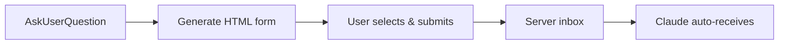

# ..show / ..ask Live Demo

::: htmlart compare
* **..show** / One-way render
  - Shows the result as a document
  - Seen in the previous chapter
* **..ask** / Two-way Q&A
  - Asks choices as a form
  - Auto-collects the answer
:::

* In common: add one trigger word to the prompt, the browser pops up on its own, and you interact only on the screen
* Turns "listing long choices in chat and answering by number" into a **clickable form**

---

# ..ask — Ask via a Form and Auto-Collect

* Instead of listing choices in chat, present a **checkbox / free-input form**
* When the user submits, Claude auto-collects the response via `Poll form answer inbox` and continues
* When there's no browser, a fallback of typing item names/numbers in chat is also supported

---

# The Actual Form Screen

::: columns
:::: {.column width="42%"}
* Enter "Suggest folders worth removing. ..ask" → a **multi-select form** appears in the browser
* Each item shows a rationale (size, modified date, recommendation), making the call easy
* `Submit` / `Submit & close` / `Submit & go to that session` buttons control the answer and flow at once
* The Claude panel on the right polls via `Poll form answer inbox`

> "Ask → wait for answer → receive" flows as one, so context never breaks
::::
:::: {.column width="58%"}

::::
:::
