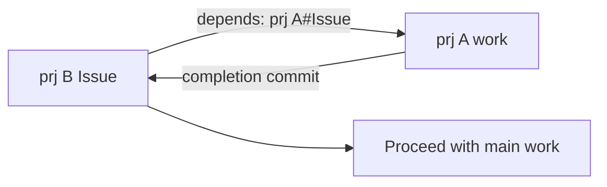

# pm-do — Cross-Project Delegation & depends

::: columns
:::: {.column width="48%"}
* **The pain without it**: hand-managing the flow of "finish project A before starting B" every time
* `pm-do` **delegates** work from one project to another, waits for completion, and collects the result (commit hash)
* An issue's `* depends:` meta **auto-handles prerequisite projects** before the main work
::::
:::: {.column width="52%"}
```bash
# Delegate work from prj16 to prj7
/fpm-pm-do 7 "Please handle Issue42"
```
::::
:::

---

# depends Dependency Chain



* `pm-do --auto-deps` parses the `depends` field to delegate and wait on prerequisite projects first
* Same-project prerequisites use no prefix (`Issue3`); other-project ones use a prefix (`prj7#Issue42`)
* The main work starts only after prerequisites finish, so **you never manage order by hand**

---

# Sequential vs Parallel — depends Decides

::: htmlart compare
* **Sequential (depends)** / A→B ordering
  - Main work after prerequisites
  - Automate order in one declared line
* **Parallel (fan-out)** / Mutually independent
  - Delegate to many projects at once
  - Collect completions & commit hashes together
:::

* With a dependency, sequential; without, parallel — a `depends` declaration auto-decides execution order

> "Dependent work you tracked by hand" gets automated by one declared line (`depends`)
