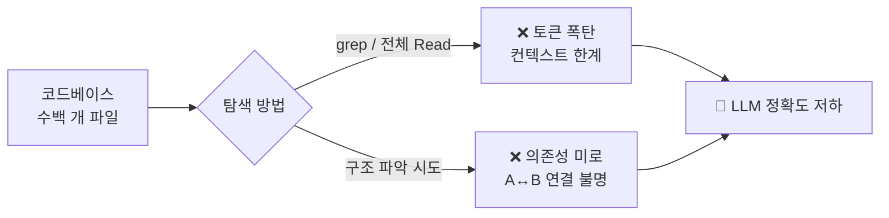
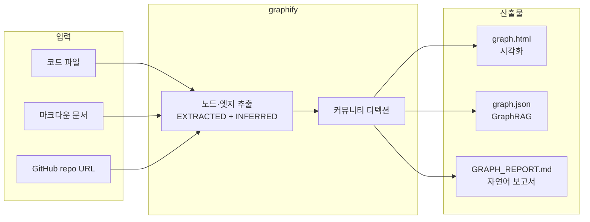
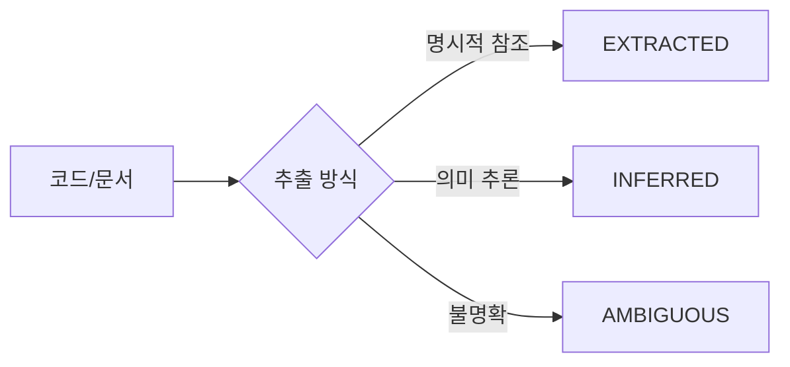
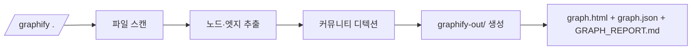
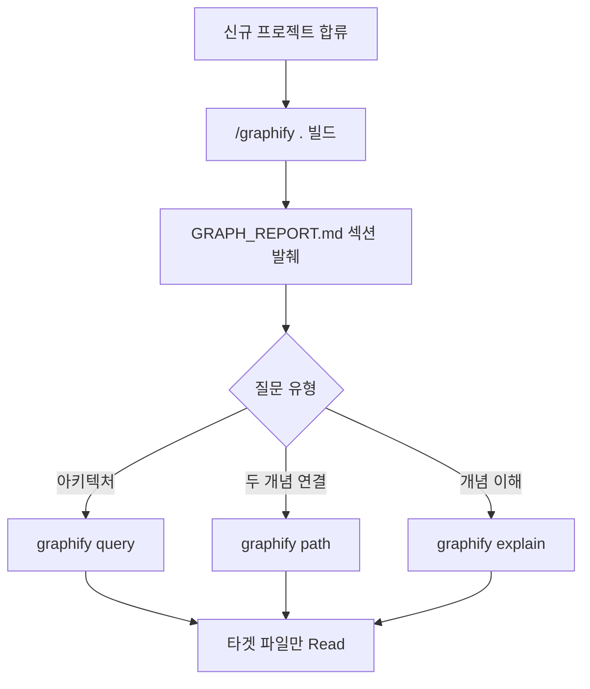

# 들어가며 — 왜 graphify인가

## 대규모 코드베이스의 문제
#layout-contents

* 파일 수백 개, 모듈 의존성 복잡
* "A와 B가 어떻게 연결돼 있지?" → grep은 한계
* **컨텍스트 창 낭비**: 파일 전체를 LLM에 올리면 토큰 폭탄



---

## graphify가 해결하는 문제
#layout-contents-split

::: left
* 코드·문서 전체를 **사전 분석** → knowledge graph 캐시
* 질의 시 필요한 노드만 가져옴 → **토큰 최소화**
* EXTRACTED + INFERRED edge로 숨겨진 연결 발견
:::

::: right

:::

---

# graphify란 무엇인가

## 정의 & 산출물
#layout-contents

* **정의**: 임의 폴더·repo·URL 입력 → community detection + knowledge graph 생성 CLI
* **3대 산출물**:
    - `graph.html` — 인터랙티브 시각화 (사람용)
    - `graph.json` — GraphRAG 백엔드용 (CLI 경유만)
    - `GRAPH_REPORT.md` — 자연어 보고서 (섹션별 발췌)



---

## Obsidian Graph vs graphify
#layout-contents

| 항목         | Obsidian Graph     | graphify              |
| :----------- | :----------------- | :-------------------- |
| 입력         | `[[wikilink]]`     | 임의 파일·repo·URL    |
| 관계 추출    | 명시적 링크만      | 의미 추출 + 추론      |
| 대상         | 마크다운 노트      | 코드·문서·멀티모달    |
| 탐색         | GUI 시각화         | CLI query/path/explain|

---

## 핵심 개념: edge 신뢰도
#layout-contents



* EXTRACTED → 신뢰도 높음 (함수 호출, import 등)
* INFERRED → 문맥 기반 추론 (avg confidence: 0.7)

---

# 설치 & 첫 빌드

## 설치 방법
#layout-contents

```bash
# Claude Code 슬래시 명령으로 실행 (별도 설치 없음)
/graphify .                    # 현재 폴더 풀 파이프라인
/graphify <path>               # 특정 경로
/graphify <github-url>         # repo clone 후 빌드
```

* ex) Claude Code 터미널에서 `/graphify ~/myproject` 실행

---

## 첫 빌드 흐름
#layout-contents



* 최초 빌드만 토큰 소비 → 이후 `graphify update .` (AST-only, 무비용)

---

# 토큰 절약 — 스마트 탐색 전략

## 절대 하지 말 것
#layout-contents

```bash
# ❌ 토큰 폭탄 — 수백 KB 파일 직접 Read
Read graphify-out/graph.json
Read graphify-out/GRAPH_REPORT.md   # 300+ 줄
Read graphify-out/graph.html
```

* `graph.json` = 수백 KB — **절대 금지**
* `GRAPH_REPORT.md` = 300+ 줄 — bash 발췌만 허용

---

## 권장 탐색 패턴
#layout-contents

```bash
# ✅ 그래프 탐색 — 필요한 노드만
graphify query "X와 Y의 관계"
graphify path "moduleA" "moduleB"
graphify explain "개념명"

# ✅ GRAPH_REPORT 섹션 발췌
sed -n '/^## Community Hubs/,/^## /p' \
  graphify-out/GRAPH_REPORT.md | head -50
```

* 허용: `GRAPH_REPORT.brief.md` (≤100줄), `wiki/index.md`, `wiki/{community}.md` (1~2개)

---

# CLI 실전: query / path / explain

## 세 가지 핵심 명령
#layout-contents

| 명령                            | 용도                              |
| :------------------------------ | :-------------------------------- |
| `graphify query "<질문>"`       | BFS 그래프 탐색 (자연어 질의)     |
| `graphify path "A" "B"`         | 두 개념 최단 경로                 |
| `graphify explain "<concept>"`  | 노드 자연어 설명                  |

---

## 명령별 역할 카드
#layout-blank


---

## query 사용 예시
#layout-contents

```bash
# 아키텍처·의존성 질문
graphify query "generate-slides.js가 어떤 모듈을 사용하나?"

# 관계 질문
graphify query "theme과 layout의 관계는?"

# 기능 위치 질문
graphify query "슬라이드 변환 핵심 함수는 어디?"
```

* 일반 grep: 파일 위치만 찾음
* graphify query: 관계 맥락까지 설명

---

## path & explain 사용 예시
#layout-contents

```bash
# 두 개념 연결 탐색
graphify path "Info.md" "slide/index.html"
# → Info.md → agenda-designer → AGENDA.md → generate-slides.js → slide/index.html

# 개념 설명
graphify explain "layout-selector"
# → layout-selector agent가 하는 일, 관련 파일, 의존 데이터 설명
```

---

# 실전 워크플로

## 코드베이스 탐색 워크플로
#layout-contents



---

## 업데이트 정책
#layout-contents

```bash
# 코드 수정 후 — AST only, 무비용
graphify update .

# 또는 post-commit hook 설치 (자동화)
# .git/hooks/post-commit에 graphify update . 추가
```

* 전체 재빌드 (`/graphify .`)는 비용 큼 → `--update` 증분 필수
* wiki 생성: `--wiki` 옵션 (agent가 크롤 가능한 구조화 wiki)

---

# 정리 & 다음 단계

## 오늘 학습한 내용
#layout-closing

* **graphify가 무엇인가**
    - 코드·문서 → knowledge graph (EXTRACTED + INFERRED edge)
    - Obsidian과의 차이: 명시적 링크 vs 의미 추출
* **토큰 절약 전략**
    - `graph.json`, `GRAPH_REPORT.md` 직접 Read 금지
    - `graphify query / path / explain` CLI 경유
* **CLI 실전**
    - query(탐색) / path(연결) / explain(설명) 3종 세트

---

## 다음 단계
#layout-closing

* `/graphify .` — 지금 작업 중인 프로젝트에 바로 적용
* `/gq <질문>` — graphify query 래퍼 (더 짧은 명령)
* `/graphify-brief <주제>` — 50줄 요약 리포트
* **Cross-repo merge** — 다중 repo 단일 그래프 통합 (고급)


