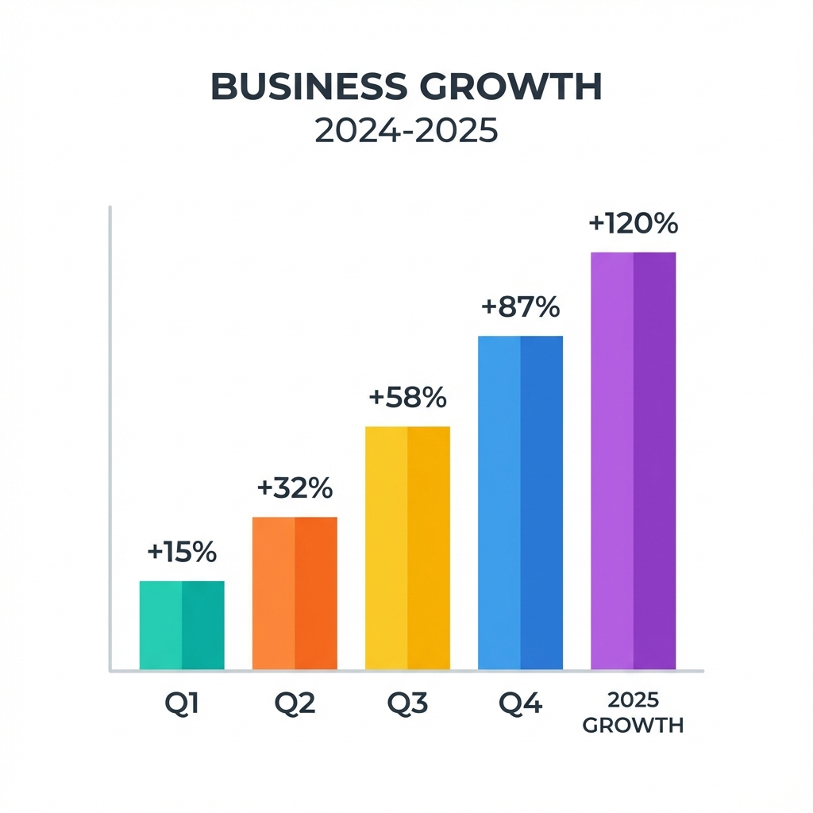

# 5. 레이아웃 예제 (DIV 활용)

---

## 2분할 레이아웃 - 1단계
* 왼쪽 텍스트 영역
  -HTML DIV 태그를 사용하여
  -원하는 레이아웃을 직접 구성할 수 있습니다.
  -flexbox 스타일을 활용하세요.

---

## 2분할 레이아웃 - 1단계 [좌이미지]

* 왼쪽 텍스트 영역
  -HTML DIV 태그를 사용하여
  -원하는 레이아웃을 직접 구성할 수 있습니다.
  -flexbox 스타일을 활용하세요.

---

## 2분할 레이아웃 - 2단계
* 왼쪽 텍스트 영역
  -HTML DIV 태그를 사용하여
  -원하는 레이아웃을 직접 구성할 수 있습니다.
  -flexbox 스타일을 활용하세요.
::right::

---

## 2분할 레이아웃 (좌: 텍스트 / 우: 이미지) - Pandoc 펜스 div

::: columns
:::: {.column width="48%"}
* 왼쪽 텍스트 영역
  - HTML DIV 태그를 사용하여
  - 원하는 레이아웃을 직접 구성할 수 있습니다.
  - flexbox 스타일을 활용하세요.
::::
:::: {.column width="48%"}

::::
:::

---

## 3분할 레이아웃 (카드 형태) - Pandoc 펜스 div

::: columns
:::: {.column .card}

::::
:::: {.column .card}
* 왼쪽 텍스트 영역
  - HTML DIV 태그를 사용하여
  - 원하는 레이아웃을 직접 구성할 수 있습니다.
  - flexbox 스타일을 활용하세요.
::::
:::: {.column .card}

::::
:::

---

## 2분할 레이아웃 (좌: 텍스트 / 우: 이미지) - dev

  

    <h3>왼쪽 텍스트 영역</h3>
    <ul>
      <li>HTML DIV 태그를 사용하여</li>
      <li>원하는 레이아웃을 직접 구성할 수 있습니다.</li>
      <li>flexbox 스타일을 활용하세요.</li>
    </ul>
  

  

    
  

---

## 3분할 레이아웃 (카드 형태) - div

  

    <h4>Card 1</h4>
    
첫 번째 카드의 내용입니다.

  

  

    <h4>Card 2</h4>
    
두 번째 카드의 내용입니다.

  

  

    <h4>Card 3</h4>
    
세 번째 카드의 내용입니다.

  

