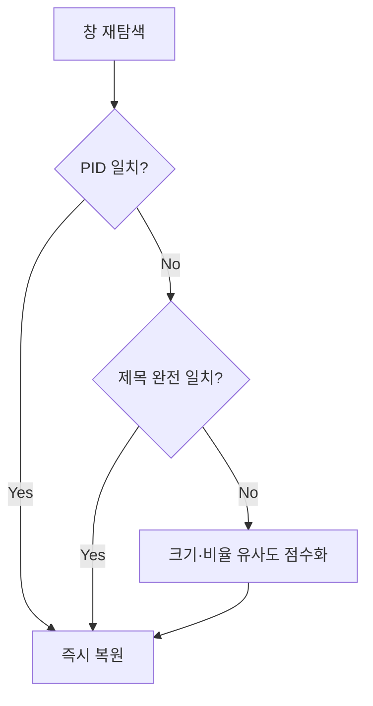
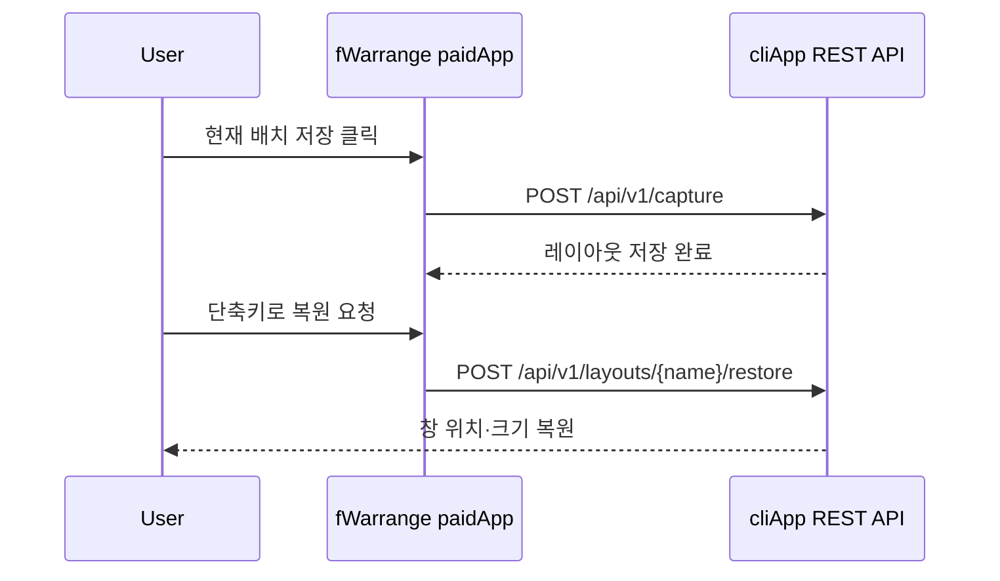
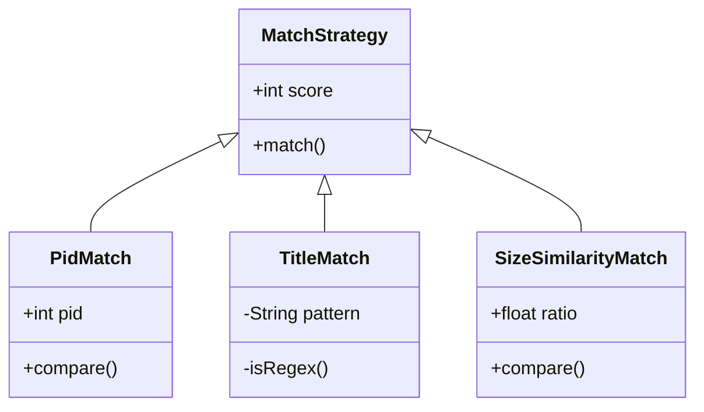
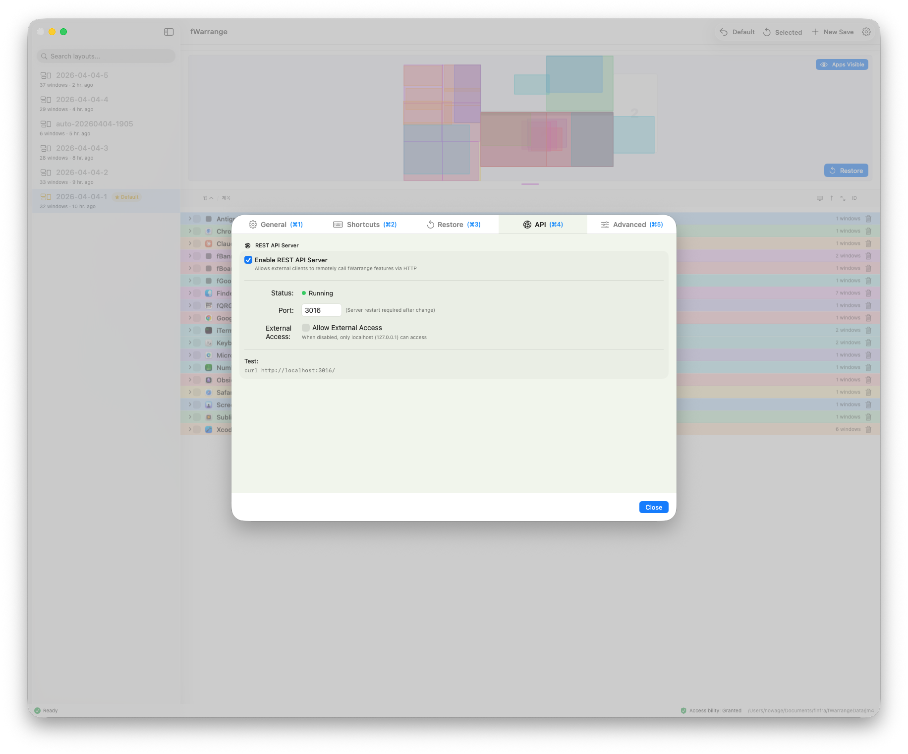
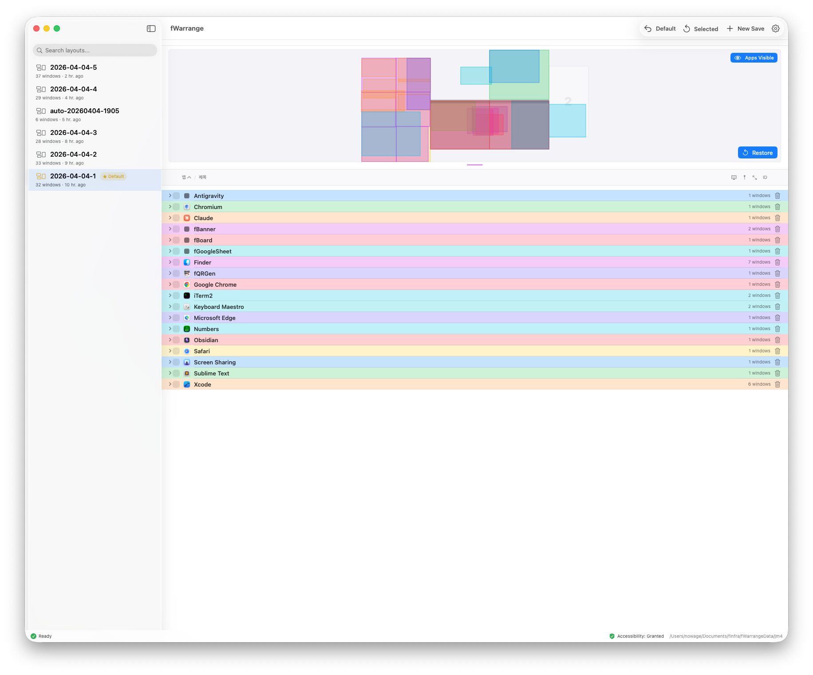
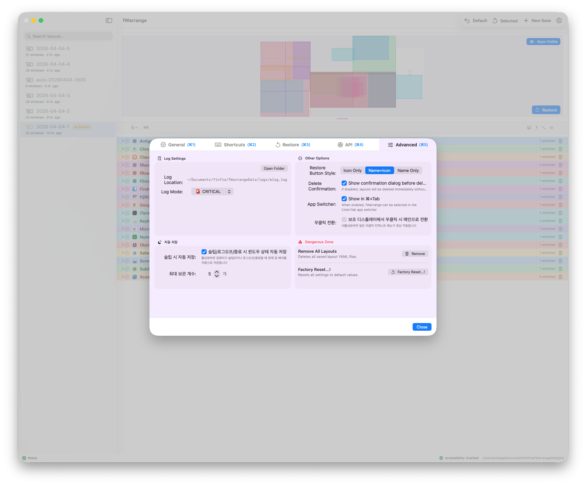
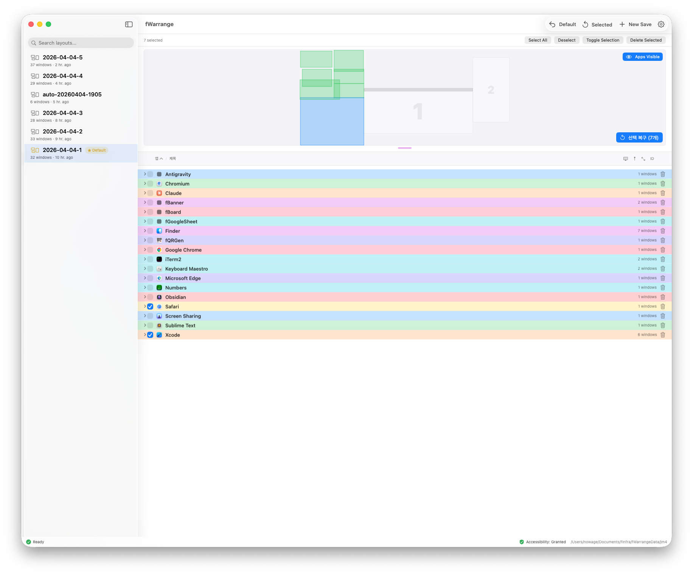
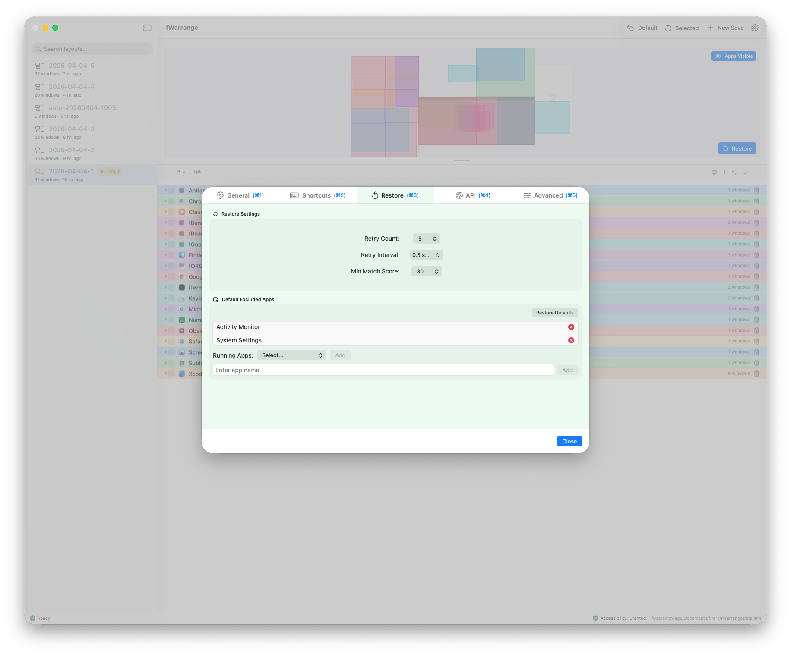
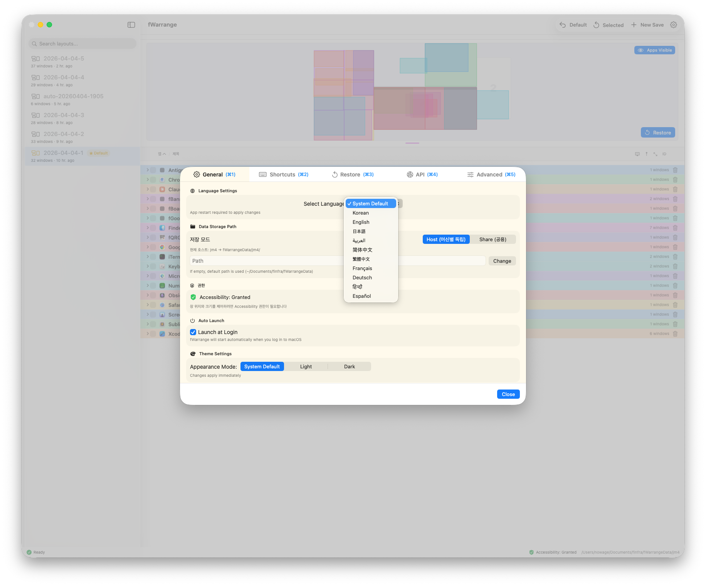
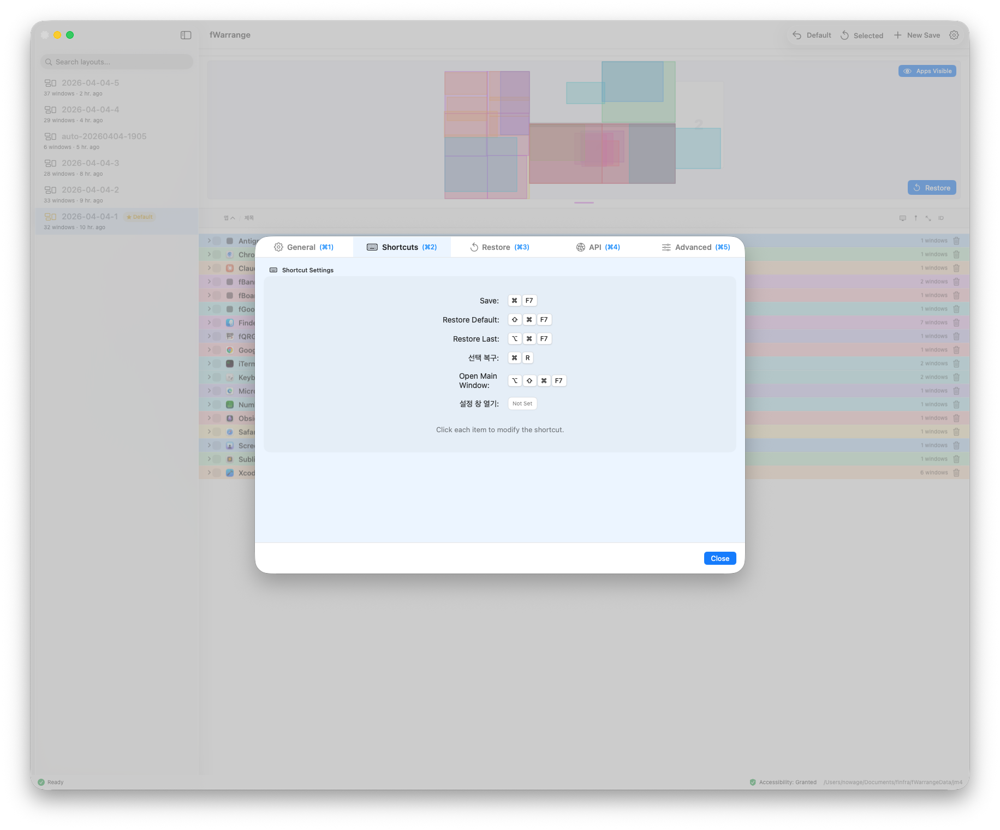

#layout-chapter

# 0. Chapter Divider 테스트

* 0.1. fWarrange 소개
* 0.2. 워크스페이스 저장·복원
* 0.3. REST API·AI 에이전트 연동

---

# 1. 텍스트 레이아웃
* 현재 예제는 1개의 md파일로 생성됨. fWarrange 소개 자료를 예시 데이터로 사용함.
---

## 기본 텍스트 스타일

* fWarrange는 macOS 활성 윈도우의 위치와 크기를 저장하고 복원하는 도구입니다.
* **스마트 창 매칭** 알고리즘과 *메뉴바 기반 GUI*를 함께 제공합니다.
* REST API 서버는 기본 포트 3016에서 상태를 확인할 수 있습니다.
* > 창이 닫혔다 다시 열려도 PID·제목·크기 유사도를 기준으로 정확히 복원됩니다.

---

## 중첩 리스트

* fWarrange 앱 구조
    - paidApp (GUI)
        - SwiftUI 메뉴바 앱
            * App Store 배포용 Sandbox 호환

---

## 번호 있는 리스트

1. 다운로드 및 설치
2. 접근성 권한 설정
3. 레이아웃 저장과 복원
    1. 현재 창 배치를 워크스페이스로 저장
    2. 저장된 워크스페이스를 단축키로 즉시 복원

---

# 2. 코드 및 신택스 하이라이팅

---

## JavaScript 코드 예시

```javascript
// 현재 창 배치를 캡처하여 저장 (REST API)
async function captureLayout(name) {
  const res = await fetch("http://fwarrange-daemon:3016/api/v1/capture", {
    method: "POST",
    body: JSON.stringify({ name })
  });
  return res.json(); // { app: "fWarrange", status: "ok" }
}
```

---

## Python 코드 예시

```python
# 스마트 창 매칭 점수 계산 (PID / 제목 / 크기 유사도)
def match_score(pid_ok, title_ok, size_ratio):
    score = 0
    if pid_ok:
        score += 50
    if title_ok:
        score += 30
    score += size_ratio * 20
    return score

print(match_score(True, True, 0.9))
```

---

# 3. 데이터 시각화 (Mermaid)

---

## 플로우차트 (Flowchart)



---

## 시퀀스 다이어그램 (Sequence Diagram)



---

## 클래스 다이어그램 (Class Diagram)



---

# 4. 이미지 및 미디어

---

## 개요

* fWarrange 실제 화면 9종 캡처로 이미지 배치 예제를 다양하게 구성
* 메뉴바 앱, 설정 화면, 다중 모니터, 언어 선택까지 화면별로 다른 캡처 사용
---

## 4.1. 이미지

---

### 이미지 Only


---

### 기본 이미지 배치 (일반 설정 화면)


* 설정(Settings) 창의 첫 화면으로, 여기서 API·단축키·복원 옵션 탭으로 이동합니다.

---

## 4.2. 리스트

---

### 리스트 Only

* 스마트 창 매칭 정확도가 지속적으로 개선되고 있습니다.
* 레이아웃 일괄 정리 기능으로 선택·마지막·기본 3개만 남기고 삭제
* 다국어 번역 커버리지 79~89% 진행 중
* 이미지가 있을 때 텍스트가 어떻게 배치되는지 확인

---

## 4.2.1. 리스트[서브 Chapter 테스트용.]

---

### 리스트 Only[서브 Chapter 테스트용.]

* 스마트 창 매칭 정확도가 지속적으로 개선되고 있습니다.
* 레이아웃 일괄 정리 기능으로 선택·마지막·기본 3개만 남기고 삭제
* 다국어 번역 커버리지 79~89% 진행 중
* 이미지가 있을 때 텍스트가 어떻게 배치되는지 확인

### 이미지와 리스트 (API 설정)



* 설정 → API 탭에서 REST API 서버 활성화 토글을 켭니다.
* 기본 포트는 3016이며 필요 시 변경할 수 있습니다.
* `curl http://<host>:3016/`로 서버 상태(Health Check)를 확인합니다.
* 이미지가 있을 때 텍스트가 어떻게 배치되는지 확인

---

# 5. 레이아웃 예제 (DIV 활용)

---

## 2분할 레이아웃 - 1단계 
* 메뉴바 아이콘을 클릭하면 저장된 워크스페이스 목록이 나타납니다.
  -앱 이름·창 위치·크기가 세트로 저장됩니다.
  -다중 모니터 환경에서는 각 창이 있던 모니터 정보도 함께 기록됩니다.



---

## 2분할 레이아웃 - 1단계 [좌이미지]



* cliApp은 Sandbox 미적용 데몬으로 Accessibility API와 REST 서버를 제공합니다.
  -paidApp과 별도 프로세스로 동작합니다.
  -고급 설정에서 로그 레벨과 데몬 연동 옵션을 조정합니다.

---

## 2분할 레이아웃 - 2단계
* 스마트 창 매칭은 여러 기준으로 점수를 매깁니다.
  -PID 일치
  -제목 완벽 일치 또는 정규표현식 매칭
  -창 크기·비율 유사도
::right::


---

## 2분할 레이아웃 (좌: 텍스트 / 우: 이미지) - Pandoc 펜스 div

::: columns
:::: {.column width="48%"}
* 레이아웃 복원이 정확하지 않다면 접근성 권한부터 확인합니다.
  - 시스템 설정 → 개인정보 보호 및 보안 → 접근성
  - fWarrange 토글을 켜야 창 위치·크기를 정확히 읽고 씁니다.
  - 권한이 없으면 복원 시 위치가 어긋나는 경우가 많습니다.
::::
:::: {.column width="48%"}

::::
:::

---

## 3분할 레이아웃 (카드 형태) - Pandoc 펜스 div

::: columns
:::: {.column .card}

::::
:::: {.column .card}
* Claude Code Skill과 MCP 서버로 자연어 명령이 가능합니다.
  - `/fwarrange capture`, `/fwarrange restore` 등 슬래시 커맨드 제공
  - REST API 서버가 켜져 있어야 동작합니다.
::::
:::: {.column .card}

::::
:::

---

## 2분할 레이아웃 (좌: 텍스트 / 우: 이미지) - dev 

<div style="display: flex; align-items: center; justify-content: space-between;">
  <div style="width: 48%;">
    <h3>키보드 단축키</h3>
    <ul>
      <li>워크스페이스별로 원하는 키 조합을 직접 지정할 수 있습니다.</li>
      <li>글로벌 단축키는 데몬 기반으로 앱이 백그라운드여도 동작합니다.</li>
      <li>Settings → Shortcuts 탭에서 즉시 저장됩니다.</li>
    </ul>
  </div>
  <div style="width: 48%;">
    
  </div>
</div>

---


## 3분할 레이아웃 (카드 형태) - div

<div style="display: flex; justify-content: space-around;">
  <div style="width: 30%; background: rgba(255,255,255,0.1); padding: 10px; border-radius: 8px;">
    <h4>paidApp</h4>
    <p>App Store 배포용 GUI. 메뉴바에서 레이아웃 저장·복원.</p>
  </div>
  <div style="width: 30%; background: rgba(255,255,255,0.1); padding: 10px; border-radius: 8px;">
    <h4>cliApp</h4>
    <p>Sandbox 미적용 데몬. Accessibility API와 REST 서버 제공.</p>
  </div>
  <div style="width: 30%; background: rgba(255,255,255,0.1); padding: 10px; border-radius: 8px;">
    <h4>REST API</h4>
    <p>포트 3016. 터미널·스크립트·AI 에이전트가 원격 제어.</p>
  </div>
</div>

---

# 6. 테이블 및 이미지 혼합

---

## 기본 테이블

| 항목      |  paidApp  |        cliApp |
| :-------- | :-------: | ------------: |
| 배포 방식 | App Store |   Helper 데몬 |
| Sandbox   |   적용    |      미적용   |
| 역할      | GUI 관리  | 창 제어 실행  |

---

## 이미지가 포함된 테이블

|         아이콘          | 이름             | 설명                 |
| :----------------------: | :--------------- | :------------------- |
|  | **paidApp**       | 메뉴바 GUI 앱        |
|  | **cliApp**        | REST API 데몬        |
|  | **워크스페이스**  | 저장된 레이아웃 YAML |

* 테이블 셀 내부에 마크다운 이미지 문법을 사용하여 아이콘을 넣을 수 있습니다.

---

# 7. m2Slide 기능 소개

---

## 네비게이션

* **ESC**: 전체 슬라이드 오버뷰
* **Space/화살표**: 슬라이드 이동
* 슬라이드 하단 프로그레스 바 확인

---

## 마무리

* 지금까지 fWarrange 소개 자료로 m2Slide 기능을 살펴봤습니다.
* Markdown으로 쉽고 빠르게 프레젠테이션을 작성할 수 있습니다.
