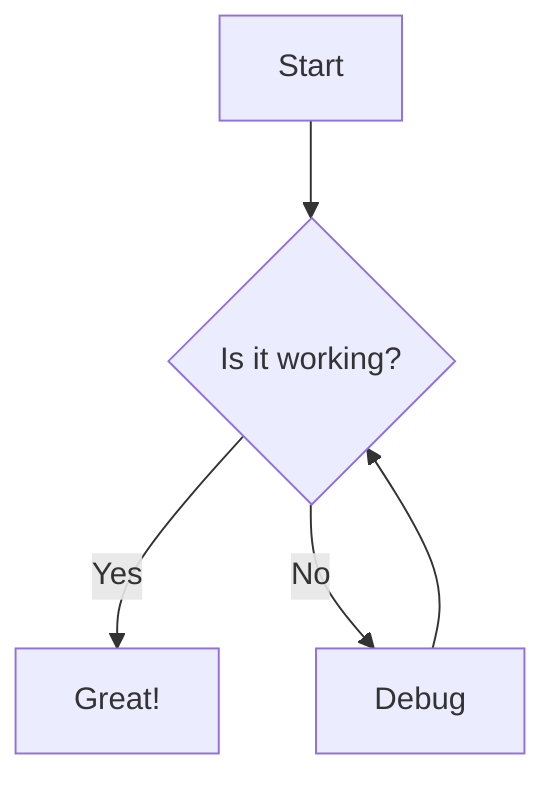
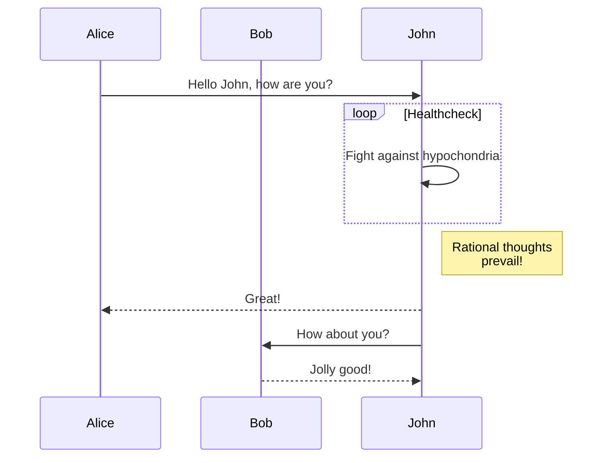
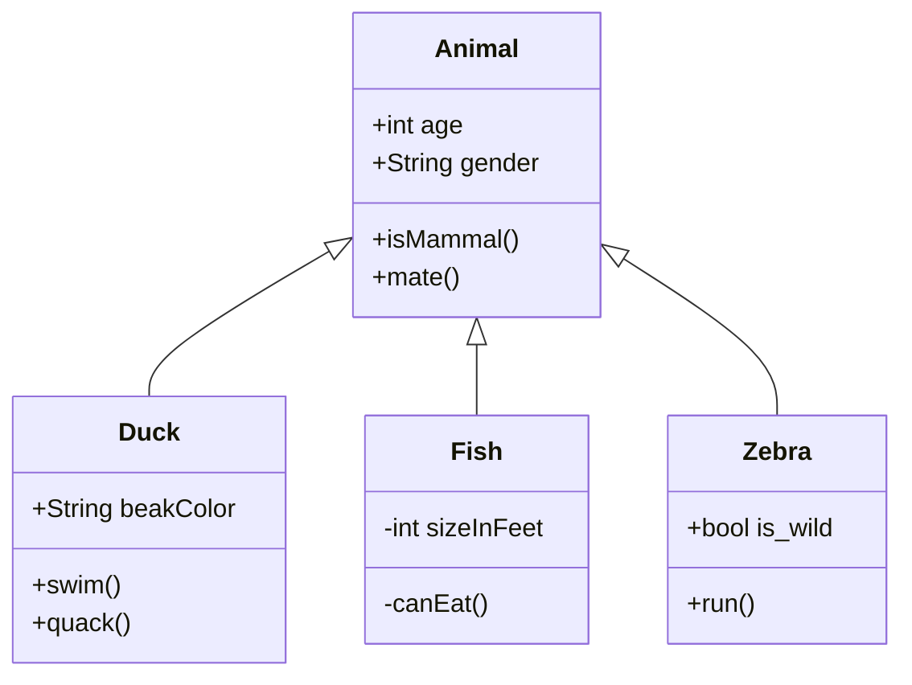
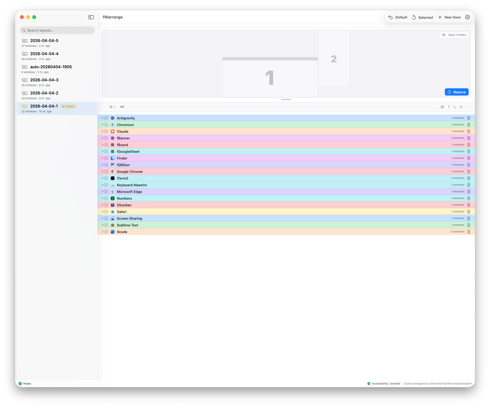
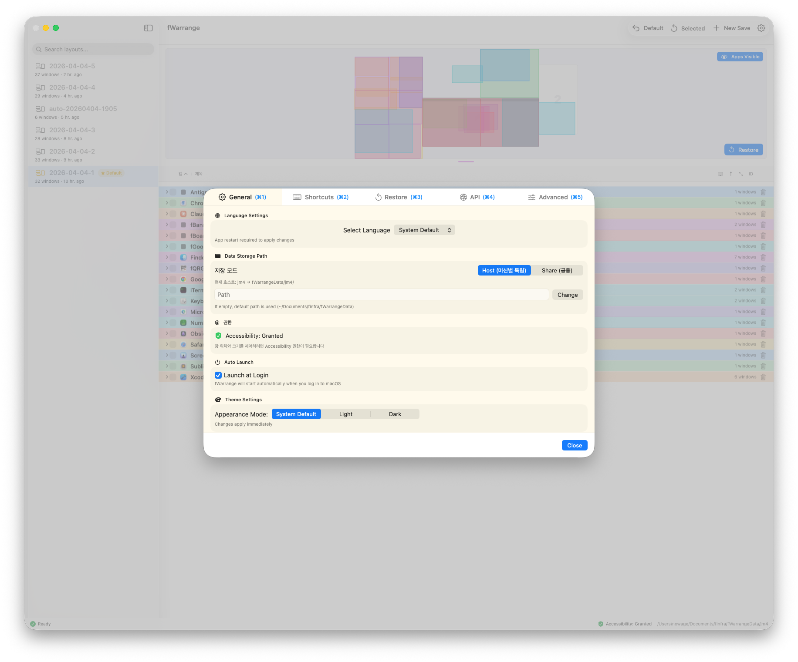

#id-text-layout-intro
#layout-_cover

# 1. 텍스트 레이아웃
* 현재 예제는 1개의 md파일로 생성됨. 
---

#id-chapter-divider-test
#layout-chapter

# 0. Chapter Divider 테스트

* 0.1. sub-section A
* 0.2. sub-section B
* 0.3. sub-section C

---

#id-basic-text-style
#layout-_contents

## 기본 텍스트 스타일

* 이것은 기본 리스트 아이템입니다.
* **굵은 글씨**와 *이탤릭체*를 지원합니다.
* `인라인 코드`도 사용할 수 있습니다.
* > 인용문(Blockquote) 스타일입니다.

---

#id-nested-list
#layout-_contents

## 중첩 리스트

* 레벨 1
    - 레벨 2
        - 레벨 3
            * 레벨 4

---

#id-numbered-list
#layout-_contents

## 번호 있는 리스트

1. 첫 번째 항목
2. 두 번째 항목
3. 세 번째 항목
    1. 중첩된 항목 1
    2. 중첩된 항목 2

---

#id-code-syntax-highlighting
#layout-_cover

# 2. 코드 및 신택스 하이라이팅

---

#id-js-code-example
#layout-_contents

## JavaScript 코드 예시

```javascript
function helloWorld() {
  console.log("Hello, m2Slide!");
  const number = 42;
  return number * 2;
}
```

---

#id-python-code-example
#layout-_contents

## Python 코드 예시

```python
def fibonacci(n):
    if n <= 1:
        return n
    else:
        return fibonacci(n-1) + fibonacci(n-2)

print(fibonacci(10))
```

---

#id-mermaid-visualization
#layout-_cover

# 3. 데이터 시각화 (Mermaid)

---

#id-mermaid-flowchart
#layout-_contents

## 플로우차트 (Flowchart)



---

#id-mermaid-sequence-diagram
#layout-_contents

## 시퀀스 다이어그램 (Sequence Diagram)



---

#id-mermaid-class-diagram
#layout-_contents

## 클래스 다이어그램 (Class Diagram)



---

#id-image-media-intro
#layout-_cover

# 4. 이미지 및 미디어

---

#id-image-media-overview
#layout-_contents

## 개요

* 테스트 용도
* 중간 노드임.
---

#id-image-section
#layout-_cover

## 4.1. 이미지

---

#id-image-only
#layout-_blank

### 이미지 Only



---

#id-image-basic-placement
#layout-_contents

### 기본 이미지 배치 (Scenery)


* 이미지 아래 텍스트

---

#id-list-section
#layout-_cover

## 4.2. 리스트

---

#id-list-only
#layout-_contents

### 리스트 Only

* 매출이 상승하고 있습니다.
* 1분기 대비 2분기 20% 성장
* 3분기 예측치 달성 무난
* 이미지가 있을 때 텍스트가 어떻게 배치되는지 확인

---

#id-list-subchapter-test
#layout-_cover

## 4.2.1. 리스트[서브 Chapter 테스트용.]

---

#id-list-only-subchapter
#layout-_contents

### 리스트 Only[서브 Chapter 테스트용.]

* 매출이 상승하고 있습니다.
* 1분기 대비 2분기 20% 성장
* 3분기 예측치 달성 무난
* 이미지가 있을 때 텍스트가 어떻게 배치되는지 확인

---

#id-image-list-chart
#layout-_contents

### 이미지와 리스트 (Chart)



* 매출이 상승하고 있습니다.
* 1분기 대비 2분기 20% 성장
* 3분기 예측치 달성 무난
* 이미지가 있을 때 텍스트가 어떻게 배치되는지 확인

---

#id-div-layout-intro
#layout-_cover

# 5. 레이아웃 예제 (DIV 활용)

---

#id-split-layout-basic
#layout-_contents

## 2분할 레이아웃 - 1단계 
* 왼쪽 텍스트 영역
  -HTML DIV 태그를 사용하여
  -원하는 레이아웃을 직접 구성할 수 있습니다.
  -flexbox 스타일을 활용하세요.


---

#id-split-layout-image-left
#layout-_contents

## 2분할 레이아웃 - 1단계 [좌이미지]


* 왼쪽 텍스트 영역
  -HTML DIV 태그를 사용하여
  -원하는 레이아웃을 직접 구성할 수 있습니다.
  -flexbox 스타일을 활용하세요.

---

#id-split-layout-slidev-slot
#layout-_contents

## 2분할 레이아웃 - 2단계
* 왼쪽 텍스트 영역
  -HTML DIV 태그를 사용하여
  -원하는 레이아웃을 직접 구성할 수 있습니다.
  -flexbox 스타일을 활용하세요.
::right::


---

#id-split-layout-pandoc-columns
#layout-_contents

## 2분할 레이아웃 (좌: 텍스트 / 우: 이미지) - Pandoc 펜스 div

::: columns
:::: {.column width="48%"}
* 왼쪽 텍스트 영역
  - HTML DIV 태그를 사용하여
  - 원하는 레이아웃을 직접 구성할 수 있습니다.
  - flexbox 스타일을 활용하세요.
::::
:::: {.column width="48%"}

::::
:::

---

#id-three-col-cards-pandoc
#layout-_contents

## 3분할 레이아웃 (카드 형태) - Pandoc 펜스 div

::: columns
:::: {.column .card}

::::
:::: {.column .card}
* 왼쪽 텍스트 영역
  - HTML DIV 태그를 사용하여
  - 원하는 레이아웃을 직접 구성할 수 있습니다.
  - flexbox 스타일을 활용하세요.
::::
:::: {.column .card}

::::
:::

---

#id-split-layout-raw-div
#layout-_contents

## 2분할 레이아웃 (좌: 텍스트 / 우: 이미지) - dev 

<div style="display: flex; align-items: center; justify-content: space-between;">
  <div style="width: 48%;">
    <h3>왼쪽 텍스트 영역</h3>
    <ul>
      <li>HTML DIV 태그를 사용하여</li>
      <li>원하는 레이아웃을 직접 구성할 수 있습니다.</li>
      <li>flexbox 스타일을 활용하세요.</li>
    </ul>
  </div>
  <div style="width: 48%;">
    
  </div>
</div>

---

#id-three-col-cards-raw-div
#layout-_contents

## 3분할 레이아웃 (카드 형태) - div

<div style="display: flex; justify-content: space-around;">
  <div style="width: 30%; background: rgba(255,255,255,0.1); padding: 10px; border-radius: 8px;">
    <h4>Card 1</h4>
    <p>첫 번째 카드의 내용입니다.</p>
  </div>
  <div style="width: 30%; background: rgba(255,255,255,0.1); padding: 10px; border-radius: 8px;">
    <h4>Card 2</h4>
    <p>두 번째 카드의 내용입니다.</p>
  </div>
  <div style="width: 30%; background: rgba(255,255,255,0.1); padding: 10px; border-radius: 8px;">
    <h4>Card 3</h4>
    <p>세 번째 카드의 내용입니다.</p>
  </div>
</div>

---

#id-table-image-intro
#layout-_cover

# 6. 테이블 및 이미지 혼합

---

#id-basic-table
#layout-_contents

## 기본 테이블

| 헤더 1    |  헤더 2   |      헤더 3 |
| :-------- | :-------: | ----------: |
| 왼쪽 정렬 | 중앙 정렬 | 오른쪽 정렬 |
| 데이터 1  | 데이터 2  |    데이터 3 |
| 내용 A    |  내용 B   |      내용 C |

---

#id-table-with-images
#layout-_contents

## 이미지가 포함된 테이블

|         아이콘          | 이름       | 설명           |
| :---------------------: | :--------- | :------------- |
|         | **Robot** | AI Assistant |
|             | **QR**    | Link Marker  |
|  | **Chart** | Data Report  |

* 테이블 셀 내부에 마크다운 이미지 문법을 사용하여 아이콘을 넣을 수 있습니다.

---

#id-feature-intro
#layout-_cover

# 7. m2Slide 기능 소개

---

#id-navigation-keys
#layout-_contents

## 네비게이션

* **ESC**: 전체 슬라이드 오버뷰
* **Space/화살표**: 슬라이드 이동
* 슬라이드 하단 프로그레스 바 확인

---

#id-closing
#layout-_contents

## 마무리

* m2Slide를 사용하여 멋진 프레젠테이션을 만드세요.
* Markdown으로 쉽고 빠르게 작성할 수 있습니다.
