# 2. 라이브러리 다이어그램·수식·심벌
#layout-chapter

---

## 2.1 Mermaid — Flowchart
#layout-contents

렌더 백엔드: Mermaid.js (CDN 조건부 주입). fenced lang `mermaid`.
flowchart / sequence / gantt / classDiagram / gitGraph 등 지원.

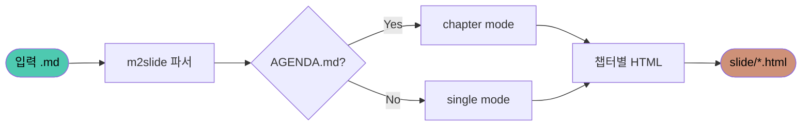

---

## 2.1b Mermaid — Sequence Diagram
#layout-contents

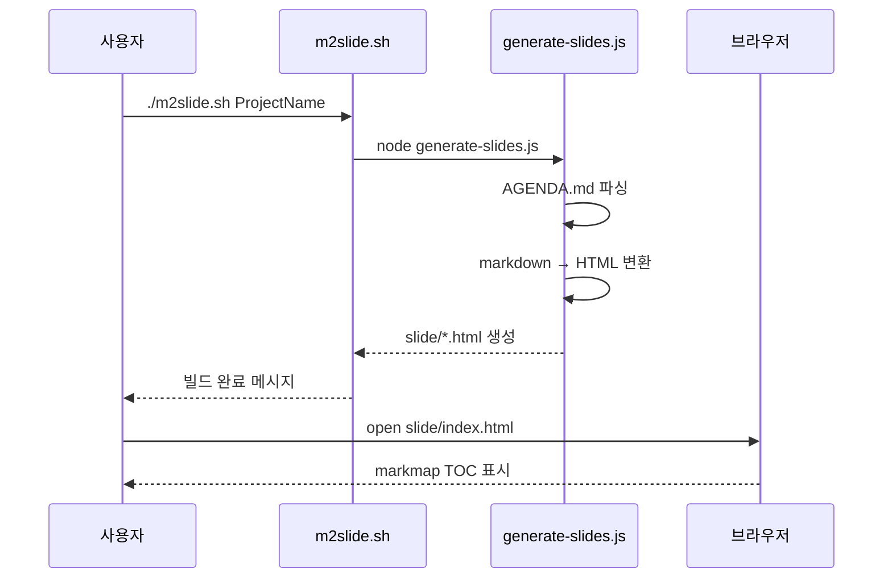

---

## 2.1c Mermaid — Gantt
#layout-contents

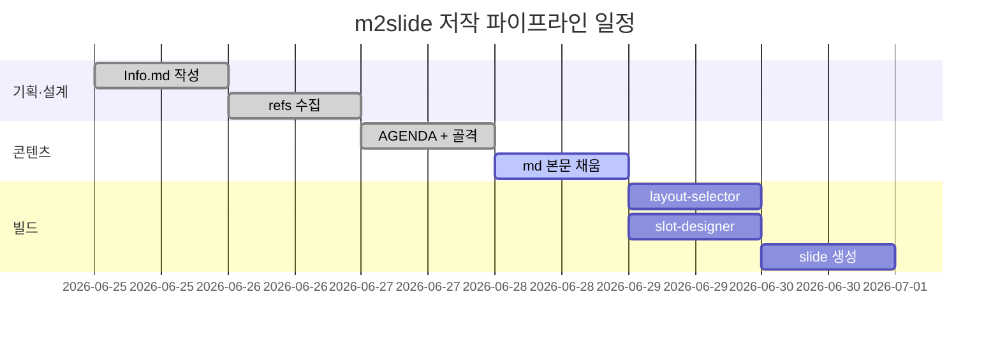

---

## 2.1d Mermaid — Class Diagram
#layout-contents

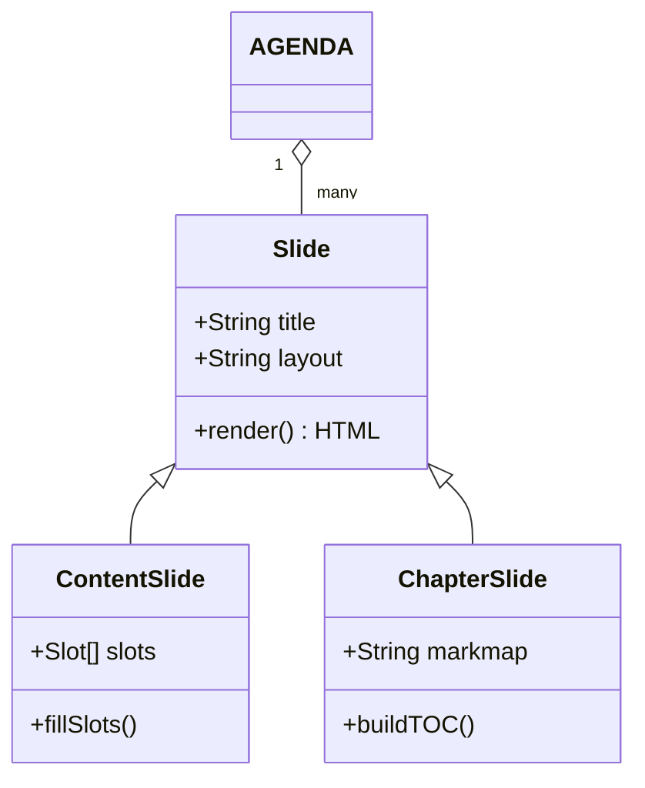

---

## 2.1e Mermaid — State Diagram
#layout-contents

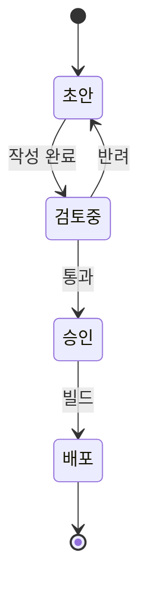

---

## 2.1f Mermaid — ER Diagram
#layout-contents

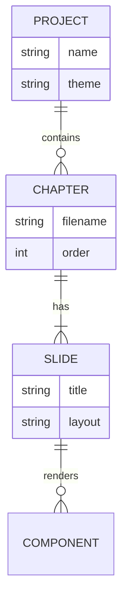

---

## 2.1g Mermaid — Mindmap
#layout-contents

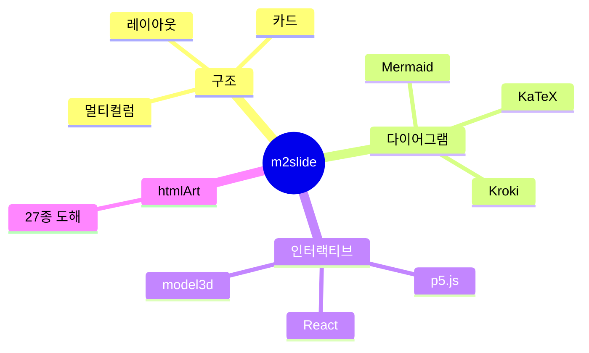

---

## 2.1h Mermaid — Git Graph
#layout-contents

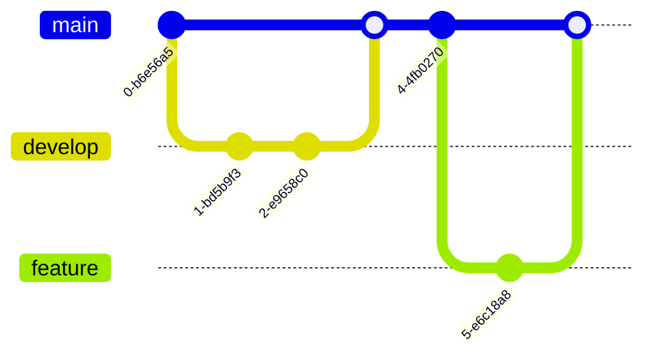

---

## 2.1i Mermaid — User Journey
#layout-contents

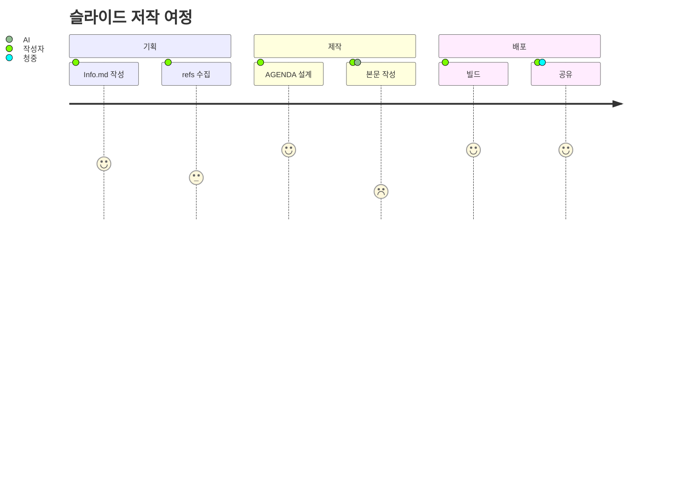

---

## 2.1j Mermaid — Quadrant Chart
#layout-contents

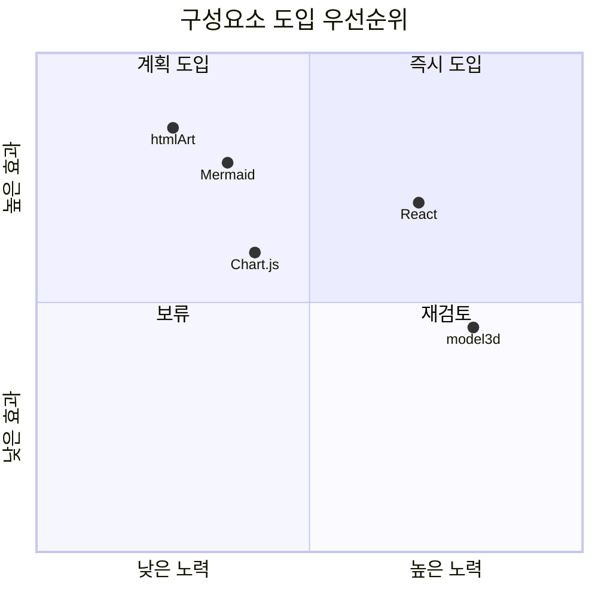

---

## 2.1k Mermaid — XY Chart
#layout-contents

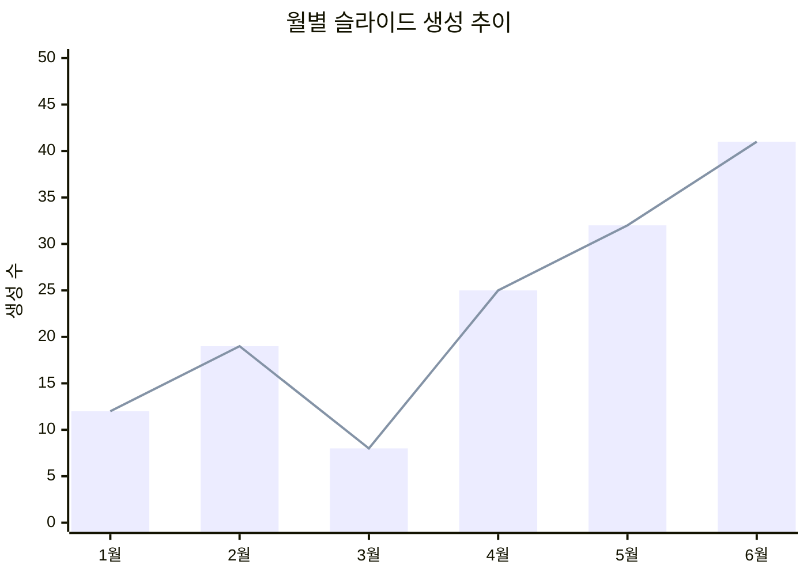

---

## 2.2 Kroki (PlantUML / Graphviz)
#layout-contents

렌더 백엔드: Kroki.io 공개 API (서버 측 렌더 → PNG/SVG 반환).
fenced lang `plantuml` 또는 `dot`. **주의**: 네트워크 연결 필요.

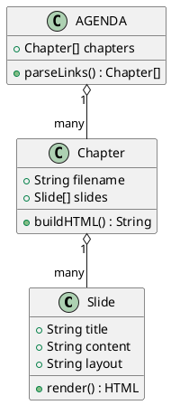

---

## 2.2b Graphviz dot
#layout-contents

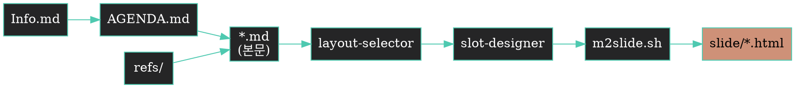

---

## 2.2c PlantUML — Sequence Diagram
#layout-contents

PlantUML class diagram(2.2)과 동일 Kroki 백엔드, 다른 다이어그램 유형.

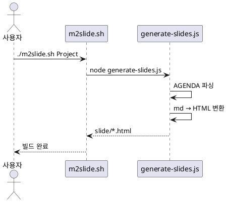

---

## 2.2d Vega-Lite
#layout-contents

렌더 백엔드: Kroki (vegalite). fenced lang `vegalite`. 데이터-주도 시각화 문법.

```vegalite
{
  "$schema": "https://vega.github.io/schema/vega-lite/v5.json",
  "width": 320,
  "height": 200,
  "data": {
    "values": [
      {"유형": "htmlArt", "수": 35},
      {"유형": "Mermaid", "수": 25},
      {"유형": "Chart.js", "수": 20},
      {"유형": "React", "수": 15},
      {"유형": "p5.js", "수": 8}
    ]
  },
  "mark": "bar",
  "encoding": {
    "x": {"field": "유형", "type": "nominal", "sort": "-y"},
    "y": {"field": "수", "type": "quantitative"}
  }
}
```

---

## 2.2e ditaa — ASCII → 그림
#layout-contents

렌더 백엔드: Kroki (ditaa). fenced lang `ditaa`. ASCII 아트를 도형으로 변환.

```ditaa
+------+      +------+      +------+
|      |      |      |      |      |
|  입력  |----->|  파서  |----->|  출력  |
| {d}  |      | cGRE |      | {s}  |
+------+      +------+      +------+
```

---

## 2.2f text-wireframe — 원문 그대로 (D2Coding)
#layout-contents

렌더 백엔드: 없음 (Kroki 변환 안 함). fenced lang `text-wireframe`. 원문 ASCII를 D2Coding 모노스페이스 textarea로 그대로 표시. D2Coding은 한글을 정확히 ASCII 2자 폭으로 렌더하므로 박스 정렬이 plain text 상태로 보장됨 — ditaa의 CJK 정렬 문제를 원천 회피.

```text-wireframe
┌────────┐      ┌────────┐      ┌────────┐
│  입력  │ ───▶ │  파서  │ ───▶ │  출력  │
└────────┘      └────────┘      └────────┘

┌──────┬──────┐
│ 입력 │ 출력 │
├──────┼──────┤
│ 파서 │ 변환 │
└──────┴──────┘
```

---

## 2.3 KaTeX 수식 — 블록
#layout-contents

렌더 백엔드: KaTeX (CDN 조건부 주입). 데크에 `$$` 또는 `\(` 신호 있을 때만 CDN 주입.
블록 수식: `$$…$$` / 인라인: `\(…\)` — 단일 `$` 미지원.

**에너지-질량 등가**

$$E = mc^2$$

**가우스 적분**

$$\int_{-\infty}^{\infty} e^{-x^2} dx = \sqrt{\pi}$$

**행렬 곱**

$$\mathbf{C} = \mathbf{A} \cdot \mathbf{B} = \begin{pmatrix} a & b \\ c & d \end{pmatrix} \begin{pmatrix} e & f \\ g & h \end{pmatrix}$$

---

## 2.3b KaTeX — 인라인 + 혼합
#layout-contents

인라인: \(a^2 + b^2 = c^2\) (피타고라스 정리)

피보나치 점화식: \(F_n = F_{n-1} + F_{n-2}\), \(F_0 = 0\), \(F_1 = 1\)

로그 복잡도: 이진 탐색은 \(O(\log n)\), 정렬은 \(O(n \log n)\)

**정규 분포 PDF**

$$f(x) = \frac{1}{\sigma\sqrt{2\pi}} \exp\!\left(-\frac{(x-\mu)^2}{2\sigma^2}\right)$$

여기서 \(\mu\)는 평균, \(\sigma\)는 표준편차.

---

## 2.4 Font Awesome 심벌
#layout-contents

렌더 백엔드: Font Awesome 6 solid CDN (조건부 주입).
`:fa-<이름>:` → `<i class="fa-solid fa-<이름>">` 변환.

**상태 아이콘**

:fa-circle-check: 완료 · :fa-circle-xmark: 실패 · :fa-circle-exclamation: 경고 · :fa-circle-info: 정보

**개발 / 배포**

:fa-code: 코드 작성 → :fa-vial: 테스트 → :fa-rocket: 배포 → :fa-gauge-high: 모니터링

**미디어 / UI**

:fa-image: 이미지 · :fa-video: 동영상 · :fa-music: 오디오 · :fa-file-pdf: PDF · :fa-database: DB

**네트워크 / 보안**

:fa-shield-halved: 보안 · :fa-lock: 잠금 · :fa-key: 키 · :fa-server: 서버 · :fa-network-wired: 네트워크

---

## 2.4b Font Awesome — 리스트 마커 활용
#layout-contents

심벌을 bullet 리스트 마커로 활용하는 패턴.

* :fa-rocket: **배포 파이프라인** — GitHub Actions → ECR → ECS
* :fa-shield-halved: **보안 스캔** — Trivy 이미지 취약점 분석
* :fa-gauge-high: **성능 모니터링** — Prometheus + Grafana 대시보드
* :fa-database: **DB 마이그레이션** — Flyway 순차 버전 관리
* :fa-rotate: **롤백 전략** — Blue-Green 무중단 전환
