# 7. 다이어그램 확장 갤러리
#layout-chapter

---

## 7.1 Mermaid — 본문 + 다이어그램 배치
#layout-contents

Lorem ipsum dolor sit amet, consectetur adipiscing elit. Sed do eiusmod tempor incididunt ut labore et dolore magna aliqua. Ut enim ad minim veniam, quis nostrud exercitation ullamco laboris nisi ut aliquip ex ea commodo consequat. Duis aute irure dolor in reprehenderit in voluptate velit esse cillum dolore eu fugiat nulla pariatur. Excepteur sint occaecat cupidatat non proident, sunt in culpa qui officia deserunt mollit anim id est laborum.

Lorem ipsum dolor sit amet, consectetur adipiscing elit. Sed do eiusmod tempor incididunt ut labore et dolore magna aliqua. Ut enim ad minim veniam, quis nostrud exercitation ullamco laboris nisi ut aliquip ex ea commodo consequat. Duis aute irure dolor in reprehenderit in voluptate velit esse cillum dolore eu fugiat nulla pariatur. Excepteur sint occaecat cupidatat non proident, sunt in culpa qui officia deserunt mollit anim id est laborum.

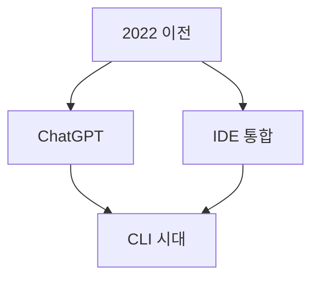

---

## 7.2 Mermaid — Architecture
#layout-contents

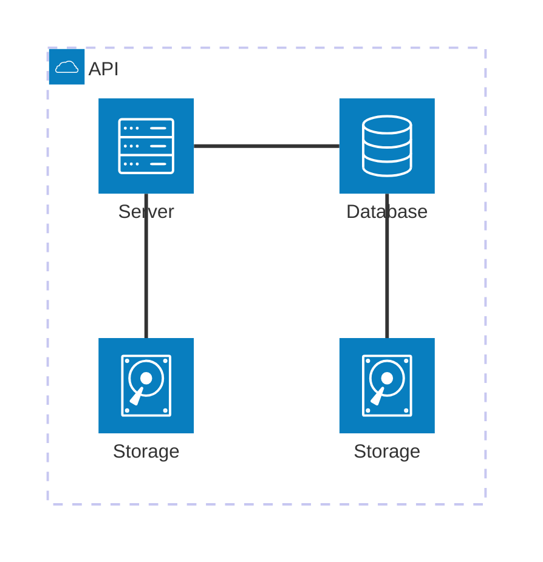

---

## 7.3 Mermaid — Block
#layout-contents

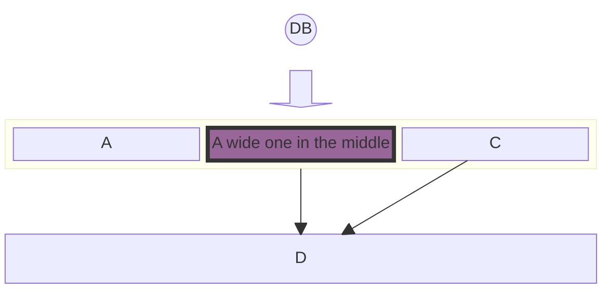

---

## 7.4 Mermaid — C4
#layout-contents

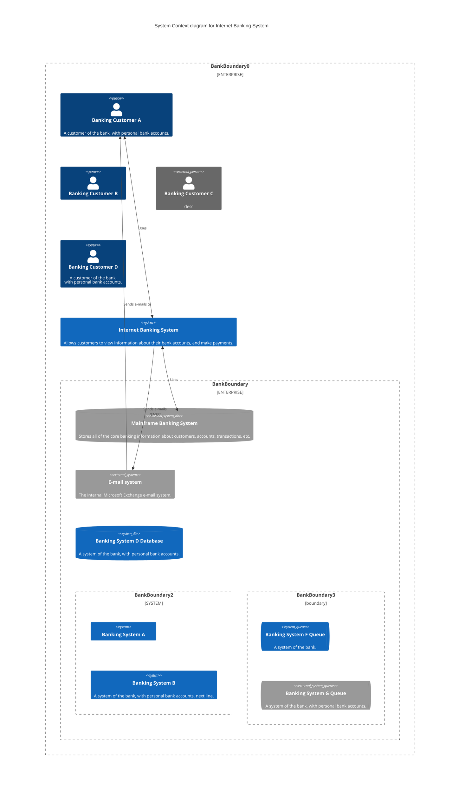

---

## 7.5 Mermaid — Kanban
#layout-contents

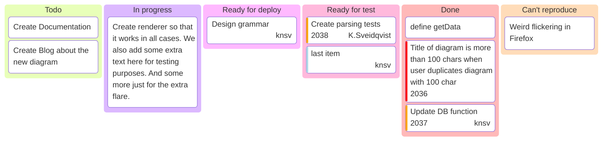

---

## 7.6 Mermaid — Packet
#layout-contents

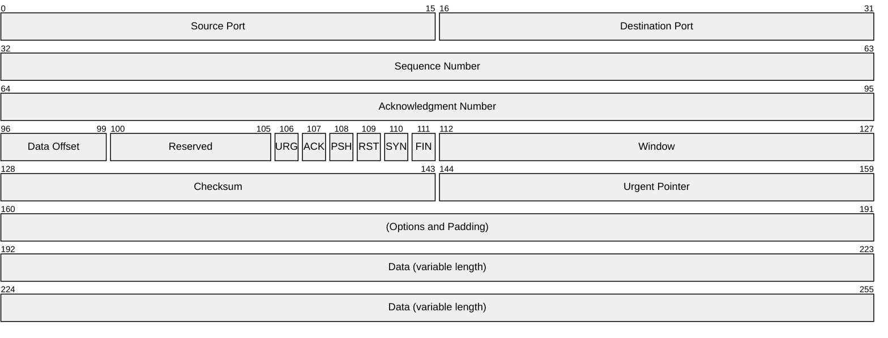

---

## 7.7 Mermaid — Pie
#layout-contents

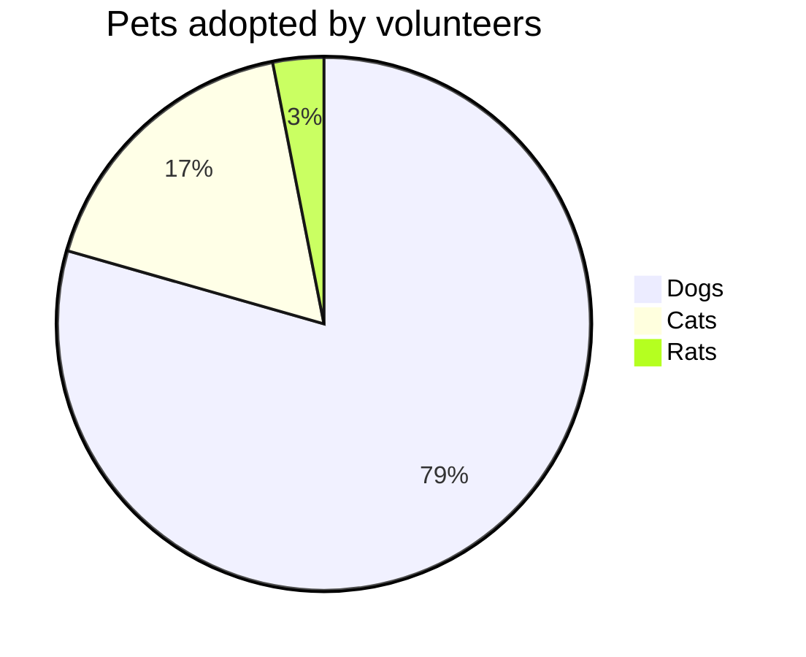

---

## 7.8 Mermaid — Radar
#layout-contents

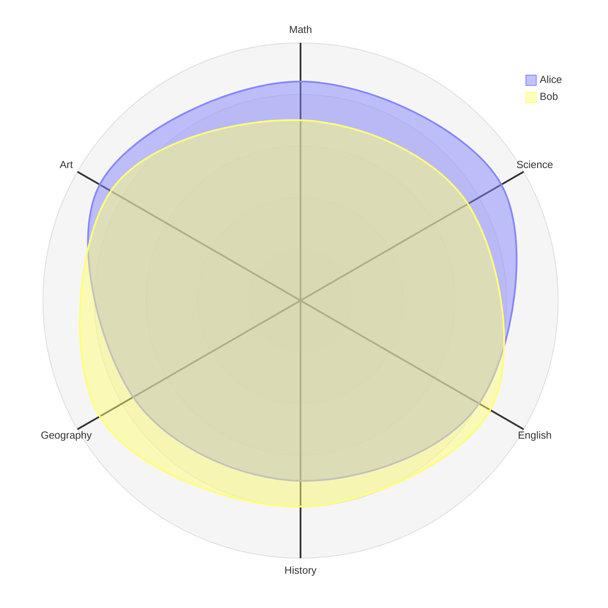

---

## 7.9 Mermaid — Requirement
#layout-contents

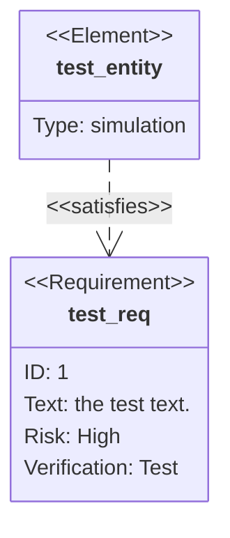

---

## 7.10 Mermaid — Sankey
#layout-contents

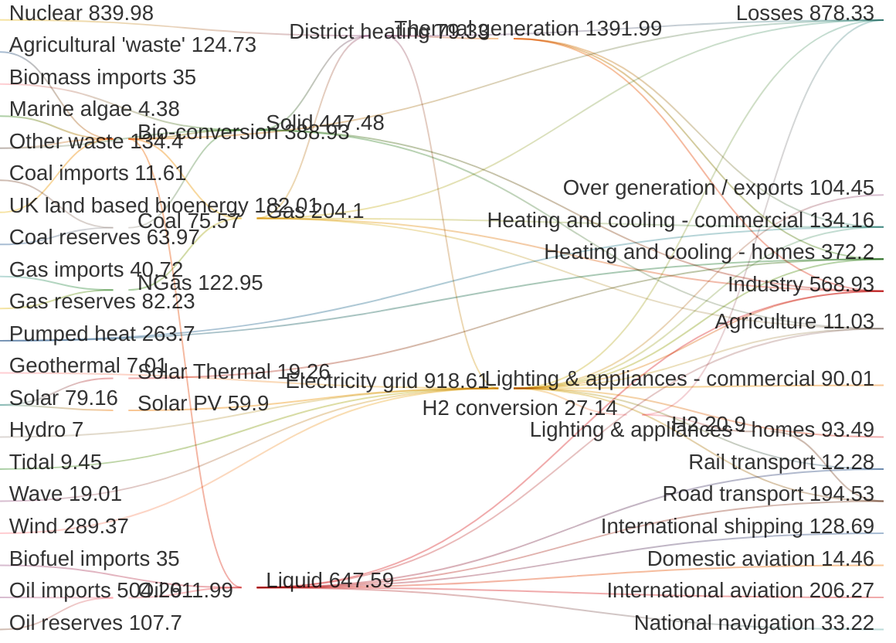

---

## 7.11 Mermaid — Timeline
#layout-contents

* base
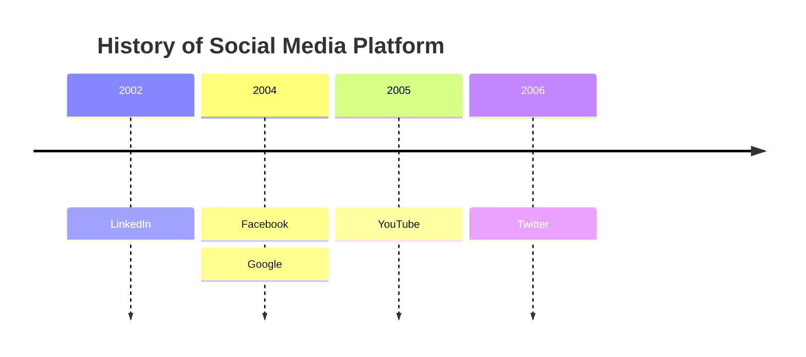

---

## 7.12 Mermaid — Timeline (계속)
#layout-contents

* beta
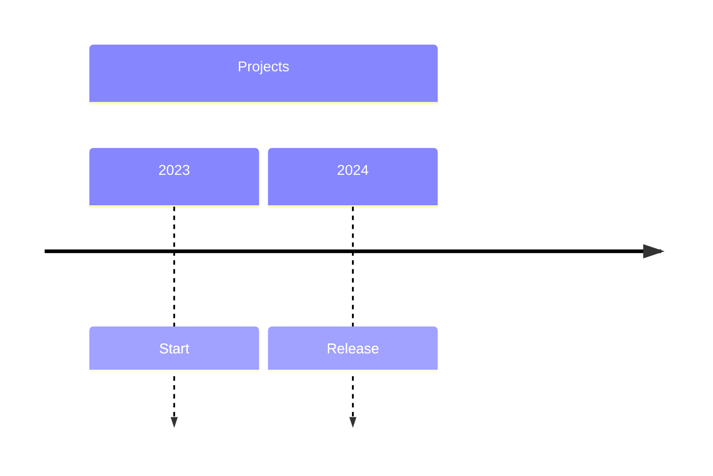

---

## 7.13 Mermaid — Treemap
#layout-contents

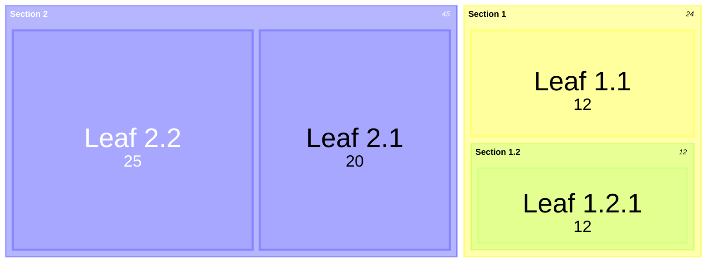

---

## 7.14 Kroki — blockdiag
#layout-contents

```blockdiag
blockdiag {
  blockdiag -> generates -> "block-diagrams";
  blockdiag -> is -> "very easy!";

  blockdiag [color = "greenyellow"];
  "block-diagrams" [color = "pink"];
  "very easy!" [color = "orange"];
}
```

---

## 7.15 Kroki — seqdiag
#layout-contents

```seqdiag
seqdiag {
  browser  -> webserver [label = "GET /index.html"];
  browser <-- webserver;

  browser  -> webserver [label = "POST /blog/comment"];
  webserver -> database [label = "INSERT comment"];
  webserver <-- database;
  browser  <-- webserver;
}
```

---

## 7.16 Kroki — actdiag
#layout-contents

```actdiag
actdiag {
  write -> convert -> image;

  lane user {
    label = "User";
    write  [label = "Writing reST"];
    image  [label = "Get diagram IMAGE!"];
  }

  lane actdiag {
    convert [label = "Convert reST to Image"];
  }
}
```

---

## 7.17 Kroki — nwdiag
#layout-contents

```nwdiag
nwdiag {
  network dmz {
    address = "210.x.x.x/24";

    web01 [address = "210.x.x.1"];
    web02 [address = "210.x.x.2"];
  }

  network internal {
    address = "192.168.0.0/24";

    web01 [address = "192.168.0.1"];
    web02 [address = "192.168.0.2"];
    db01  [address = "192.168.0.10"];
  }
}
```

---

## 7.18 Vega
#layout-contents

```vega
{
  "$schema": "https://vega.github.io/schema/vega/v5.json",
  "width": 300,
  "height": 200,
  "padding": 5,

  "data": [
    {
      "name": "table",
      "values": [
        {"category": "A", "amount": 28},
        {"category": "B", "amount": 55},
        {"category": "C", "amount": 43},
        {"category": "D", "amount": 91},
        {"category": "E", "amount": 81},
        {"category": "F", "amount": 53}
      ]
    }
  ],

  "scales": [
    {
      "name": "xscale",
      "type": "band",
      "domain": {"data": "table", "field": "category"},
      "range": "width",
      "padding": 0.05
    },
    {
      "name": "yscale",
      "type": "linear",
      "domain": {"data": "table", "field": "amount"},
      "range": "height"
    }
  ],

  "axes": [
    {"orient": "bottom", "scale": "xscale"},
    {"orient": "left", "scale": "yscale"}
  ],

  "marks": [
    {
      "type": "rect",
      "from": {"data": "table"},
      "encode": {
        "enter": {
          "x": {"scale": "xscale", "field": "category"},
          "width": {"scale": "xscale", "band": 1},
          "y": {"scale": "yscale", "field": "amount"},
          "y2": {"scale": "yscale", "value": 0}
        },
        "update": {"fill": {"value": "steelblue"}},
        "hover": {"fill": {"value": "red"}}
      }
    }
  ]
}

```

---

## 7.19 PlantUML — Class Diagram
#layout-contents

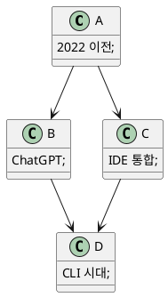

---

## 7.20 PlantUML — Component Diagram
#layout-contents

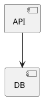

---

## 7.21 PlantUML — Activity Diagram
#layout-contents

<div style="display:flex; gap:20px;">
  <div style="flex:1;">
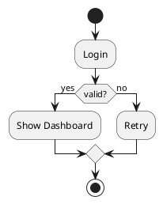
  </div>
  <div style="flex:1;">
* 항목 1
* 항목 2

  </div>
</div>

---

## 7.22 PlantUML — Use Case Diagram
#layout-contents

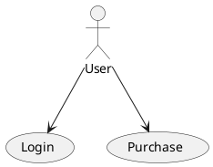

---

## 7.23 다이어그램 백엔드 정리
#layout-contents

::: cards
* **Mermaid**
  - Flowchart·Class·Sequence·ER·State·Gantt·Pie 등 텍스트 기반 다이어그램
* **PlantUML**
  - Class·Component·Activity·Use Case UML 다이어그램
* **Kroki 계열**
  - blockdiag·seqdiag·actdiag·nwdiag·ditaa ASCII 변환
* **데이터 시각화**
  - Vega·Vega-lite 선언형 차트
:::

> 이 장은 2장에 없는 종류만 모았다(옛 `m2Slide_MermaidExample` 덱 통합). Flowchart·Sequence·Gantt·Class·State·ER·Mindmap·Git·User Journey·Quadrant·XY·Graphviz·Vega-Lite·ditaa 는 2장 예시가 정본이다
