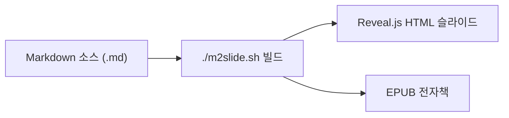
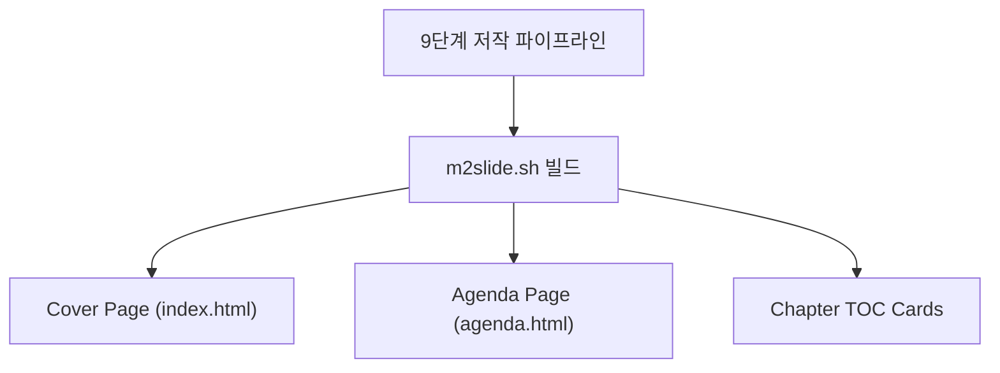

# 01. m2slide란?

#layout-chapter

::: part
Chapter 1.
:::

## 정체성 · 포지셔닝 · 기존 도구 대비 장점

---

## m2slide 한 줄 정의

* **마크다운(.md)으로 작성 → 한 줄 빌드 → Reveal.js HTML 슬라이드** 변환 도구
* HTML·CSS·JS를 직접 만지지 않고 슬라이드를 저작
* 한 번 작성한 소스로 **HTML 프레젠테이션 + EPUB 전자책** 동시 생성

---

## 기존 도구의 한계

| 항목 | PowerPoint | 순수 Reveal.js | m2slide |
| :--- | :--- | :--- | :--- |
| 작성 방식 | GUI 드래그 | HTML 직접 작성 | 마크다운 |
| 버전 관리 | 어려움(바이너리) | 가능(HTML) | 쉬움(텍스트 diff) |
| 테마 변경 | 수동 재배치 | CSS 직접 수정 | `_config.yml` 1줄 |
| 재사용 | 복사·붙여넣기 | 파일 수작업 | `AGENDA.md` 인라인 링크 |

---

## m2slide 핵심 가치

* 콘텐츠와 디자인 분리 — 작성자는 글쓰기에만 집중
* 텍스트 기반이라 **git diff·코드 리뷰**가 자연스럽게 동작
* 추가 설치 없이 차트·수식·3D 등 컴포넌트 내장

::: cards
* **저작은 마크다운**
* **외관은 설정 1줄**
* **산출물은 다중 포맷**
:::

---

## 두 가지 프로젝트 모드

| 모드 | 구성 | 산출 HTML |
| :--- | :--- | :--- |
| **Single Mode** | `AGENDA.md` 없이 단일 `.md` | `index.html` 한 deck |
| **Chapter Mode** | `AGENDA.md` + 챕터별 `.md` | 챕터마다 별도 deck |

* 본 자료는 **Chapter Mode**를 기준으로 설명함 (Single Mode는 축소형)

---

## 아키텍처 한눈에 보기

* 기획부터 대본까지 **9단계 파이프라인**으로 자동화 (챕터 07에서 상세)
* 두 모드 공통 **3-Page Model**: Cover · Agenda · TOC

---

## 이 자료에서 다루는 내용

* m2slide의 정체성과 기존 도구 대비 이점 {.fragment}
* Chapter Mode 프로젝트 구조와 시작 방법 {.fragment}
* theme / layout 시스템으로 외관 조정 {.fragment}
* 내장 컴포넌트를 펜스드 블록으로 작성하는 방법 {.fragment}
* EPUB·dev-server·authoring-pipeline 활용 {.fragment}
