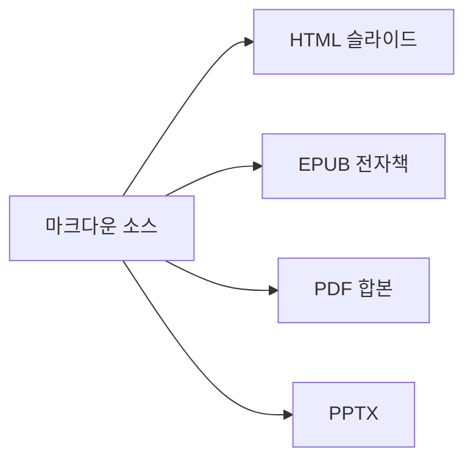

# 04. m2slide의 강점

#layout-chapter

::: part
Chapter 4.
:::

## 다른 도구와 비교했을 때 특히 두드러지는 지점

---

## 강점 한눈에 보기

::: cards
* **패턴을 고치면 덱 전체가 바뀜**
  - 슬라이드를 한 장씩 손대지 않고 설정·정책 한 줄로 일괄 적용
* **내장 컴포넌트**
  - 차트·수식·지도·3D·인터랙티브까지 설치 없이 바로 사용
* **멀티포맷 동시 산출**
  - HTML·EPUB·PDF·PPTX를 한 소스에서
* **코드처럼 리뷰**
  - 마크다운 소스라서 diff·PR로 발표자료를 검토
* **PPT 양방향 변환**
  - 기존 PPT 자산 이관·제출 모두 지원
* **어디서든 열리는 배포**
  - 서버 없이 `file://`만으로 동작
* **AI 저작 파이프라인**
  - 기획부터 완성 슬라이드까지 단계별 자동화
:::

---

## 강점 1 — 슬라이드를 고치지 말고 패턴을 고침

수백 장짜리 덱에 "타이틀 스타일을 전부 바꿔달라"는 요청이 들어오면, 슬라이드 도구에서는 장수만큼 반복 작업이 생김. m2slide는 바꾸는 대상이 슬라이드가 아니라 **패턴**임.

| 바꾸는 것 | 파일 | 적용 범위 |
| :--------------- | :---------------------------------------- | :------------------------------ |
| 테마·팔레트      | `_config.yml`의 `theme` · `palette`       | 재빌드만으로 덱 전체 외관       |
| 레이아웃 기본값  | `_config.yml`의 `theme_default_layout`    | 슬라이드별 지정이 없는 전부     |
| 본문 작성 패턴   | `_pipeline/policy/<단계>.yml`             | 이후 재생성되는 본문 전체       |

* 앞의 둘은 **재빌드만으로 즉시 반영**되고, 마지막은 본문을 다시 생성할 때 적용됨
* 프로젝트별 정책은 글로벌 기본값 위에 얹히는 구조라, 한 프로젝트만 다르게 두어도 나머지는 영향받지 않음

---

## 강점 2 — 내장 컴포넌트가 많음

* 수식(KaTeX)·차트(chart.js)·지도(Leaflet)·인포그래픽(d3)·3D 모델·인터랙티브 데모(React·p5.js)까지 **펜스드 블록 하나로 즉시 렌더**
* 별도 라이브러리 설치·번들링 없이, 필요한 슬라이드에만 조건부로 CDN이 붙음
* 아래는 이 문서 안에서 실제로 렌더되는 예시임 — 별도 이미지가 아니라 살아있는 컴포넌트

```chart
{
  "type": "bar",
  "data": {
    "labels": ["PPT", "순수 Reveal.js", "m2slide"],
    "datasets": [{ "label": "저작 난이도(낮을수록 좋음)", "data": [3, 8, 2] }]
  }
}
```

---

## 강점 3 — HTML·EPUB·PDF·PPTX를 한 번에

* 슬라이드 소스 한 벌로 **네 가지 산출물**을 각각 옵션 하나씩만 켜서 생성
* 발표용 HTML, 배포용 전자책(EPUB), 인쇄·공유용 PDF, 편집 요청 대응용 PPTX를 **따로 만들 필요가 없음**
* PDF·PPTX 산출은 외부 변환 도구(pandoc·decktape)에 의존함 — 처음 쓰는 환경에서는 설치가 한 번 필요



---

## 강점 4 — 발표자료를 코드처럼 리뷰함

슬라이드 리뷰가 파일을 주고받으며 "3장 고쳤어요"를 말로 전달하는 방식으로 도는 경우가 많음. 덱이 마크다운 소스이면 그 과정이 코드 리뷰와 같아짐.

* 무엇이 바뀌었는지 **줄 단위로** 드러나므로 전체를 다시 훑을 필요가 없음
* 리뷰 이력이 저장소에 남아 어떤 문장을 왜 고쳤는지 추적 가능
* 여러 명이 서로 다른 챕터를 동시에 고쳐도 병합이 성립함


---

## 강점 5 — PowerPoint와 양방향으로 오갈 수 있음

* 기존에 만들어둔 `.pptx` 자산은 **`ppt2m2slide`** 로 마크다운 프로젝트로 역변환해 이관함 — 이후 git으로 관리되는 소스가 됨
* 반대로 마크다운에서 PowerPoint 파일로 **내보내기**도 가능 — PPT를 요구하는 곳에도 대응
* `ppt2m2slide` 변환은 **Claude Code 환경을 필요로 함**. 복잡한 레이아웃은 변환 후 손보정이 필요할 수 있음
* "한쪽 포맷에 갇힌다"는 부담 없이 상황에 맞는 형식을 골라 쓸 수 있음

---

## 강점 6 — 어디서든 열리는 배포

* 빌드 산출물은 **단일 HTML 파일 + 이미지 폴더**만으로 완결됨
* 인터넷이 없어도 `file://`로 그대로 열림 — 서버·로그인·설치 과정이 필요 없음
* 다른 컴퓨터로 폴더째 복사해도 그대로 재생됨 — 발표 당일 환경 걱정이 줄어듦

---

## 강점 7 — AI가 저작을 함께함

* 기획 인터뷰 → 자료 수집 → 목차 설계 → 본문 작성 → 미디어 배치 → 레이아웃 선택까지, **단계별로 전용 에이전트가 초안을 만들어줌**
* 사람은 각 단계 결과를 검토·수정만 하면 됨 — 빈 화면에서 시작하지 않아도 됨
* 슬라이드에 대한 피드백이 쌓일수록 다음 저작에 반영되는 **학습 루프**도 갖추고 있음
