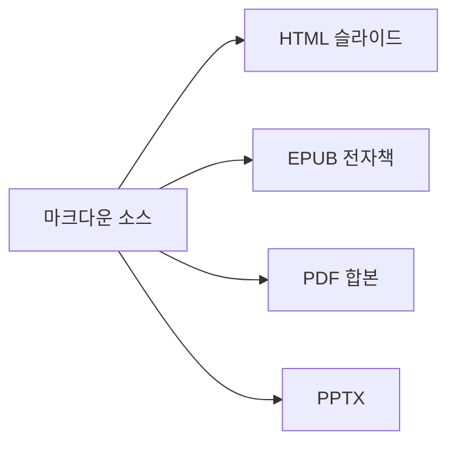

# 04. m2slide의 강점

#layout-chapter

::: part
Chapter 4.
:::

## 다른 도구와 비교했을 때 특히 두드러지는 지점

---

## 강점 한눈에 보기

::: cards
* **내장 컴포넌트**
  - 차트·수식·지도·3D·인터랙티브까지 설치 없이 바로 사용
* **멀티포맷 동시 산출**
  - HTML·EPUB·PDF·PPTX를 한 소스에서
* **어디서든 열리는 배포**
  - 서버 없이 `file://`만으로 동작
* **PPT 양방향 변환**
  - 기존 PPT 자산 이관·제출 모두 지원
* **AI 저작 파이프라인**
  - 기획부터 완성 슬라이드까지 단계별 자동화
:::

---

## 강점 1 — 내장 컴포넌트가 많음

* 수식(KaTeX)·차트(chart.js)·지도(Leaflet)·인포그래픽(d3)·3D 모델·인터랙티브 데모(React·p5.js)까지 **펜스드 블록 하나로 즉시 렌더**
* 별도 라이브러리 설치·번들링 없이, 필요한 슬라이드에만 조건부로 CDN이 붙음
* 아래는 이 문서 안에서 실제로 렌더되는 예시임 — 별도 이미지가 아니라 살아있는 컴포넌트

```chart
{
  "type": "bar",
  "data": {
    "labels": ["PPT", "순수 Reveal.js", "m2slide"],
    "datasets": [{ "label": "저작 난이도(낮을수록 좋음)", "data": [3, 8, 2] }]
  }
}
```

---

## 강점 2 — HTML·EPUB·PDF·PPTX를 한 번에

* 슬라이드 소스 한 벌로 **네 가지 산출물**을 각각 옵션 하나씩만 켜서 생성
* 발표용 HTML, 배포용 전자책(EPUB), 인쇄·공유용 PDF, 편집 요청 대응용 PPTX를 **따로 만들 필요가 없음**



---

## 강점 3 — 어디서든 열리는 배포

* 빌드 산출물은 **단일 HTML 파일 + 이미지 폴더**만으로 완결됨
* 인터넷이 없어도 `file://`로 그대로 열림 — 서버·로그인·설치 과정이 필요 없음
* 다른 컴퓨터로 폴더째 복사해도 그대로 재생됨 — 발표 당일 환경 걱정이 줄어듦

---

## 강점 4 — PowerPoint와 양방향으로 오갈 수 있음

* 기존에 만들어둔 `.pptx` 자산을 마크다운 프로젝트로 **역변환**해 이관 가능
* 반대로 마크다운에서 PowerPoint 파일로 **내보내기**도 가능 — PPT를 요구하는 곳에도 대응
* "한쪽 포맷에 갇힌다"는 부담 없이 상황에 맞는 형식을 골라 쓸 수 있음

---

## 강점 5 — AI가 저작을 함께함

* 기획 인터뷰 → 자료 수집 → 목차 설계 → 본문 작성 → 미디어 배치 → 레이아웃 선택까지, **단계별로 전용 에이전트가 초안을 만들어줌**
* 사람은 각 단계 결과를 검토·수정만 하면 됨 — 빈 화면에서 시작하지 않아도 됨
* 슬라이드에 대한 피드백이 쌓일수록 다음 저작에 반영되는 **학습 루프**도 갖추고 있음
