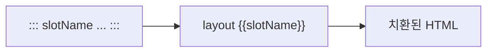

## _config.yml — 렌더링 설정 SSOT

* 슬라이드 외관·구조를 코드 없이 키 몇 개로 제어

```yaml
theme: default_lec              # theme/{name}/slide.css
theme_default_layout: contents  # 기본 layout
cover_enabled: true             # Cover Page 자동 주입
markmap_depth: 2                # TOC 마인드맵 깊이
head_left: d1                   # 상단 좌측 (챕터명)
head_right: now                 # 상단 우측 (현재 위치)
```

---

## Theme 선택

* `theme:` 한 줄만 바꿔도 배경색·폰트·헤더가 전부 달라짐
* 우선순위: `slide_css:` (직접 경로) > `theme:` (이름) > 미지정(default)

| theme | 성격 |
| :--- | :--- |
| `default` | 범용 기본 테마 |
| `default_lec` | 강의용 공식 테마 (본 자료 적용) |

---

## 시스템 Layout 6종

| layout | 용도 |
| :--- | :--- |
| `_cover` | 발표 표지 (자동 주입) |
| `_contents` | 제목 + 본문 기본 슬라이드 |
| `_contents_no_title` | 제목 없는 콘텐츠 슬라이드 |
| `_blank` | 풀스크린 이미지 등 |
| `_toc` / `_cards` | 챕터 deck 목차 카드 |
| `_agenda` | Agenda Page 전용 |

---

## 슬라이드별 Layout Override

* 슬라이드 첫 줄에 `#layout-{name}`을 적으면 그 슬라이드만 다른 layout

```markdown
#layout-blank


---

#layout-contents

## 일반 슬라이드
* 내용
```

* 출력 HTML에서 `#layout-*` 라인은 자동 제거됨

---

## 슬롯 메커니즘



* `::: slotName ... :::` fenced div → layout 템플릿 `{{slotName}}` 위치에 삽입
* 시스템 슬롯: `{{title}}` · `{{content}}` · `{{markmap}}`

---

## 애니메이션 디렉티브

* 슬라이드 제목 다음 줄에 디렉티브를 누적 작성

```markdown
## 슬라이드 제목
#transition-zoom
#auto-animate
#background-color-1a1a2e

* 내용
```

| 디렉티브 | 효과 |
| :--- | :--- |
| `#transition-{name}` | 전환 효과 (fade·zoom 등) |
| `#auto-animate` | 인접 슬라이드 모핑 |
| `#background-color-{hex}` | 배경색 지정 |
