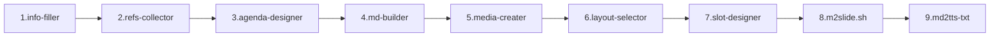
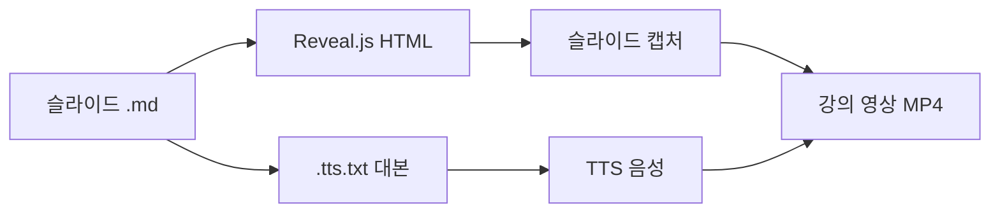
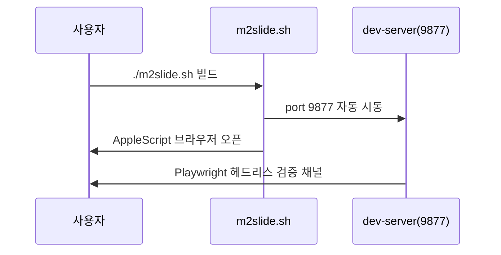

# 07. Authoring Pipeline

#layout-chapter

::: part
Chapter 7.
:::

## 기획부터 대본까지 9단계 자동화

---

## 9단계 저작 파이프라인 개요

* 기획부터 빌드·대본까지 단계별 전용 agent/skill이 담당
* 각 단계는 산출물을 검증한 뒤 다음 단계로 진행

---

## 단계 1~3 — 기획·자료·목차

| 단계 | 담당 | 산출물 |
| :--- | :--- | :--- |
| 1 | info-filler | `Info.md` (주제·청중·목표) |
| 2 | refs-collector | `refs/*.md` (수집 자료) |
| 3 | agenda-designer | `AGENDA.md` + 챕터 골격 |

* 인터뷰형 대화로 기획 메타를 채우고, 웹 수집 자료를 근거로 목차를 설계

---

## 단계 4~7 — 본문·미디어·레이아웃·슬롯

* **4. md-builder**: 챕터 골격에 본문(불릿·표·코드) 채움 — *이 슬라이드도 그 산출물*
* **5. media-creater**: mermaid·차트·이미지 placeholder 생성
* **6. layout-selector**: 슬라이드별 `#layout-*` 자동 선택
* **7. slot-designer**: `::: slotName :::` 슬롯 배치

> 각 단계가 독립적이라 일부 단계만 재실행 가능

---

## 단계 8~9 — 빌드 · TTS 대본

* **8. m2slide.sh**: 마크다운 → Reveal.js HTML + EPUB 빌드
* **9. md2tts-txt**: 슬라이드 → TTS 합성용 내레이션 대본 생성
* 영상 강의 제작까지 한 흐름으로 이어짐 (상위 videoMaker 연계)

---

## dev-server 자동 시동 흐름

* 빌드 한 번으로 미리보기·검증 환경이 함께 준비됨

---

## Pipeline 데이터 접근 격리

* 각 단계는 **자기 `data/<stage>/` 폴더만** 읽음 (크로스-단계 읽기 금지)

| 단계 | 전용 폴더 |
| :--- | :--- |
| md-builder | `data/md-builder/styles.yml` |
| layout-selector | `data/layout-selector/rules.yml` |
| slot-designer | `data/slot-designer/patterns.yml` |

* 정책이 데이터로 외부화되어 SCAR 코드 변경 없이 확장 가능
