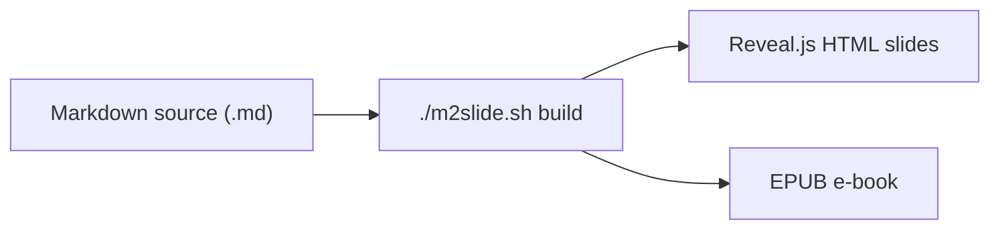

# 01. What is m2slide?

#layout-chapter

::: part
Chapter 1.
:::

## A one-line definition of its identity

---

## m2slide in One Line

* **Write in Markdown (.md) → build with one command → get Reveal.js HTML slides** — that's m2slide
* The same source also produces a **presentation HTML plus a readable EPUB**
* You author slides without ever touching HTML, CSS, or JS directly



---

## What Problem Did It Start From?

* Presentation material gets revised often, yet **every PPT edit is tedious**
* Plain Reveal.js is great because it's text-based, but **you must edit HTML by hand**
* The gap between them — a tool that is **as easy to write as Markdown, yet as web-native as Reveal.js**

::: cards
* **Author in Markdown**
  - Focus only on writing
* **Look = one config line**
  - theme and layout in `_config.yml`
* **Multi-format output**
  - HTML · EPUB · PDF · PPTX
:::

---

## The Three Questions This Material Answers

* **Why** a tool like m2slide is needed {.fragment}
* **Where** it works especially well {.fragment}
* What m2slide's own **strengths** are {.fragment}

* It does not cover every Markdown rule or config key — see the README and repo docs for those

---

## Here's How You Actually Use It

* Installing and using it takes just a few lines — the real reason authoring feels light

```bash
# 1) Clone the repository
git clone https://github.com/Finfra/m2slide.git

# 2) Build a project folder's Markdown in one line
./m2slide.sh MyProject
```

* The build opens straight in the browser as HTML slides — no server or deploy setup, verify via `file://`

---

## See It for Yourself

* The two links below let you view a live, running m2slide right now

::: cards
* **GitHub**
  - [github.com/Finfra/m2slide](https://github.com/Finfra/m2slide) — full source, public
* **Online demo**
  - [finfra.github.io/m2slide](https://finfra.github.io/m2slide) — open real project slides in the browser as-is
:::
