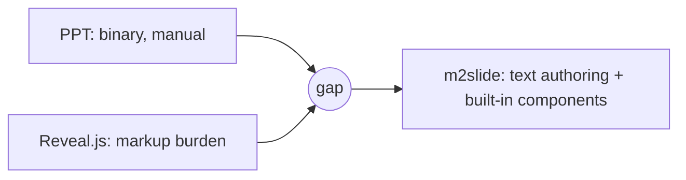

# 02. Why It Matters

#layout-chapter

::: part
Chapter 2.
:::

## The gap in existing tools and m2slide's answer

---

## The Problem with PowerPoint

* It's a binary format, so **git diff and code review don't work** — to see what changed you must re-scan the slides by eye
* Text and layout are tangled together on one slide, so **editing content forces you to touch the design too**
* When several people edit at once, **merging is effectively impossible**

---

## The Problem with Plain Reveal.js / Hand-Built HTML Slides

* It's text-based so diff works, but **you type HTML tags by hand for every new slide**
* Using elements like charts, math, or 3D viewers means **wiring up libraries manually each time**
* When content authors and markup authors are different teams, a **collaboration bottleneck** appears

---

## Positioning at a Glance

| Item | PowerPoint | Plain Reveal.js | m2slide |
| :--- | :--- | :--- | :--- |
| Authoring | GUI drag | Write HTML directly | Markdown |
| Version control | Hard (binary) | Possible (HTML) | Easy (text diff) |
| Theme change | Manual re-layout per slide | Edit CSS directly | One line in `_config.yml` |
| Charts, math, etc. | Paste as images | Wire libraries yourself | Use via fenced blocks |
| Reuse | Copy and paste | Manual file work | Link structure in the TOC file |

---

## What m2slide Actually Changes

* **Content–design separation** — authors focus on writing, appearance is handled by theme settings
* **Text-based authoring** — slide change history stays in git log and is reviewable via PR
* **Built-in components** — charts, math, 3D, and interactive elements work with no extra setup

---

## Why Now

* These days presentation material and docs are **often drafted together with AI** — and LLMs handle Markdown best
* Authoring in Markdown means **the human-polished parts and AI-generated parts travel in the same format**
* On top of this flow, m2slide even provides a pipeline: "AI drafts, humans refine, the tool builds finished slides"
