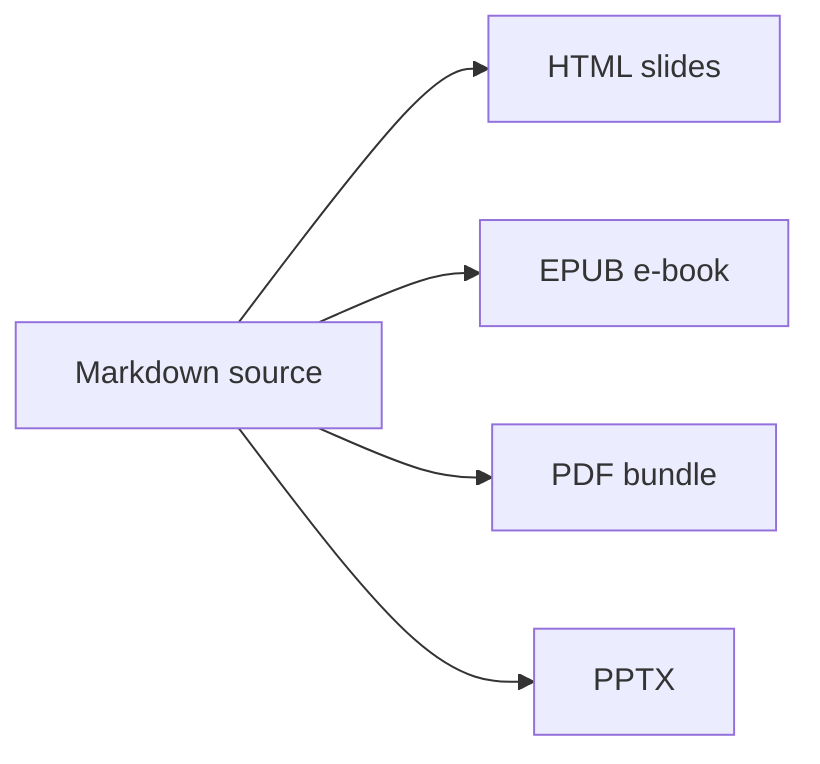

# 04. Strengths of m2slide

#layout-chapter

::: part
Chapter 4.
:::

## Where it stands out against other tools

---

## Strengths at a Glance

::: cards
* **Built-in components**
  - Charts, math, maps, 3D, interactive — no install
* **Multi-format output**
  - HTML · EPUB · PDF · PPTX from one source
* **Opens anywhere**
  - Works from `file://` with no server
* **Two-way PPT conversion**
  - Migrate in and export out of PPT assets
* **AI authoring pipeline**
  - Stage-by-stage automation from plan to finished slides
:::

---

## Strength 1 — Many Built-in Components

* Math (KaTeX), charts (chart.js), maps (Leaflet), infographics (d3), 3D models, interactive demos (React, p5.js) — all **render instantly from a single fenced block**
* No separate library install or bundling; the CDN is attached conditionally only to the slides that need it
* Below is an example rendered live inside this document — not an image, but a living component

```chart
{
  "type": "bar",
  "data": {
    "labels": ["PPT", "Plain Reveal.js", "m2slide"],
    "datasets": [{ "label": "Authoring difficulty (lower is better)", "data": [3, 8, 2] }]
  }
}
```

---

## Strength 2 — HTML, EPUB, PDF, PPTX at Once

* One slide source generates **four outputs**, each turned on with a single option
* Presentation HTML, distributable EPUB, print/share PDF, and edit-friendly PPTX — **no need to build them separately**



---

## Strength 3 — Deploys That Open Anywhere

* Build output is complete with just a **single HTML file plus an image folder**
* It opens via `file://` even offline — no server, login, or install step
* Copy the whole folder to another computer and it still plays — less worry about the day-of setup

---

## Strength 4 — Two-Way Trips with PowerPoint

* Existing `.pptx` assets can be **reverse-converted** into a Markdown project to migrate them
* Conversely you can **export** from Markdown to a PowerPoint file — handling places that require PPT
* No fear of being "locked into one format"; pick the form that fits the situation

---

## Strength 5 — AI Co-Authors the Material

* From plan interview → research → TOC design → body writing → media placement → layout selection, **a dedicated agent drafts each stage**
* Humans just review and revise each stage's result — no starting from a blank screen
* As feedback on slides accumulates, it feeds the next authoring pass — a **learning loop**
