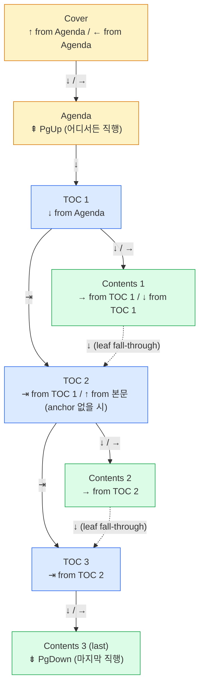

# 목적

m2slide 빌드 산출물에서 키보드(또는 swipe·click)로 이동하는 경로 SSOT. 구현은 [`lib/html-builder.js`](../lib/html-builder.js) 3종 핸들러(deck/agenda/cover)가 본 문서를 따름. 페이지 모델(Cover/Agenda/TOC) 정의는 [`chapter-single-mode.md`](chapter-single-mode.md).

# 키 정의

| 표기 | 키          | 키코드 | 동작 요약                                            |
| :--- | :---------- | :----- | :--------------------------------------------------- |
| ⎋    | Esc         | 27     | Reveal.js overview 토글 (m2slide 미개입)             |
| ←    | Left arrow  | 37     | 이전 슬라이드 (deck 첫이면 이전 챕터·Agenda)         |
| →    | Right arrow | 39     | 다음 슬라이드 (deck 마지막이면 다음 챕터)            |
| ↑    | Up arrow    | 38     | 페이지 계층 parent 이동                              |
| ↓    | Down arrow  | 40     | 페이지 계층 child 이동                               |
| ⇤    | Home / `,`  | 36     | 이전 챕터 TOC slide (Single: 이전 H1 anchor)         |
| ⇥    | End / `.`   | 35     | 다음 챕터 TOC slide (Single: 다음 H1 anchor)         |
| ⇞    | PgUp        | 33     | Agenda Page 직행                                     |
| ⇟    | PgDown      | 34     | 마지막 페이지 직행                                   |

* ↑·↓는 페이지 트리 **수직(계층) 이동** — 화살표 방향과 계층 상하가 일치
* ⇤·⇥는 **챕터/섹션 단위 점프** (sibling 좌우 이동) — Home/End의 "양 끝 이동" 의미와 정합
* ⇞·⇟는 **양 끝단 직행** (위치 무관)
* swipe·mouse drag는 ←/→/↑/↓ 4방향만 dispatch (⇤/⇥/⇞/⇟는 키보드 전용)
* ⚠️ ⇞/⇟는 Reveal.js PgUp/PgDown 기본 navigation을 hijack — 본 정의 우선 적용
* ⚠️ Home/End **fallback 키 `,` / `.`** (Issue92) — 일부 macOS·외장 키보드 환경에서 Home·End 의 keydown 이벤트가 OS 단계에서 페이지로 전달되지 않는 사례가 있어 동일 동작을 `,`(Comma) / `.`(Period) 키에도 매핑함. 매칭은 `event.code === 'Comma' / 'Period'` 기반이라 Shift·한글 IME 무관

# 페이지 계층

↑/↓ (parent/child)·⇤/⇥ (sibling)·← (deck 첫 슬라이드 후퇴) 키 동작의 기준 트리. H1 anchor는 `lib/slide-parser.js:243-269`에서 `layout: '_toc'` + `autoToc: true`로 자동 분류된 슬라이드.

| 단계 | Single (4-tier)            | Chapter (5-tier)                         |
| :--- | :------------------------- | :--------------------------------------- |
| L0   | Cover (`index.html#/0`)    | Cover (`index.html#/0`)                  |
| L1   | Agenda (`agenda.html`)     | Agenda (`agenda.html`)                   |
| L2   | H1 anchor (`#/N` autoToc)  | TOC slide (`0X-*.html#/toc-placeholder`) |
| L3   | 본문 슬라이드 (`#/N`)      | H1 anchor (`0X-*.html#/N` autoToc)       |
| L4   | —                          | 본문 슬라이드 (`0X-*.html#/N`, N≥1)      |

* graceful fallback: H1 anchor가 없으면 한 단계 건너뜀 (본문 ↔ Agenda 또는 본문 ↔ TOC 직결)
* TOC slide는 `id="toc-placeholder"`로 autoToc(id 없음)와 구분

# 키 동작 매트릭스

> ←/→/↑/↓ 4개 방향 키 한정. ⇤/⇥/⇞/⇟ 단축키는 [단축키 동작](#단축키-동작) 섹션 참조.

## Single 모드 (`AGENDA.md` 없음)

> Single 모드는 챕터 개념이 없으므로 ⇤/⇥(sibling 점프)는 **같은 deck 내 트리 탐색 sibling 이동** — 현재 슬라이드의 enclosing anchor 레벨 N(H1=1, H2=2, H3=3, …) 기준으로 같은 deck 내 prev/next anchor at `level ≤ N` (Issue105). H1 ↔ H1, H2 ↔ H2 같은 레벨 sibling 우선. 같은 레벨 sibling 부재 시 자연스럽게 부모(H1) anchor로 fall-up되어 결과적으로 "이전/다음 TOC anchor"로 이동.

| 현재 위치     | ←                                                    | →                | ↑ (parent)                            | ↓ (child / leaf 시 다음 H1 anchor)                  |
| :------------ | :--------------------------------------------------- | :--------------- | :------------------------------------ | :-------------------------------------------------- |
| Cover (`#/0`) | (없음)                                               | `agenda.html`    | (없음 — 최상위)                       | `agenda.html`                                       |
| H1/H2 anchor  | Reveal 기본                                          | Reveal 기본      | `agenda.html` (H1) / 부모 H1 (H2)     | **첫 자식 sub-anchor (level > 현재) 있으면 그곳, 없으면 직후 슬라이드 (본문)** (Issue106) |
| 본문 슬라이드 | Reveal 기본 (단 `#/1`+cover_enabled은 `agenda.html`) | Reveal 기본      | 직전 H1 anchor (없으면 `agenda.html`) | **다음 H1 anchor (없으면 동작 없음, 메시지 없음)**  |
| Agenda        | `index.html` (Cover)                                 | 첫 본문 슬라이드 | `index.html` (Cover)                  | 첫 H1 anchor (없으면 첫 본문)                       |

> **Single 본문 leaf ↓ fall-through (Issue103 신규)**: leaf에서 ↓는 child 부재 시 **다음 H1 anchor**로 이동. ⇥ End와 같은 도착지지만 위치 무관성을 의미상 강조 — Chapter 모드 leaf ↓가 "다음 챕터(deck-level sibling)"로 가는 것과 대칭(H1-level sibling). 마지막 H1 섹션 본문에서는 다음 anchor 부재 → 동작 없음.

`cover_enabled: false` 변형: `index.html`이 `agenda.html`로 redirect되며 deck `#/0`이 본문 첫. Cover 부재로 다음 동작이 모두 "동작 없음":
* 본문 첫 슬라이드(`#/0`) ← (이전 슬라이드 없음, Cover 우회 폴백 불가)
* Agenda ← (parent 없음, Issue57)
* Agenda ↑ (parent 없음 — 본 표 ↑ 컬럼 역시 동일 폴백)

## Chapter 모드 (`AGENDA.md` 있음)

> Chapter 모드의 ↑/↓는 위치와 무관하게 **페이지 트리 parent/child 단계 이동** (수직). sibling(이전/다음 챕터) 점프는 ⇤/⇥로 분리됨.

| 현재 위치     | ←                                         | →                                          | ↑ (parent)                            | ↓ (child / leaf 시 다음 챕터)                          |
| :------------ | :---------------------------------------- | :----------------------------------------- | :------------------------------------ | :----------------------------------------------------- |
| Cover         | (없음)                                    | `agenda.html`                              | (없음 — 최상위)                       | `agenda.html`                                          |
| Agenda        | `index.html` (Cover)                      | 첫 챕터                                    | `index.html` (Cover)                  | 첫 챕터 TOC slide                                      |
| TOC slide     | 이전 챕터 마지막 슬라이드 (없으면 Agenda) | Reveal 기본                                | `agenda.html`                         | 첫 H1 anchor (없으면 본문 첫)                          |
| H1/H2 anchor  | Reveal 기본                               | Reveal 기본                                | 같은 deck `#/toc-placeholder` (H1) / 부모 H1 (H2) | **첫 자식 sub-anchor (level > 현재) 있으면 그곳, 없으면 직후 슬라이드 (본문)** (Issue106) |
| 본문 슬라이드 | Reveal 기본                               | Reveal 기본                                | 직전 H1 anchor (없으면 TOC slide)     | **다음 챕터 첫 슬라이드 (TOC slide, 메시지 없음)**     |
| 본문 마지막   | Reveal 기본                               | 다음 챕터 첫 슬라이드 (2회 누름·메시지 후) | 직전 H1 anchor (없으면 TOC slide)     | **다음 챕터 첫 슬라이드 (TOC slide, 메시지 없음·1회)** |

> Cover →키의 `agenda.html` 직행은 [`chapter-single-mode.md`](chapter-single-mode.md) D5/D6 결정.
>
> **본문에서 ↓의 leaf-fallthrough 동작 (Issue93 신규)**: 본문(leaf)에서 ↓는 `child`가 없으므로 sibling 트리 다음 가지 — **다음 챕터 첫 슬라이드(TOC slide)** — 로 fall-through함. → 와의 차이는 두 가지:
>
> 1. **위치 무관**: → 는 본문 마지막에서만 다음 챕터로 이동(그 외 Reveal 기본). ↓ 는 본문 어느 슬라이드에서든 즉시 이동.
> 2. **확인 메시지 없음**: → 는 마지막 슬라이드 첫 누름에서 "다음 챕터로 이동하려면 다시 →를 누르세요" 안내 후 두 번째 누름에서 이동. ↓ 는 1회 누름으로 즉시 이동(메시지 없음).
>
> 마지막 챕터에서는 다음 챕터 부재 → 동작 없음(leaf 그대로 유지).

# 단축키 동작

⇤/⇥/⇞/⇟는 위치 무관 **점프**. 발표 중 빠른 이동용.

| 키  | 동작                          | Single                                                                                                                              | Chapter                                          |
| :-- | :---------------------------- | :---------------------------------------------------------------------------------------------------------------------------------- | :----------------------------------------------- |
| ⇤   | 이전 sibling — 트리 탐색      | 같은 deck 내 직전 anchor at `level ≤ N` (N = enclosing anchor level). H2 first sibling이면 부모 H1로 fall-up. 첫 anchor 도달 시 → **agenda.html?back=1** (Issue133 fallback). Cover 슬라이드(Single deck #/0)에선 동작 없음 (최상위) | **계층 인식 sibling**(Issue136): main에서 ⇤ → 직전 main(중간 sub skip), sub에서 ⇤ → 같은 부모의 직전 sub(첫 sub면 부모 main으로 fall-up). 부재 시 → **agenda.html?back=1**(Issue114). Cover에선 동작 없음 (최상위), Agenda에선 cover_enabled=true 시 Cover 이동 |
| ⇥   | 다음 sibling — 트리 탐색      | 같은 deck 내 직후 anchor at `level ≤ N`. H2 last sibling이면 부모의 다음 H1 sibling으로 fall-up. 마지막 anchor 도달 시 → **동작 없음** (Issue139, Chapter 마지막 main과 대칭). 단 Cover 슬라이드(Single deck #/0)에선 → **agenda.html?fwd=1** (2026-05-10 Cover 부분 복원, Agenda Home → Cover 대칭) | **계층 인식 sibling**(Issue136): main에서 ⇥ → 직후 main(중간 sub skip), sub에서 ⇥ → 같은 부모의 직후 sub(마지막 sub면 부모의 다음 main으로 fall-up). 마지막 main(또는 마지막 sub의 부모도 마지막)인 경우 **동작 없음**(K5, Issue114 line 108). Cover에선 → **agenda.html?fwd=1** (Issue114 fall-through, Issue139 제거 후 2026-05-10 복원), Agenda에선 첫 챕터 TOC (Issue114) |
| ⇞   | Agenda Page 직행              | 어디서든 `agenda.html`                                                                                                              | 어디서든 `agenda.html`                           |
| ⇟   | 마지막 페이지 직행            | deck 마지막 슬라이드                                                                                                                | 마지막 챕터의 마지막 본문 슬라이드 (`?last=1`)   |

* ⇤/⇥는 sibling 단위 점프이므로 ↑(parent) 동작과 90도 직교 — Home/End의 "양 끝 이동" 의미 반영
* **Issue114 boundary fallback (chapter 모드)**: sibling 부재 시 트리 한 단계 위·아래로 fall-through
    - Cover ⇥ → Agenda (다음 sibling 부재 → child) — Issue139에서 제거 후 **2026-05-10 복원**(Agenda Home → Cover 대칭)
    - Agenda ⇤ → Cover (sibling 없는 메타 페이지 → parent, cover_enabled=true 한정)
    - Agenda ⇥ → 첫 챕터 TOC (sibling 없는 메타 페이지 → child)
    - 첫 챕터 ⇤ → Agenda (이전 sibling 없음 → parent fallback)
    - Cover ⇤ / 마지막 챕터 ⇥ : 동작 없음 (한쪽 끝)
* **Single 모드 Cover 슬라이드 ⇥ fall-through (2026-05-10 신규)**: Single 모드는 Chapter와 달리 Cover가 별도 페이지가 아닌 deck `#/0` 슬라이드. 이 Cover 슬라이드에서 ⇥ End는 → `agenda.html?fwd=1`로 fall-through(Chapter Cover 페이지 ⇥ 동작과 동일 정책). Cover 외 Single deck H1/본문 슬라이드의 ⇥ boundary는 Issue139 정책 그대로(다음 sibling 부재 시 동작 없음)

# 구현 매핑

| 동작 그룹                          | 구현 위치 (`lib/`)                                                              |
| :--------------------------------- | :------------------------------------------------------------------------------ |
| Cover deck 키 핸들러               | `html-builder.js` `generateCoverHTML` (1373–1379)                               |
| Agenda standalone 키 핸들러        | `html-builder.js` `generateAgendaHTML` (1545–1573)                              |
| 일반 deck 키 핸들러                | `html-builder.js` `generateHTML` (1074–1146)                                    |
| swipe·mouse drag → key dispatch    | `html-builder.js` IIFE (1156–1216) — 4방향만                                    |
| 챕터 sibling lookup (⇤/⇥)          | `agenda.js` `getPrevSiblingChapter`·`getNextSiblingChapter` (Issue136 신규, level-aware) → `?back=1`/`?fwd=1` 시그널. `getPrevChapter`/`getNextChapter`는 ↓·→ sequential 이동 전용으로 분리 유지 |
| 트리 탐색 sibling lookup (Single ⇤/⇥) | deck 내 `layout-_toc` autoToc 슬라이드 색인 + `data-heading-level` 속성으로 `level ≤ N` 필터링 (Issue105). 신규 함수: `findPrevSiblingAnchorIndex(curH, level)`, `findNextSiblingAnchorIndex(curH, level)` |
| 계층 parent/child lookup (↑/↓)     | deck 내 `findPrev/NextAnchorIndex` + `findTocSlideIndex` + 정적 redirect (Cover↔Agenda↔TOC)  |
| 끝단 직행 (⇞/⇟)                    | `agenda.html` 고정 / `getLastChapter`(신규) + `?last=1`                         |

# 페이지 트리 & 단축키

Chapter 모드 페이지 계층을 트리로 시각화. 각 노드 라벨의 두 번째 줄은 **해당 노드로 도달하는 키**(화살표·단축키 모두 포함). 트리 단순화를 위해 H1 anchor 노드는 생략 — TOC↔Contents 사이에 anchor가 존재하면 ↓ 동작은 anchor 우선이며, anchor 없을 때만 Contents로 직결.

* ↑·↓는 **수직 (parent/child)**, ⇤·⇥는 **수평 (이전/다음 sibling)** — 두 축이 직교
* Single 모드에서는 TOC 단계가 H1 anchor로 대체되며 1계층 축소 (4-tier)

# 결정 사항

| 번호 | 결정                          | 확정                                                       |
| :--- | :---------------------------- | :--------------------------------------------------------- |
| K1   | Single 본문 첫(`#/1`, cover_enabled=true)에서 ← | Agenda (Cover로 가지 않음). cover_enabled=false면 본문 첫이 `#/0`이며 동작 없음 (line 61-64 변형 참조) |
| K2   | Chapter TOC slide에서 ←       | 이전 챕터 마지막 슬라이드 (없으면 Agenda 폴백)             |
| K3   | ↑/↓ 의미                      | 페이지 계층 parent / child 이동 (수직). ↓ from anchor: **첫 자식 sub-anchor (level > 현재) 있으면 그곳, 없으면 직후 슬라이드** — 자식 sub-anchor가 outline 우선 (Issue106). ↓ from leaf 본문: K7 (fall-through) |
| K4   | ⇤/⇥ 의미                      | 이전/다음 sibling — 트리 탐색 (수평). Single: enclosing anchor 레벨 N 기준 같은 deck 내 prev/next anchor at `level ≤ N` (H1↔H1, H2↔H2, …; 같은 레벨 끝에서 자연 fall-up하여 부모 sibling으로). Chapter (Issue136 갱신): AGENDA.md main(`##`)/sub(`###`) 계층 인식 sibling — main↔main(중간 sub skip), sub↔sub(같은 부모 scope). sub 끝에서 부모의 다음 main으로 자연 fall-up |
| K5   | 첫/마지막 sibling에서 ⇤·⇥     | Chapter: ⇤는 첫 main에서 → `agenda.html?back=1`(Issue114 parent fallback). ⇥는 마지막 main에서 **동작 없음**(K5 한쪽 끝, Issue114 line 108). Cover 페이지에서 ⇤는 최상위로 동작 없음, ⇥는 → `agenda.html?fwd=1`(2026-05-10 복원). Single: ⇤는 첫 anchor에서 → `agenda.html?back=1`(Issue133 유지). ⇥는 마지막 anchor에서 **동작 없음**(Issue139 — Chapter 마지막 main과 대칭). 단 Cover 슬라이드(deck `#/0`)에서 ⇥는 → `agenda.html?fwd=1`(2026-05-10 신규, Chapter Cover ⇥와 동일 정책) |
| K6   | Cover에서 ↑                   | 동작 없음 (최상위)                                         |
| K7   | 본문(leaf)에서 ↓              | leaf fall-through: child 부재 시 다음 sibling 가지로 이동. Chapter 모드 → 다음 챕터 첫 슬라이드(TOC slide), Single 모드 → 다음 H1 anchor. 메시지·확인 없이 1회 누름. 다음 sibling 부재(마지막 챕터/마지막 H1 섹션) 시 동작 없음 |
| K8   | 이전 챕터 ← 진입 위치         | 마지막 본문 슬라이드 (`?last=1`)                           |
| K9   | swipe/drag 매트릭스           | ←/→/↑/↓ 4방향만 dispatch (단축키는 키보드 전용)            |
| K10  | H1 anchor 식별                | 기존 `layout-_toc` autoToc 재사용 (Issue71)                |
| K11  | ⇞/⇟                           | Agenda 직행 / 마지막 페이지 직행 (Reveal 기본 동작 override) |

# 변경 이력

* **2026-05-10 (Cover ⇥ 부분 복원, 사용자 요청)**: Issue139가 제거했던 Cover ⇥ → Agenda fall-through를 **Cover 페이지·슬라이드에 한해** 복원. Agenda Home → Cover의 역방향 이동(⇥/Home 대칭)을 회복하기 위함. Chapter Cover 페이지 + Single deck `#/0` cover 슬라이드 양쪽 모두 ⇥ End/`.`/⌘+→ → `agenda.html?fwd=1`. Cover 외 deck 슬라이드(H1 anchor·본문)의 ⇥ boundary는 Issue139 정책 유지(다음 sibling 부재 시 동작 없음). 구현: `lib/html-builder.js` 일반 deck End 핸들러에 `if (isCoverSlide(cur))` fall-through 추가, Cover 페이지 핸들러는 Issue139 무동작 가지를 fall-through로 교체. 부수 변경: `isAnchorSlide`가 `data-heading-level` dataset 슬라이드도 anchor로 인식하도록 확장(Single 모드 H1 anchor 호환 보강). K5·Issue114 boundary fallback 표 갱신.
* **2026-05-10 (Issue139)**: Single·Chapter 모든 모드에서 ⇥ End → agenda fallback 일괄 제거. Issue133(Single), Issue114(Cover) 양쪽에서 도입한 fall-through 모두 무효화. K5 정책: ⇥ 마지막 sibling에서 동작 없음(한쪽 끝). 후속(Cover만) 재복원은 위 항목 참조.
* **2026-05-09 (Issue136)**: Chapter 모드 ⇤/⇥를 계층 인식 sibling 점프로 변경. AGENDA.md의 main(`##`)/sub(`###`) 구분을 인식하여 main↔main(중간 sub skip), sub↔sub(같은 부모 scope) 이동. sub 끝에서 부모의 다음/이전 main으로 자연 fall-up. 직전 동작(`getNextChapter`로 다음 *파일* 직행)은 ↓ leaf-fallthrough·→ 마지막 슬라이드 등 sequential 이동에만 유지. 신규 함수 `agenda.js: getNextSiblingChapter`·`getPrevSiblingChapter`. K4 결정 갱신. ⇤ boundary는 Issue114 첫 챕터 → `agenda.html?back=1` parent fallback 유지, ⇥ boundary는 K5(마지막 main 무동작) 유지 — Single 모드 Issue133과 의도적으로 비대칭(Chapter는 마지막 main이 명확한 종착점)
* **2026-05-09 (Issue133)**: Single 모드 ⇤/⇥ boundary fallback 추가. 첫 anchor 도달 시 ⇤ → `agenda.html?back=1`, 마지막 anchor 도달 시 ⇥ → `agenda.html?fwd=1`로 fall-through. Chapter 모드 Issue114 boundary fallback과 정책 대칭. K5 결정 갱신: Single은 양쪽 모두 agenda fallback (Chapter는 Cover ⇤ / 마지막 챕터 ⇥는 무동작 유지). 구현: `lib/html-builder.js` Single 분기 Home/End 핸들러에서 `prevAnchorIdx`/`nextAnchorIdx` < 0 시 `window.location.href` 분기 추가
* **2026-05-04 (Issue106)**: ↓ from anchor (H1/H2/…) 동작 정밀화. 기존 "직후 슬라이드 (본문)" → **자식 sub-anchor 우선** 정책. anchor 슬라이드에서 ↓ 누름 시:
    - 같은 deck 내 다음 anchor 중 첫 deeper-level anchor (level > 현재) 가 같은 부모 scope 안에 있으면 → 그곳으로 이동 (예: H1 "4" ↓ → H2 "4.1")
    - 없으면 → 직후 슬라이드 (본문, 기존 동작)
    - scope 판정: 같은 또는 더 얕은 level의 anchor를 만나면 부모 scope 종료
    - 효과: outline 트리 우선 — 사용자가 H1에서 ↓를 누르면 첫 H2 자식으로 점프하여 subsection 빠르게 탐색. H2가 없는 H1 섹션은 본문으로 직진(기존 동작)
    - 알고리즘: `findFirstChildAnchorIndex(curH, level)` — curH+1부터 scan, anchor 발견 시 level > 현재면 반환, level ≤ 현재면 -1 (scope 종료)
* **2026-05-04 (Issue105)**: ⇤/⇥ Single 모드 sibling 이동을 H1 전용에서 **레벨 인식 트리 탐색**으로 확장. H2/H3/… sub-anchor도 같은 레벨 sibling으로 인식. 알고리즘 — 현재 슬라이드의 enclosing anchor 레벨 N을 결정 → 같은 deck 내 prev/next anchor 중 `level ≤ N` 첫 매치 반환. 효과:
    - H2 anchor 간 sibling 이동 (예: `4.1 ↔ 4.2`) 가능
    - H2 마지막 sibling에서 ⇥ → 부모 H1의 다음 H1 sibling으로 자연 fall-up (트리 탐색 결과)
    - 본문 슬라이드도 동일 알고리즘 — enclosing anchor 레벨 기준
    - Issue92의 H1-only sibling 정책을 트리 탐색으로 일반화 (H1 ↔ H1 케이스에서는 동일 동작 유지)
* **2026-05-04 (Issue103)**: Single 모드 본문 leaf ↓ fall-through 추가 — Chapter 모드 leaf ↓(다음 챕터)와 대칭으로 Single 모드 leaf ↓는 **다음 H1 anchor**로 이동. K7 결정 leaf fall-through 통합 정의로 갱신. 도착지는 ⇥ End와 동일하나 의미상 위치 무관 leaf fall-through로 정합. 마지막 H1 섹션 본문에서는 무동작.
* **2026-05-04 (↓ leaf fall-through 설계 추가, 이슈 등록 TBD)**: Chapter 모드 본문(leaf)에서 ↓ 동작 추가 — 다음 챕터 첫 슬라이드(TOC slide)로 fall-through. K7 결정 갱신. ⚠️ 미구현 — 현재 코드에서는 leaf ↓가 동작 없음 상태. → 와 차별점: 위치 무관·메시지 없음·1회 누름. 시각: ↓는 트리 child를 우선하되, child 부재 시 다음 sibling 가지로 자동 진입(DFS fall-through)하는 의미로 확장.
* **2026-05-04 (Issue92)**: Home/End fallback `,`·`.` 추가. 일부 macOS 환경에서 Home/End keydown이 OS 단계 가로채임으로 페이지 미수신 → 대체 키 매핑. 동시에 H1 sibling 점프 필터(`isH1Anchor` + `data-heading-level="1"`) 도입 — H2 sub-section autoToc 슬라이드는 sibling/parent 후보에서 제외
* **2026-05-04 (Issue87 설계 갱신)**: K3/K4 키 매핑 swap (↑↔Home, ↓↔End). 사용 피드백 — Home/End의 "양 끝 이동" 시각이 sibling 점프(수평)에 더 정합. 화살표(↑/↓)는 트리 시각 직관(수직 = parent/child)과 일치
* **2026-05-04 (Issue87 초기)**: ↑를 "이전 챕터 TOC 직행" sibling 점프로 재정의 + ⇤/⇥/⇞/⇟ 4개 단축키 신설

# 후속 검토

* **Space 키**: → 동의어 (Reveal 기본 유지)
* **B/F 키**: 검정/포커스 (Reveal 기본 유지)
* **숫자 키 1~9**: 챕터 N번 직행 — 챕터 모드 한정 후보
* **OS 호환성**: ⇤/⇥/⇞/⇟ 키코드는 macOS Fn 조합 등 레이아웃별 검증 필요
* **Chapter 모드 deck 내 anchor sibling 점프 통일 (Issue105 후속)**: Single 모드는 Issue105로 deck 내 레벨 인식 트리 탐색 sibling 점프 도입. Chapter 모드는 여전히 ⇤/⇥가 deck(챕터) 단위 점프 — Single 모드와 동일한 deck 내 트리 탐색을 도입하면 deck 경계(첫/마지막 anchor)에서 자연 fall-up하여 이전/다음 챕터로 이어지는 통일된 모델 가능. 별도 키 분리 대신 ⇤/⇥ 의미 일반화 후보

# 참고

* 페이지 모델: [`chapter-single-mode.md`](chapter-single-mode.md)
* layout 시스템: [`theme_layout.md`](theme_layout.md)
* DOM 스키마: [`theme_layout_default.md`](theme_layout_default.md)
* 용어 정의: [`Glossary.md`](Glossary.md)
* 구현: [`lib/html-builder.js`](../lib/html-builder.js), [`lib/agenda.js`](../lib/agenda.js), [`lib/slide-parser.js`](../lib/slide-parser.js)
* 검증: [`.claude/rules/apply-verify-rules.md`](../.claude/rules/apply-verify-rules.md)
